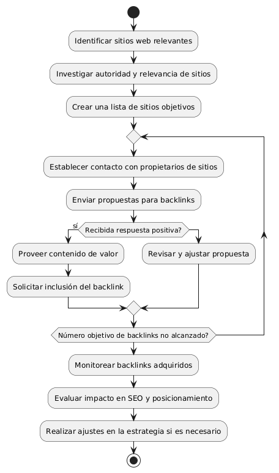
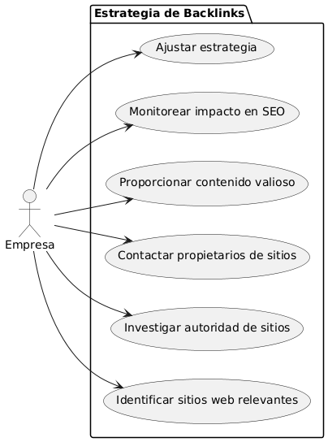

# Epica de Análisis

------
## Diagrama de Actividades
[Creado con plantuml](https://plantuml.com/es/)

{ align=center }
---
El proceso para implementar contenido de calidad en blogs incluye investigar palabras clave, crear y optimizar contenido, y realizar revisiones antes de publicar. Después de la publicación, se monitorea el rendimiento del contenido, se hacen ajustes según sea necesario, y se evalúa el impacto a largo plazo en el sitio web.
---

###
###

## Escenario MACP-46
Rubén al buscar una página de ventas de muebles  por medio de palabras claves podrá identificar o encontrar contenidos de nuestra página, encontrando títulos  llamativos y con historias de productos que atraigan a rubén a la investigación de nuestros productos en la página.

<table id="customers">
  <tr class="idtext principal">
    <td>ID MACP-55</td>
  </tr>
  <tr class="single text">
    <td><strong>Requerimiento</strong>: implementar backlinks de calidad ID MACP-55</td>
  </tr>
  <tr class="single gray">
    <td><strong>Historia de usuario</strong></td>
  </tr>
  <tr class="single text">
    <td>Como empresa que busca mejorar su posicionamiento en motores de búsqueda y aumentar su visibilidad online, quiero desarrollar una estrategia para obtener backlinks de calidad de sitios respetables.</td>
  </tr>
  <tr class="duo">
    <th class="gray"><strong>Estado de la tarea</strong></th>
    <th>En desarrollo</th>
  </tr>
  <tr class="single gray">
    <td><strong>Caso de uso (Pasos)</strong></td>
  </tr>
  <tr class="single text">
    <td>
        <ol>
            <li>Identificar Sitios Relevantes.</li>
            <li>Establecer Relaciones.</li>
            <li>Crear Contenido de Valor.</li>
            <li>Solicitar Backlinks.</li>
            <li>Monitorear y Evaluar.</li>
        </ol>
    </td>
  </tr>
  <tr class="single gray">
    <td><strong>Criterios de aceptación</strong></td>
  </tr>
  <tr class="single text">
    <td>
        <ol>
            <li>Relevancia de los Sitios: Los sitios seleccionados deben ser relevantes para la industria y tener alta autoridad de dominio.</li>
            <li>Calidad del Contenido: El contenido vinculado debe ser de alta calidad y útil para los usuarios del sitio.</li>
            <li>Número de Backlinks Adquiridos: Debe alcanzarse un número objetivo de backlinks de calidad en el período establecido.</li>
            <li>Incremento en el Posicionamiento SEO: Se debe medir el aumento en el ranking de búsqueda tras adquirir backlinks.</li>
            <li>Monitoreo de Enlaces: Verificar que los backlinks estén activos y correctamente implementados en los sitios de destino.</li>
            <li>Cumplimiento de Directrices: Los backlinks deben cumplir con las directrices de Google para evitar penalizaciones.</li>          
        </ol>
    </td>
  </tr>
 <tr class="duo">
    <th class="gray"><strong>Calidad</strong></th>
    <th>En desarrollo</th>
  </tr>
  <tr class="duo">
    <th class="gray"><strong>Versionamiento</strong></th>
    <th>En desarrollo</th>
  </tr>
</table>

---
## Diagrama de Caso de uso
[Creado con plantuml](https://plantuml.com/es/)

{ align=center }
---
Para mejorar el posicionamiento en motores de búsqueda, la empresa desarrollará una estrategia de backlinks de calidad. Esto incluye identificar sitios web relevantes, investigar su autoridad, contactar a los propietarios para obtener enlaces, proporcionar contenido valioso, y monitorear el impacto en SEO para ajustar la estrategia.
---
