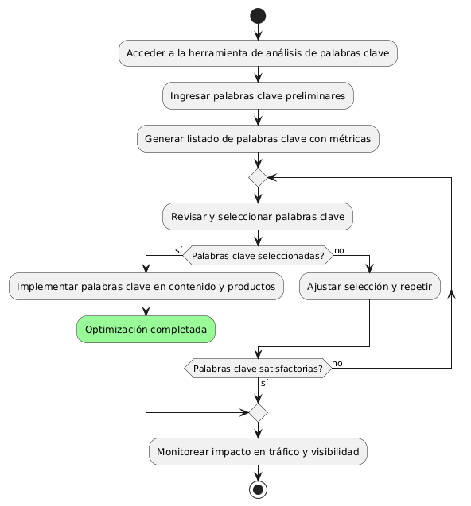

# Epica de Análisis

------
## Diagrama de Actividades
[Creado con plantuml](https://plantuml.com/es/)

{ align=center }
---
Este diagrama de actividades ilustra el proceso de análisis e implementación de palabras clave para mejorar la visibilidad y atraer tráfico web calificado. Incluye la selección de palabras clave, su implementación en contenido y productos, y el monitoreo de resultados, asegurando una optimización continua en estrategias de marketing digital.
---

###
###

## Escenario MACP-46
Rubén al buscar una página de ventas de muebles  por medio de palabras claves podrá identificar o encontrar contenidos de nuestra página, encontrando títulos  llamativos y con historias de productos que atraigan a rubén a la investigación de nuestros productos en la página.

<table id="customers">
  <tr class="idtext principal">
    <td>ID MACP-56</td>
  </tr>
  <tr class="single text">
    <td><strong>Requerimiento</strong>: implementar análisis de palabras claves ID MACP-56</td>
  </tr>
  <tr class="single gray">
    <td><strong>Historia de usuario</strong></td>
  </tr>
  <tr class="single text">
    <td>Como especialista en marketing digital, quiero contar con herramientas que me permitan realizar un análisis exhaustivo de palabras clave para optimizar nuestros productos y contenidos, para aumentar la visibilidad de nuestra marca y atraer tráfico web calificado.</td>
  </tr>
  <tr class="duo">
    <th class="gray"><strong>Estado de la tarea</strong></th>
    <th>En desarrollo</th>
  </tr>
  <tr class="single gray">
    <td><strong>Caso de uso (Pasos)</strong></td>
  </tr>
  <tr class="single text">
    <td>
        <ol>
            <li>El especialista accede a la herramienta de análisis de palabras clave.</li>
            <li>Ingresa las palabras clave preliminares o relacionadas con los productos y contenidos actuales.</li>
            <li>La herramienta genera un listado de palabras clave sugeridas junto con métricas relevantes (volumen de búsqueda, competencia, etc).</li>
            <li>El especialista revisa y selecciona las palabras clave más adecuadas para la estrategia.</li>
            <li>Se implementan las palabras clave seleccionadas en el contenido y productos.</li>
            <li>Se monitorea el impacto de las palabras clave implementadas en el tráfico y visibilidad</li>
        </ol>
    </td>
  </tr>
  <tr class="single gray">
    <td><strong>Criterios de aceptación</strong></td>
  </tr>
  <tr class="single text">
    <td>
        <ol>
            <li>Las herramientas de análisis de palabras clave deben estar configuradas y ser accesibles para el especialista.</li>
            <li>El listado de palabras clave sugeridas debe incluir métricas clave como volumen de búsqueda, nivel de competencia, y CPC (costo por clic).</li>
            <li>El especialista debe poder exportar e integrar las palabras clave seleccionadas en las estrategias de contenido y SEO.</li>
            <li>Se debe realizar un seguimiento del impacto en el tráfico y la visibilidad para ajustar la estrategia según los resultados obtenidos.</li>                 
        </ol>
    </td>
  </tr>
 <tr class="duo">
    <th class="gray"><strong>Calidad</strong></th>
    <th>En desarrollo</th>
  </tr>
  <tr class="duo">
    <th class="gray"><strong>Versionamiento</strong></th>
    <th>En desarrollo</th>
  </tr>
</table>

---
## Diagrama de Caso de uso
[Creado con plantuml](https://plantuml.com/es/)

{ align=center }
---
Para mejorar el posicionamiento en motores de búsqueda, la empresa desarrollará una estrategia de backlinks de calidad. Esto incluye identificar sitios web relevantes, investigar su autoridad, contactar a los propietarios para obtener enlaces, proporcionar contenido valioso, y monitorear el impacto en SEO para ajustar la estrategia.
---
