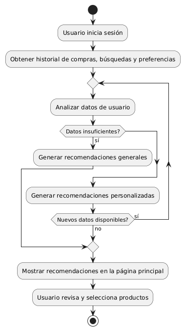
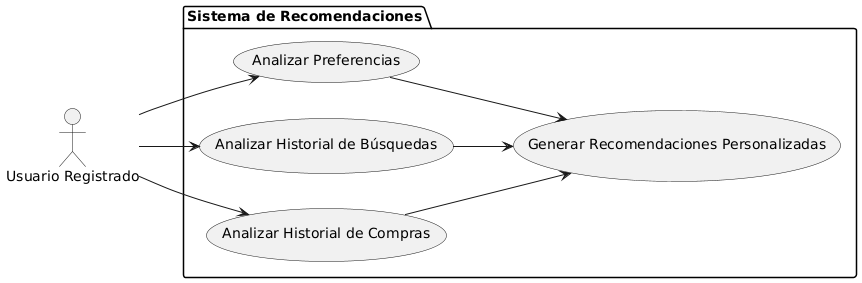

# Epica de Análisis

------
## Diagrama de Actividades
[Creado con plantuml](https://plantuml.com/es/)

{ align=center }
---
El diagrama de actividades ilustra el proceso de generación de recomendaciones personalizadas de productos para un usuario registrado. Inicia con la obtención del historial de compras y preferencias, seguido de un análisis de datos. Según la disponibilidad de información, se generan recomendaciones específicas o generales, que luego se muestran al usuario.
---

###
###

## Escenario MACP-57
El sistema debe generar recomendaciones de productos basadas en las preferencias del pepito perez como color, estilo y material. El sistema debe ajustar las recomendaciones de pepito  basándose en el historial de búsqueda y compra como usuario de la página. Por ende, pepito pérez tendrá varios resultados que coincidan exactamente o se aproximen a los criterios de búsqueda.  El sistema debe enviar notificaciones personalizadas sobre nuevos productos, ofertas y promociones basadas en las preferencias de PEPITO, El sistema debe aprender de las interacciones implícitas del usuario (como el tiempo de permanencia en ciertas páginas) para afinar las recomendaciones de productos.

<table id="customers">
  <tr class="idtext principal">
    <td>ID MACP-58</td>
  </tr>
  <tr class="single text">
    <td><strong>Requerimiento</strong>: crear recomendación personalizada de productos ID MACP-58</td>
  </tr>
  <tr class="single gray">
    <td><strong>Historia de usuario</strong></td>
  </tr>
  <tr class="single text">
    <td>Como usuario registrado, quiero recibir recomendaciones personalizadas de productos en función de mi historial de compras, búsquedas y preferencias para descubrir productos que me puedan interesar y aumentar la probabilidad de compra.</td>
  </tr>
  <tr class="duo">
    <th class="gray"><strong>Estado de la tarea</strong></th>
    <th>En desarrollo</th>
  </tr>
  <tr class="single gray">
    <td><strong>Caso de uso (Pasos)</strong></td>
  </tr>
  <tr class="single text">
    <td>
        <ol>
            <li>El usuario inicia sesión en la plataforma.</li>
            <li>El sistema analiza el historial de compras, búsquedas y preferencias del usuario.</li>
            <li>El sistema genera una lista de productos recomendados basada en el análisis.</li>
            <li>El sistema muestra las recomendaciones personalizadas en la página principal del usuario o en secciones dedicadas.</li>
            <li>El usuario revisa las recomendaciones y puede hacer clic en los productos para obtener más información o realizar una compra.</li>
        </ol>
    </td>
  </tr>
  <tr class="single gray">
    <td><strong>Criterios de aceptación</strong></td>
  </tr>
  <tr class="single text">
    <td>
        <ol>
            <li>El sistema debe generar recomendaciones basadas en el historial de compras, búsquedas y preferencias del usuario.</li>
            <li>Las recomendaciones deben actualizarse de manera dinámica cada vez que el usuario interactúe con la plataforma.</li>
            <li>El sistema debe ser capaz de ofrecer recomendaciones alternativas si no hay suficientes datos del usuario.</li>
            <li>El usuario debe tener la opción de ajustar o personalizar sus preferencias de recomendación.</li>                 
        </ol>
    </td>
  </tr>
 <tr class="duo">
    <th class="gray"><strong>Calidad</strong></th>
    <th>En desarrollo</th>
  </tr>
  <tr class="duo">
    <th class="gray"><strong>Versionamiento</strong></th>
    <th>En desarrollo</th>
  </tr>
</table>

---
## Diagrama de Caso de uso
[Creado con plantuml](https://plantuml.com/es/)

{ align=center }
---
El caso de uso describe cómo un sistema de recomendaciones personalizadas analiza el historial de compras, búsquedas y preferencias de un usuario registrado para sugerir productos relevantes. Esto mejora la experiencia del usuario al ofrecerle opciones que coinciden con sus intereses, incrementando la probabilidad de conversión y compra.
---
