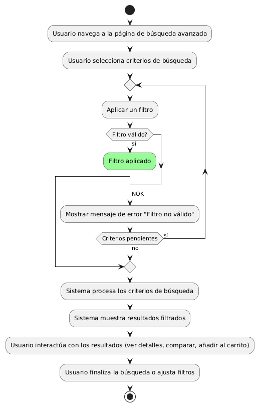
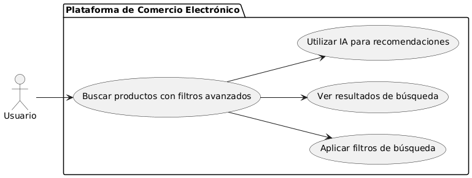

# Epica de Análisis

------
## Diagrama de Actividades
[Creado con plantuml](https://plantuml.com/es/)

{ align=center }
---
La búsqueda avanzada de productos permite a los usuarios encontrar productos de manera rápida y eficiente, utilizando tecnología de inteligencia artificial para filtrar resultados según criterios específicos. El proceso incluye la selección y aplicación de filtros, validación, y la visualización de productos que coinciden con las preferencias del usuario.
---

###
###

## Escenario MACP-57
El sistema debe generar recomendaciones de productos basadas en las preferencias del pepito perez como color, estilo y material. El sistema debe ajustar las recomendaciones de pepito  basándose en el historial de búsqueda y compra como usuario de la página. Por ende, pepito pérez tendrá varios resultados que coincidan exactamente o se aproximen a los criterios de búsqueda.  El sistema debe enviar notificaciones personalizadas sobre nuevos productos, ofertas y promociones basadas en las preferencias de PEPITO, El sistema debe aprender de las interacciones implícitas del usuario (como el tiempo de permanencia en ciertas páginas) para afinar las recomendaciones de productos.

<table id="customers">
  <tr class="idtext principal">
    <td>ID MACP-59</td>
  </tr>
  <tr class="single text">
    <td><strong>Requerimiento</strong>: diseñar búsqueda avanzada de productos ID MACP-59</td>
  </tr>
  <tr class="single gray">
    <td><strong>Historia de usuario</strong></td>
  </tr>
  <tr class="single text">
    <td>Como usuario, quiero utilizar una búsqueda avanzada de productos con tecnología de IA para encontrar rápidamente los productos que estoy buscando en función de diversos criterios y filtros, incluyendo características.</td>
  </tr>
  <tr class="duo">
    <th class="gray"><strong>Estado de la tarea</strong></th>
    <th>En desarrollo</th>
  </tr>
  <tr class="single gray">
    <td><strong>Caso de uso (Pasos)</strong></td>
  </tr>
  <tr class="single text">
    <td>
        <ol>
            <li>Inicio de Búsqueda.</li>
            <li>Selección de Criterios.</li>
            <li>Aplicación de Filtros.</li>
            <li>Presentación de Resultados.</li>
            <li>Interacción con Resultados.</li>
            <li>Finalización.</li>
        </ol>
    </td>
  </tr>
  <tr class="single gray">
    <td><strong>Criterios de aceptación</strong></td>
  </tr>
  <tr class="single text">
    <td>
        <ol>
            <li>Soporte para Múltiples Filtros: El sistema debe permitir aplicar múltiples filtros simultáneamente.</li>
            <li>Exactitud de los Resultados: Los resultados deben reflejar con precisión los criterios seleccionados.</li>
            <li>Tiempo de Respuesta: El sistema debe mostrar los resultados en menos de 2 segundos.</li>
            <li>Facilidad de Uso: La interfaz de búsqueda avanzada debe ser intuitiva y fácil de usar.</li>
            <li>Sugerencias Personalizadas: El sistema debe ofrecer sugerencias basadas en el historial del usuario.</li>
            <li>Compatibilidad con Móviles: La búsqueda avanzada debe estar optimizada para dispositivos móviles.</li>
            <li>Accesibilidad: La función debe ser accesible para usuarios con discapacidades.</li>
            <li>Validación de Datos: Los datos de productos deben ser validados y actualizados regularmente.</li>                  
        </ol>
    </td>
  </tr>
 <tr class="duo">
    <th class="gray"><strong>Calidad</strong></th>
    <th>En desarrollo</th>
  </tr>
  <tr class="duo">
    <th class="gray"><strong>Versionamiento</strong></th>
    <th>En desarrollo</th>
  </tr>
</table>

---
## Diagrama de Caso de uso
[Creado con plantuml](https://plantuml.com/es/)

{ align=center }
---
La búsqueda avanzada de productos permite a los usuarios encontrar rápidamente lo que buscan mediante el uso de filtros avanzados y tecnología de inteligencia artificial. Los usuarios pueden aplicar criterios específicos, ver resultados precisos y recibir recomendaciones personalizadas, optimizando su experiencia de compra y facilitando la toma de decisiones.
---
