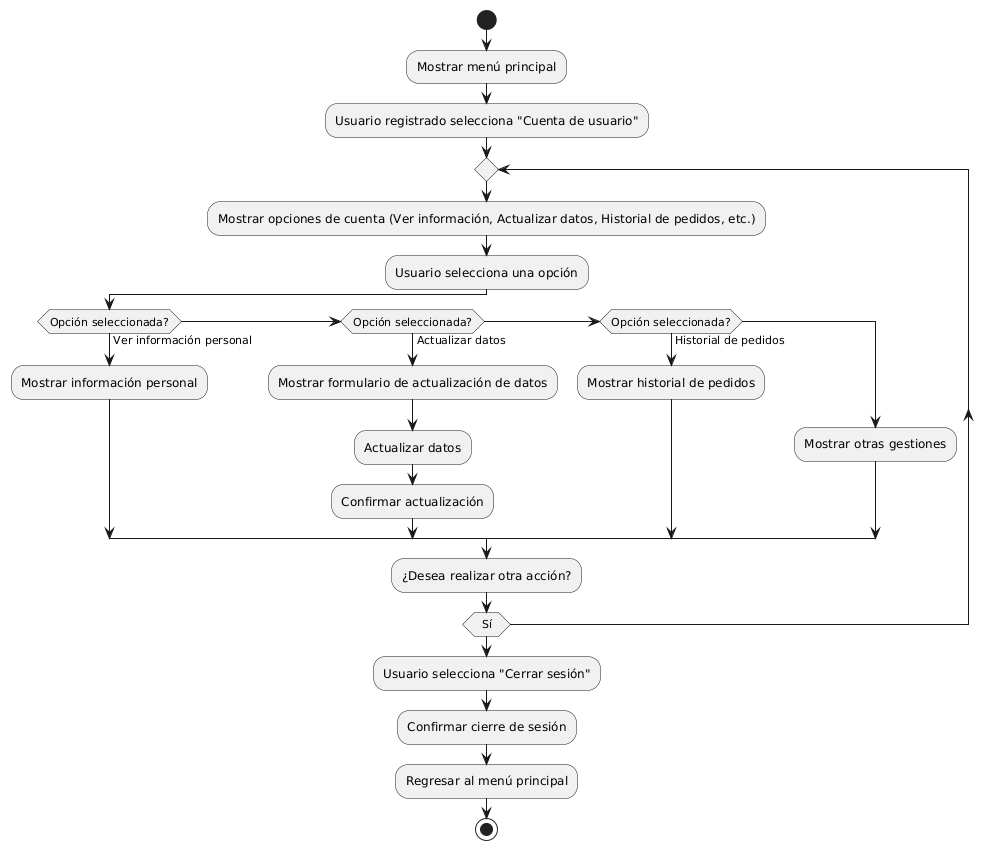

# CREAR ENLACE AL CARRITO DE COMPRAS EN EL MENÚ PRINCIPAL 

------
## Diagrama de Actividades
[Creado con plantuml](https://plantuml.com/es/)

{ align=center }

El diagrama de actividad muestra cómo un usuario registrado accede a su cuenta desde el menú principal, elige entre opciones como ver información personal, actualizar datos, o revisar el historial de pedidos, y luego decide si realizar más acciones o cerrar sesión, regresando al menú principal.
---
###

## Caso de uso historia Crear paginas de Inicio 
El usuario que quiere comprar muebles puede entrar a un menú principal o una página de inicio , el cual tiene enlaces a otras  páginas principales como inicio, catálogos, contactos entre otros más. Dentro de la misma página cuando el usuario pase el ratón sobre las opciones del menú principal se desplegará los submenús con más opciones; la página le proporcionará enlaces rápidos para iniciar sesión o registrarse; si la persona quiere entrar a la página desde su móvil, lo podrá hacer con toda comodidad ya que el menú es responsivo para móviles. También si el usuario quiere consultar las redes sociales lo podrá hacer ya que el menú de inicio tiene enlaces  a las mismas, y no menos importante la capacidad de ver todos los productos recomendados o más vendidos de la página.

<table id="customers">
  <tr class="idtext principal">
    <td>ID MACP-6</td>
  </tr>
  <tr class="single text">
    <td><strong>Requerimiento</strong>: Diseñar un enlace al carrito de compras en el menú principal ID MACP-6</td>
  </tr>
  <tr class="single gray">
    <td><strong>Historia de usuario</strong></td>
  </tr>
  <tr class="single text">
    <td>Como usuario registrado, quiero acceder rápidamente a mi cuenta de usuario desde el menú principal para poder ver mi información personal, actualizar mis datos, acceder a mi historial de pedidos y realizar otras gestiones.</td>
  </tr>
  <tr class="duo">
    <th class="gray"><strong>Estado de la tarea</strong></th>
    <th>En desarrollo</th>
  </tr>
  <tr class="single gray">
    <td><strong>Caso de uso (Pasos)</strong></td>
  </tr>
  <tr class="single text">
    <td>
        <ol>
            <li> El usuario está en la página principal de la aplicación.</li>
            <li> El usuario localiza el menú principal.</li>
            <li> El usuario selecciona el enlace al carrito de compras en el menú principal.</li>
            <li> El sistema redirige al usuario a la página del carrito de compras.</li>
            <li> El sistema muestra los productos actualmente en el carrito.</li>
        </ol>
    </td>
  </tr>
  <tr class="single gray">
    <td><strong>Criterios de aceptación</strong></td>
  </tr>
  <tr class="single text">
    <td>
        <ol>
               <li>Visibilidad: El enlace al carrito de compras debe estar claramente visible en el menú principal de todas las páginas relevantes.</li>
               <li>Accesibilidad: El enlace debe ser accesible con un solo clic desde el menú principal.</li>
               <li> Redirección: Al hacer clic en el enlace, el usuario debe ser redirigido correctamente a la página del carrito de compras.</li>
               <li> Estado del Carrito: La página del carrito de compras debe mostrar correctamente todos los productos añadidos, así como las opciones para modificar la cantidad o eliminar productos.</li>
               <li> Mensajes de Error: Si el enlace está roto o hay un problema con la redirección, el sistema debe mostrar un mensaje de error adecuado y proporcionar opciones para resolver el problema.</li>
               <li> Consistencia: El enlace debe seguir el estilo de diseño y las convenciones de la aplicación para mantener la coherencia visual y funcional.</li>
        </ol>
    </td>
  </tr>
 <tr class="duo">
    <th class="gray"><strong>Calidad</strong></th>
    <th>En desarrollo</th>
  </tr>
  <tr class="duo">
    <th class="gray"><strong>Versionamiento</strong></th>
    <th>En desarrollo</th>
  </tr>
</table>

---
## Diagrama de Caso de uso
[Creado con plantuml](https://plantuml.com/es/)

{ align=center }

Este diagrama de casos de uso muestra cómo un "Usuario Registrado" interactúa con el sistema a través del menú principal. Incluye funcionalidades como "Acceder a Cuenta", "Ver Información Personal", "Actualizar Datos", "Acceder a Historial de Pedidos", y "Realizar Otras Gestiones", facilitando la gestión de su cuenta.
---
