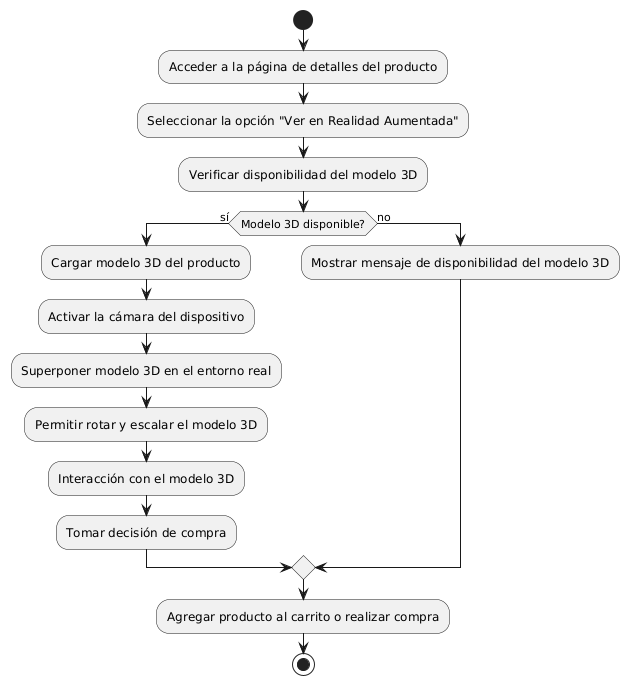
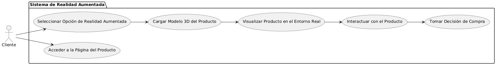

# Epica de Análisis

------
## Diagrama de Actividades
[Creado con plantuml](https://plantuml.com/es/)

{ align=center }
---
Este diagrama detalla el proceso para la visualización de productos en realidad aumentada. Incluye acceder a la página del producto, seleccionar la opción de realidad aumentada, verificar la disponibilidad del modelo 3D, cargarlo y superponerlo en el entorno real, permitir la interacción y tomar la decisión de compra.
---

###
###

## Escenario MACP-57
El sistema debe generar recomendaciones de productos basadas en las preferencias del pepito perez como color, estilo y material. El sistema debe ajustar las recomendaciones de pepito  basándose en el historial de búsqueda y compra como usuario de la página. Por ende, pepito pérez tendrá varios resultados que coincidan exactamente o se aproximen a los criterios de búsqueda.  El sistema debe enviar notificaciones personalizadas sobre nuevos productos, ofertas y promociones basadas en las preferencias de PEPITO, El sistema debe aprender de las interacciones implícitas del usuario (como el tiempo de permanencia en ciertas páginas) para afinar las recomendaciones de productos.

<table id="customers">
  <tr class="idtext principal">
    <td>ID MACP-60</td>
  </tr>
  <tr class="single text">
    <td><strong>Requerimiento</strong>: crear visualización de productos en realidad aumentada ID MACP-60</td>
  </tr>
  <tr class="single gray">
    <td><strong>Historia de usuario</strong></td>
  </tr>
  <tr class="single text">
    <td>Como cliente, quiero visualizar productos en realidad aumentada para poder superponer modelos 3D de los productos en mi entorno real, permitiéndome observarlos a escala, rotarlos, interactuar con ellos y tomar decisiones de compra más informadas antes de la compra.</td>
  </tr>
  <tr class="duo">
    <th class="gray"><strong>Estado de la tarea</strong></th>
    <th>En desarrollo</th>
  </tr>
  <tr class="single gray">
    <td><strong>Caso de uso (Pasos)</strong></td>
  </tr>
  <tr class="single text">
    <td>
        <ol>
            <li>El cliente accede a la página de detalles del producto.</li>
            <li>El cliente selecciona la opción de "Ver en Realidad Aumentada".</li>
            <li>El sistema carga el modelo 3D del producto.</li>
            <li>El sistema activa la cámara del dispositivo del cliente para captar su entorno real.</li>
            <li>El cliente visualiza el modelo 3D del producto superpuesto en su entorno real.</li>
            <li>El cliente puede rotar, escalar e interactuar con el modelo 3D.</li>
            <li>El cliente toma una decisión de compra basándose en la visualización proporcionada.</li>
        </ol>
    </td>
  </tr>
  <tr class="single gray">
    <td><strong>Criterios de aceptación</strong></td>
  </tr>
  <tr class="single text">
    <td>
        <ol>
            <li>Disponibilidad del Modelo 3D: Los modelos 3D deben estar disponibles para todos los productos que los ofrecen y deben ser precisos y de alta calidad.</li>
            <li>Interactividad: El cliente debe poder rotar, escalar y mover el modelo 3D en su entorno real sin retrasos.</li>
            <li>Compatibilidad del Dispositivo: que soportan realidad aumentada, con instrucciones claras para su uso.</li>
            <li>Experiencia del Usuario: La visualización debe ser clara y realista, permitiendo ajustes de escala y rotación con facilidad.</li>
            <li>Errores y Mensajes: El sistema debe manejar errores efectivamente y proporcionar mensajes claros en caso de fallos técnicos.</li>
            <li>Decisión de Compra: El cliente debe poder agregar el producto al carrito o comprar directamente desde la interfaz de realidad aumentada.</li>                     
        </ol>
    </td>
  </tr>
 <tr class="duo">
    <th class="gray"><strong>Calidad</strong></th>
    <th>En desarrollo</th>
  </tr>
  <tr class="duo">
    <th class="gray"><strong>Versionamiento</strong></th>
    <th>En desarrollo</th>
  </tr>
</table>

---
## Diagrama de Caso de uso
[Creado con plantuml](https://plantuml.com/es/)

{ align=center }
---
El diagrama de casos de uso muestra cómo un cliente interactúa con el sistema de realidad aumentada. El cliente accede a la página del producto, selecciona la opción de realidad aumentada, carga el modelo 3D del producto, lo visualiza en el entorno real, interactúa con el producto y, finalmente, toma una decisión de compra.
---
