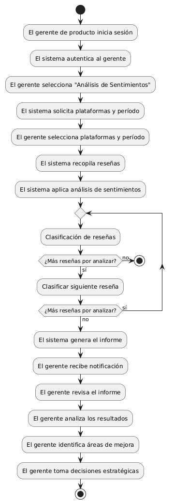
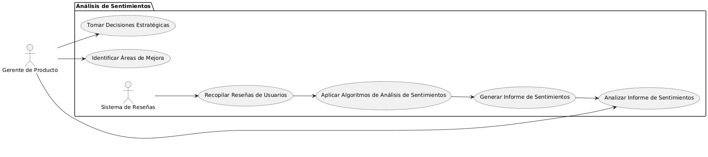

# Epica de Análisis

------
## Diagrama de Actividades
[Creado con plantuml](https://plantuml.com/es/)

{ align=center }
---
El diagrama de actividades detalla el proceso de implementación del análisis de sentimientos de las reseñas, abarcando desde la autenticación del gerente de producto hasta la toma de decisiones estratégicas. Incluye la recopilación de reseñas, aplicación de algoritmos de análisis y generación de informes, ayudando a mejorar la percepción y experiencia del cliente.
---

###
###

## Escenario MACP-57
El sistema debe generar recomendaciones de productos basadas en las preferencias del pepito perez como color, estilo y material. El sistema debe ajustar las recomendaciones de pepito  basándose en el historial de búsqueda y compra como usuario de la página. Por ende, pepito pérez tendrá varios resultados que coincidan exactamente o se aproximen a los criterios de búsqueda.  El sistema debe enviar notificaciones personalizadas sobre nuevos productos, ofertas y promociones basadas en las preferencias de PEPITO, El sistema debe aprender de las interacciones implícitas del usuario (como el tiempo de permanencia en ciertas páginas) para afinar las recomendaciones de productos.

<table id="customers">
  <tr class="idtext principal">
    <td>ID MACP-61</td>
  </tr>
  <tr class="single text">
    <td><strong>Requerimiento</strong>: implementar análisis de sentimientos de las reseñas ID MACP-61</td>
  </tr>
  <tr class="single gray">
    <td><strong>Historia de usuario</strong></td>
  </tr>
  <tr class="single text">
    <td>Como gerente de producto, quiero analizar el sentimiento de las reseñas de los usuarios para comprender mejor la percepción de los usuarios sobre nuestros productos y servicios, identificar áreas de mejora y tomar decisiones informadas para optimizar la experiencia del cliente.</td>
  </tr>
  <tr class="duo">
    <th class="gray"><strong>Estado de la tarea</strong></th>
    <th>En desarrollo</th>
  </tr>
  <tr class="single gray">
    <td><strong>Caso de uso (Pasos)</strong></td>
  </tr>
  <tr class="single text">
    <td>
        <ol>
            <li>El gerente de producto accede al sistema de análisis de sentimientos.</li>
            <li>El sistema recopila las reseñas de los usuarios desde diversas plataformas (sitio web, redes sociales, etc.).</li>
            <li>El sistema aplica algoritmos de análisis de sentimientos para categorizar las reseñas como positivas, negativas o neutras.</li>
            <li>El sistema genera un informe detallado sobre el sentimiento de los usuarios.</li>
            <li>El gerente de producto revisa el informe y analiza los resultados.</li>
            <li>El gerente identifica áreas de mejora basadas en el análisis de sentimientos.</li>
            <li>El gerente utiliza los insights para tomar decisiones estratégicas que optimicen la experiencia del cliente.</li>
        </ol>
    </td>
  </tr>
  <tr class="single gray">
    <td><strong>Criterios de aceptación</strong></td>
  </tr>
  <tr class="single text">
    <td>
        <ol>
            <li>Precisión del análisis: El sistema debe categorizar correctamente el sentimiento de al menos el 90% de las reseñas analizadas.</li>
            <li>Cobertura de las reseñas: El sistema debe ser capaz de analizar las reseñas provenientes de todas las plataformas integradas.</li>
            <li>Generación de informes: El sistema debe generar informes detallados y fáciles de interpretar, que incluyan métricas clave como la proporción de sentimientos positivos, negativos y neutros.</li>
            <li>Accesibilidad de los datos: El gerente debe poder acceder a los resultados del análisis en tiempo real y filtrarlos por producto, categoría, fecha, y otras variables relevantes.</li>
            <li>Seguridad y privacidad: El sistema debe cumplir con todas las normativas de seguridad y privacidad de datos, garantizando que las reseñas y los resultados del análisis sean tratados de manera confidencial.</li>                      
        </ol>
    </td>
  </tr>
 <tr class="duo">
    <th class="gray"><strong>Calidad</strong></th>
    <th>En desarrollo</th>
  </tr>
  <tr class="duo">
    <th class="gray"><strong>Versionamiento</strong></th>
    <th>En desarrollo</th>
  </tr>
</table>

---
## Diagrama de Caso de uso
[Creado con plantuml](https://plantuml.com/es/)

{ align=center }
---
El diagrama de casos de uso ilustra cómo un gerente de producto utiliza un sistema de análisis de sentimientos para recopilar reseñas de usuarios, aplicar algoritmos que categorizan las reseñas, generar informes detallados, y luego identificar áreas de mejora. El proceso culmina en la toma de decisiones estratégicas para optimizar la experiencia del cliente.
---
