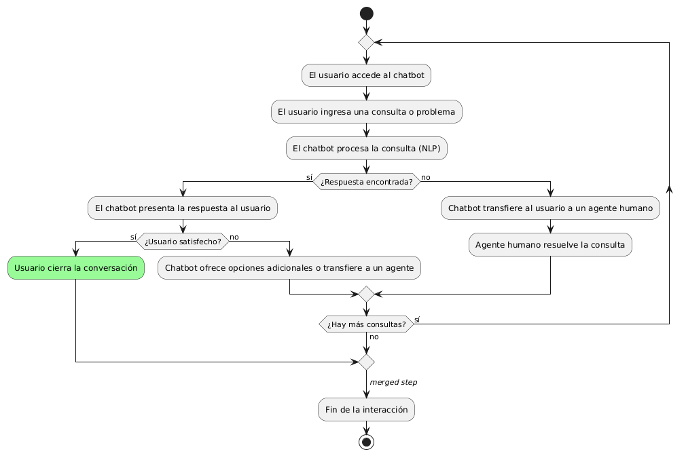
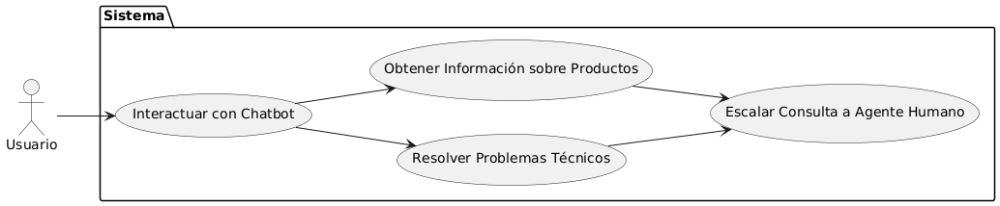

# Epica de Análisis

------
## Diagrama de Actividades
[Creado con plantuml](https://plantuml.com/es/)

{ align=center }
---
Este diagrama de actividades ilustra el flujo de interacción entre un usuario y un chatbot inteligente. El usuario ingresa una consulta, el chatbot la procesa y, si encuentra una respuesta adecuada, la presenta al usuario. Si no, transfiere la consulta a un agente humano para su resolución.
---

###
###

## Escenario MACP-57
El sistema debe generar recomendaciones de productos basadas en las preferencias del pepito perez como color, estilo y material. El sistema debe ajustar las recomendaciones de pepito  basándose en el historial de búsqueda y compra como usuario de la página. Por ende, pepito pérez tendrá varios resultados que coincidan exactamente o se aproximen a los criterios de búsqueda.  El sistema debe enviar notificaciones personalizadas sobre nuevos productos, ofertas y promociones basadas en las preferencias de PEPITO, El sistema debe aprender de las interacciones implícitas del usuario (como el tiempo de permanencia en ciertas páginas) para afinar las recomendaciones de productos.

<table id="customers">
  <tr class="idtext principal">
    <td>ID MACP-62</td>
  </tr>
  <tr class="single text">
    <td><strong>Requerimiento</strong>: crear chatbot inteligente para asistencia ID MACP-62</td>
  </tr>
  <tr class="single gray">
    <td><strong>Historia de usuario</strong></td>
  </tr>
  <tr class="single text">
    <td>Como usuario, quiero interactuar con un chatbot inteligente para obtener asistencia rápida y eficiente con mis consultas, resolver problemas técnicos y obtener información sobre productos o servicios, mejorando mi experiencia de usuario y reduciendo el tiempo de espera para recibir atención al cliente.</td>
  </tr>
  <tr class="duo">
    <th class="gray"><strong>Estado de la tarea</strong></th>
    <th>En desarrollo</th>
    <th>En desarrollo</th>
  </tr>
  <tr class="single gray">
    <td><strong>Caso de uso (Pasos)</strong></td>
  </tr>
  <tr class="single text">
    <td>
        <ol>
            <li>El usuario accede al chatbot desde la página web o aplicación móvil.</li>
            <li>El usuario ingresa su consulta o problema en el chatbot.</li>
            <li>El chatbot procesa la consulta utilizando procesamiento de lenguaje natural (NLP).</li>
            <li>El chatbot busca respuestas en la base de datos o realiza consultas a APIs externas.</li>
            <li>El chatbot presenta una respuesta al usuario.</li>
            <li>El usuario evalúa la respuesta y, si está satisfecho, cierra la conversación.</li>
            <li>Si la respuesta no es satisfactoria, el chatbot ofrece opciones adicionales o transfiere al usuario a un agente humano.</li>
        </ol>
    </td>
  </tr>
  <tr class="single gray">
    <td><strong>Criterios de aceptación</strong></td>
  </tr>
  <tr class="single text">
    <td>
        <ol>
            <li>Interfaz de Usuario: El chatbot debe ser accesible desde cualquier página del sitio web y la aplicación móvil, permitiendo entrada de texto y opciones predefinidas.</li>
            <li>Precisión de Respuestas: El chatbot debe proporcionar respuestas correctas al menos el 80% del tiempo, basadas en la información más reciente de la base de datos.</li>
            <li>Tiempo de Respuesta: El chatbot debe responder a las consultas del usuario en menos de 3 segundos.</li>
            <li>Escalabilidad: El chatbot debe manejar múltiples usuarios simultáneamente sin comprometer la calidad del servicio.</li>
            <li>Transferencia a Agente Humano: Debe haber una opción clara para transferir al usuario a un agente humano, incluyendo todo el contexto de la conversación.</li>
            <li>Satisfacción del Usuario: Debe implementarse un sistema de retroalimentación para que los usuarios califiquen su experiencia con el chatbot.</li>
            <li>Actualización de Información: La base de datos del chatbot debe actualizarse periódicamente para reflejar cambios en productos, servicios o políticas.</li>                   
        </ol>
    </td>
  </tr>
 <tr class="duo">
    <th class="gray"><strong>Calidad</strong></th>
    <th>En desarrollo</th>
  </tr>
  <tr class="duo">
    <th class="gray"><strong>Versionamiento</strong></th>
    <th>En desarrollo</th>
  </tr>
</table>

---
## Diagrama de Caso de uso
[Creado con plantuml](https://plantuml.com/es/)

{ align=center }
---
El diagrama de casos de uso ilustra cómo un usuario interactúa con un chatbot inteligente para recibir asistencia. El usuario puede resolver problemas técnicos, obtener información sobre productos y, si es necesario, escalar la consulta a un agente humano para una solución más específica, mejorando la experiencia de atención al cliente.
---
