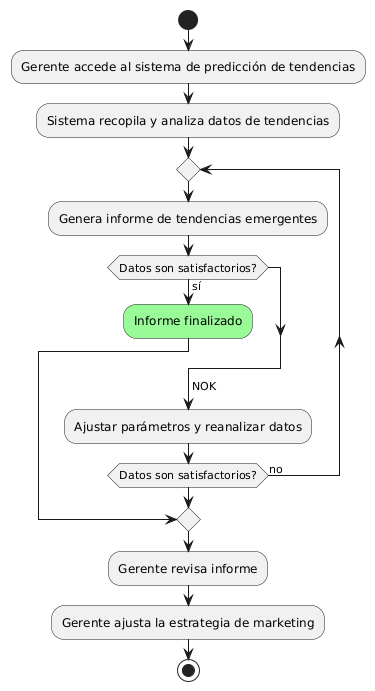
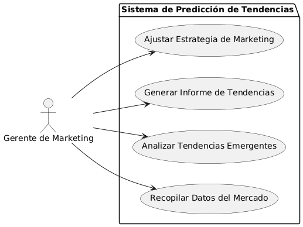

# Epica de Análisis

------
## Diagrama de Actividades
[Creado con plantuml](https://plantuml.com/es/)

{ align=center }
---
El diagrama de actividades muestra el proceso para diseñar un sistema de predicción de tendencias en mobiliario. Incluye la recopilación y análisis de datos, la generación de informes, y la revisión por parte del gerente de marketing, quien ajusta la estrategia de marketing basada en las tendencias identificadas.
---

###
###

## Escenario MACP-57
El sistema debe generar recomendaciones de productos basadas en las preferencias del pepito perez como color, estilo y material. El sistema debe ajustar las recomendaciones de pepito  basándose en el historial de búsqueda y compra como usuario de la página. Por ende, pepito pérez tendrá varios resultados que coincidan exactamente o se aproximen a los criterios de búsqueda.  El sistema debe enviar notificaciones personalizadas sobre nuevos productos, ofertas y promociones basadas en las preferencias de PEPITO, El sistema debe aprender de las interacciones implícitas del usuario (como el tiempo de permanencia en ciertas páginas) para afinar las recomendaciones de productos.

<table id="customers">
  <tr class="idtext principal">
    <td>ID MACP-63</td>
  </tr>
  <tr class="single text">
    <td><strong>Requerimiento</strong>: diseñar predicción de tendencias de moda en mobiliario ID MACP-63</td>
  </tr>
  <tr class="single gray">
    <td><strong>Historia de usuario</strong></td>
  </tr>
  <tr class="single text">
    <td>Como gerente de marketing, quiero utilizar un sistema de predicción de tendencias de moda en mobiliario para identificar las tendencias emergentes en el mercado, anticipar las demandas de los clientes y tomar decisiones informadas sobre el desarrollo de nuevos productos y estrategias de marketing, aumentando las ventas y la rentabilidad del negocio.</td>
  </tr>
  <tr class="duo">
    <th class="gray"><strong>Estado de la tarea</strong></th>
    <th>En desarrollo</th>
    <th>En desarrollo</th>
  </tr>
  <tr class="single gray">
    <td><strong>Caso de uso (Pasos)</strong></td>
  </tr>
  <tr class="single text">
    <td>
        <ol>
            <li>El gerente de marketing accede al sistema de predicción de tendencias.</li>
            <li>El sistema recopila y analiza datos de tendencias de mobiliario.</li>
            <li>El sistema genera un informe con las tendencias emergentes.</li>
            <li>El gerente revisa el informe y ajusta la estrategia de marketing.</li>
            <li>Se implementan las decisiones basadas en las predicciones.</li>            
        </ol>
    </td>
  </tr>
  <tr class="single gray">
    <td><strong>Criterios de aceptación</strong></td>
  </tr>
  <tr class="single text">
    <td>
        <ol>
            <li>El sistema debe ser capaz de recopilar datos de al menos tres fuentes diferentes (ej., redes sociales, ventas históricas, informes de la industria).</li>
            <li>El informe generado debe incluir al menos cinco tendencias emergentes con predicciones de demanda.</li>
            <li>El sistema debe permitir al gerente de marketing acceder a los informes en un formato fácil de entender (gráficos, tablas, etc.).</li>
            <li>El análisis y la generación de informes deben completarse en un tiempo razonable, no mayor a 24 horas desde la recopilación de los datos.</li>
            <li>El gerente de marketing debe poder utilizar las predicciones para realizar ajustes en las estrategias de producto y marketing con un impacto positivo medible en las ventas dentro de un período de seis meses.</li>                              
        </ol>
    </td>
  </tr>
 <tr class="duo">
    <th class="gray"><strong>Calidad</strong></th>
    <th>En desarrollo</th>
  </tr>
  <tr class="duo">
    <th class="gray"><strong>Versionamiento</strong></th>
    <th>En desarrollo</th>
  </tr>
</table>

---
## Diagrama de Caso de uso
[Creado con plantuml](https://plantuml.com/es/)

{ align=center }
---
Este caso de uso describe cómo un gerente de marketing utiliza un sistema de predicción de tendencias de moda en mobiliario para recopilar datos del mercado, analizar tendencias emergentes, generar informes detallados y ajustar las estrategias de marketing. El objetivo es anticipar las demandas de los clientes y aumentar la rentabilidad del negocio.
---
