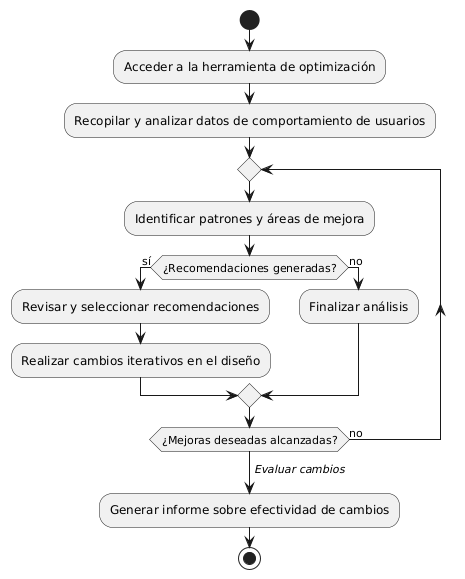
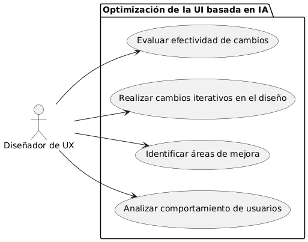

# Epica de Análisis

------
## Diagrama de Actividades
[Creado con plantuml](https://plantuml.com/es/)

{ align=center }
---
El diagrama de actividades ilustra el proceso de optimización de la interfaz de usuario basada en IA, desde el acceso a la herramienta de análisis, la identificación de áreas de mejora basadas en el comportamiento de los usuarios, hasta la implementación de cambios iterativos en el diseño y la evaluación de su efectividad, finalizando con un informe de resultados.
---

###
###

## Escenario MACP-57
El sistema debe generar recomendaciones de productos basadas en las preferencias del pepito perez como color, estilo y material. El sistema debe ajustar las recomendaciones de pepito  basándose en el historial de búsqueda y compra como usuario de la página. Por ende, pepito pérez tendrá varios resultados que coincidan exactamente o se aproximen a los criterios de búsqueda.  El sistema debe enviar notificaciones personalizadas sobre nuevos productos, ofertas y promociones basadas en las preferencias de PEPITO, El sistema debe aprender de las interacciones implícitas del usuario (como el tiempo de permanencia en ciertas páginas) para afinar las recomendaciones de productos.

<table id="customers">
  <tr class="idtext principal">
    <td>ID MACP-64</td>
  </tr>
  <tr class="single text">
    <td><strong>Requerimiento</strong>: dimplementar optimización de la interfaz de usuario basada en ia ID MACP-64</td>
  </tr>
  <tr class="single gray">
    <td><strong>Historia de usuario</strong></td>
  </tr>
  <tr class="single text">
    <td>Como diseñador de UX, quiero utilizar la optimización de la interfaz de usuario basada en IA para analizar el comportamiento de los usuarios en nuestro sitio web o aplicación, identificar áreas de mejora y realizar cambios iterativos en el diseño para mejorar la usabilidad, la experiencia del usuario y la tasa de conversión, aumentando el compromiso de los usuarios.</td>
  </tr>
  <tr class="duo">
    <th class="gray"><strong>Estado de la tarea</strong></th>
    <th>En desarrollo</th>
    <th>En desarrollo</th>
  </tr>
  <tr class="single gray">
    <td><strong>Caso de uso (Pasos)</strong></td>
  </tr>
  <tr class="single text">
    <td>
        <ol>
            <li>El diseñador de UX accede a la herramienta de optimización basada en IA.</li>
            <li>La herramienta recopila y analiza datos de comportamiento de los usuarios en el sitio web o aplicación.</li>
            <li>El sistema identifica patrones de uso y áreas de mejora en la interfaz de usuario.</li>
            <li>Se generan recomendaciones basadas en los análisis de IA para optimizar la interfaz.</li>
            <li>El diseñador revisa las recomendaciones y selecciona las más relevantes para implementar.</li>
            <li>Se realizan cambios iterativos en el diseño de la interfaz de usuario.</li>            
            <li>La herramienta vuelve a analizar el comportamiento de los usuarios para evaluar la efectividad de los cambios</li>
            <li>El ciclo se repite hasta alcanzar las mejoras deseadas en la usabilidad y tasa de conversión.</li>          
        </ol>
    </td>
  </tr>
  <tr class="single gray">
    <td><strong>Criterios de aceptación</strong></td>
  </tr>
  <tr class="single text">
    <td>
        <ol>
            <li>La herramienta de IA debe ser capaz de recopilar y analizar datos de comportamiento de los usuarios en tiempo real.</li>
            <li>Las recomendaciones generadas deben estar alineadas con los objetivos de mejora de la experiencia del usuario y tasa de conversión.</li>
            <li>Los cambios realizados en la interfaz deben resultar en una mejora medible en la usabilidad y en la tasa de conversión.</li>
            <li>El diseñador debe ser capaz de realizar cambios iterativos basados en las recomendaciones de la IA y ver resultados en el comportamiento de los usuarios.</li>
            <li>La herramienta debe proporcionar informes detallados que permitan al diseñador analizar el impacto de los cambios realizados.</li>                              
        </ol>
    </td>
  </tr>
 <tr class="duo">
    <th class="gray"><strong>Calidad</strong></th>
    <th>En desarrollo</th>
  </tr>
  <tr class="duo">
    <th class="gray"><strong>Versionamiento</strong></th>
    <th>En desarrollo</th>
  </tr>
</table>

---
## Diagrama de Caso de uso
[Creado con plantuml](https://plantuml.com/es/)

{ align=center }
---
El caso de uso "implementar optimización de la interfaz de usuario basada en IA" permite al diseñador de UX analizar el comportamiento de los usuarios, identificar áreas de mejora, realizar cambios iterativos en el diseño y evaluar la efectividad de estos cambios, mejorando la usabilidad, la experiencia del usuario y la tasa de conversión.
---
