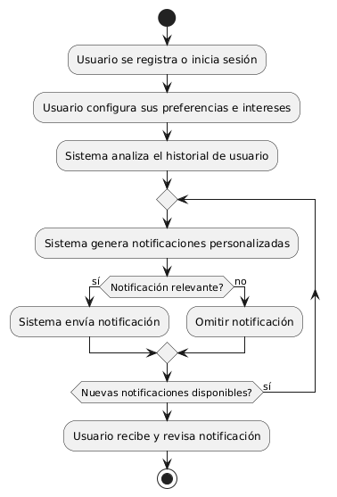
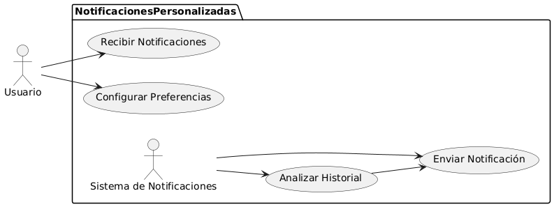

# Epica de Análisis

------
## Diagrama de Actividades
[Creado con plantuml](https://plantuml.com/es/)

{ align=center }
---
El sistema de alertas personalizadas permite a los usuarios recibir notificaciones sobre nuevos productos, ofertas y promociones relevantes según sus preferencias e intereses. El usuario configura sus intereses, el sistema analiza su historial y envía notificaciones pertinentes, mejorando así la experiencia del usuario y aumentando la participación.
---

###
###

## Escenario MACP-57
El sistema debe generar recomendaciones de productos basadas en las preferencias del pepito perez como color, estilo y material. El sistema debe ajustar las recomendaciones de pepito  basándose en el historial de búsqueda y compra como usuario de la página. Por ende, pepito pérez tendrá varios resultados que coincidan exactamente o se aproximen a los criterios de búsqueda.  El sistema debe enviar notificaciones personalizadas sobre nuevos productos, ofertas y promociones basadas en las preferencias de PEPITO, El sistema debe aprender de las interacciones implícitas del usuario (como el tiempo de permanencia en ciertas páginas) para afinar las recomendaciones de productos.

<table id="customers">
  <tr class="idtext principal">
    <td>ID MACP-65</td>
  </tr>
  <tr class="single text">
    <td><strong>Requerimiento</strong>: implementar alertas personalizadas y notificaciones ID MACP-65</td>
  </tr>
  <tr class="single gray">
    <td><strong>Historia de usuario</strong></td>
  </tr>
  <tr class="single text">
    <td>Como usuario, quiero recibir notificaciones personalizadas sobre nuevos productos, ofertas y promociones que sean relevantes para mis intereses y preferencias.</td>
  </tr>
  <tr class="duo">
    <th class="gray"><strong>Estado de la tarea</strong></th>
    <th>En desarrollo</th>
    <th>En desarrollo</th>
  </tr>
  <tr class="single gray">
    <td><strong>Caso de uso (Pasos)</strong></td>
  </tr>
  <tr class="single text">
    <td>
        <ol>
            <li>El usuario se registra o inicia sesión en la plataforma.</li>
            <li>El usuario configura sus preferencias e intereses en su perfil.</li>
            <li>El sistema de notificaciones analiza el historial de compras, búsquedas y configuraciones del usuario.</li>
            <li>El sistema genera notificaciones personalizadas basadas en los intereses y comportamientos del usuario.</li>
            <li>El sistema envía las notificaciones a través de los canales seleccionados (email, SMS, app push).</li>
            <li>El usuario recibe y revisa las notificaciones.</li>           
        </ol>
    </td>
  </tr>
  <tr class="single gray">
    <td><strong>Criterios de aceptación</strong></td>
  </tr>
  <tr class="single text">
    <td>
        <ol>
            <li>El sistema debe permitir que el usuario configure sus intereses y preferencias.</li>
            <li>El sistema debe enviar notificaciones relevantes basadas en el comportamiento y las preferencias del usuario.</li>
            <li>El usuario debe poder seleccionar los canales preferidos para recibir notificaciones.</li>
            <li>Las notificaciones deben ser entregadas en tiempo real o en el horario configurado por el usuario.</li>
            <li>El usuario debe poder optar por dejar de recibir ciertas notificaciones o ajustar sus preferencias en cualquier momento.</li>                           
        </ol>
    </td>
  </tr>
 <tr class="duo">
    <th class="gray"><strong>Calidad</strong></th>
    <th>En desarrollo</th>
  </tr>
  <tr class="duo">
    <th class="gray"><strong>Versionamiento</strong></th>
    <th>En desarrollo</th>
  </tr>
</table>

---
## Diagrama de Caso de uso
[Creado con plantuml](https://plantuml.com/es/)

{ align=center }
---
El diagrama de casos de uso muestra cómo un usuario interactúa con un sistema de notificaciones personalizadas. Incluye la configuración de preferencias, el análisis del historial de usuario y el envío de notificaciones personalizadas basadas en estos datos, lo que garantiza la relevancia y personalización de las alertas recibidas por el usuario.
---
