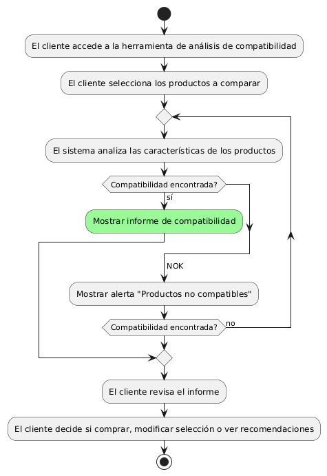
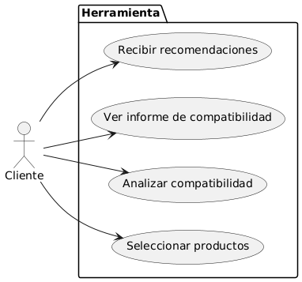

# Epica de Análisis

------
## Diagrama de Actividades
[Creado con plantuml](https://plantuml.com/es/)

{ align=center }
---
Este diagrama describe el proceso de análisis de compatibilidad de productos desde la perspectiva del cliente, incluyendo la selección de productos, el análisis por parte del sistema, y la presentación de los resultados o alertas correspondientes.
---

###
###

## Escenario MACP-57
El sistema debe generar recomendaciones de productos basadas en las preferencias del pepito perez como color, estilo y material. El sistema debe ajustar las recomendaciones de pepito  basándose en el historial de búsqueda y compra como usuario de la página. Por ende, pepito pérez tendrá varios resultados que coincidan exactamente o se aproximen a los criterios de búsqueda.  El sistema debe enviar notificaciones personalizadas sobre nuevos productos, ofertas y promociones basadas en las preferencias de PEPITO, El sistema debe aprender de las interacciones implícitas del usuario (como el tiempo de permanencia en ciertas páginas) para afinar las recomendaciones de productos.

<table id="customers">
  <tr class="idtext principal">
    <td>ID MACP-66</td>
  </tr>
  <tr class="single text">
    <td><strong>Requerimiento</strong>: implementar análisis de compatibilidad de productos ID MACP-66</td>
  </tr>
  <tr class="single gray">
    <td><strong>Historia de usuario</strong></td>
  </tr>
  <tr class="single text">
    <td>Como cliente de una tienda de muebles, quiero poder utilizar una herramienta de análisis de compatibilidad de productos para asegurarme de que los muebles que estoy comprando combinen bien entre sí y con mi decoración existente.</td>
  </tr>
  <tr class="duo">
    <th class="gray"><strong>Estado de la tarea</strong></th>
    <th>En desarrollo</th>
    <th>En desarrollo</th>
  </tr>
  <tr class="single gray">
    <td><strong>Caso de uso (Pasos)</strong></td>
  </tr>
  <tr class="single text">
    <td>
        <ol>
            <li>El cliente accede a la herramienta de análisis de compatibilidad desde la página del producto.</li>
            <li>El cliente selecciona los productos que quiere comparar o analiza la compatibilidad con productos previamente comprados.</li>
            <li>El sistema analiza las características de los productos seleccionados (color, estilo, tamaño) y las compara con la decoración existente, si se ha proporcionado.</li>
            <li>El sistema muestra un informe de compatibilidad, indicando qué productos combinan bien entre sí y sugiriendo posibles ajustes o alternativas.</li>
            <li>El cliente revisa el informe y decide si continuar con la compra, modificar la selección o explorar recomendaciones adicionales.</li>      
        </ol>
    </td>
  </tr>
  <tr class="single gray">
    <td><strong>Criterios de aceptación</strong></td>
  </tr>
  <tr class="single text">
    <td>
        <ol>
            <li>El sistema debe permitir al cliente seleccionar múltiples productos para comparar su compatibilidad.</li>
            <li>El informe de compatibilidad debe ser claro, indicando los niveles de compatibilidad (alta, media, baja) entre los productos.</li>
            <li>El sistema debe proporcionar recomendaciones adicionales basadas en el análisis de compatibilidad.</li>
            <li>El análisis debe completarse en un tiempo razonable (menos de 5 segundos).</li>
            <li>El cliente debe poder guardar el informe de compatibilidad o enviarlo por correo electrónico.</li>
            <li>El sistema debe permitir la integración de imágenes de la decoración existente para un análisis más personalizado.</li>                          
        </ol>
    </td>
  </tr>
 <tr class="duo">
    <th class="gray"><strong>Calidad</strong></th>
    <th>En desarrollo</th>
  </tr>
  <tr class="duo">
    <th class="gray"><strong>Versionamiento</strong></th>
    <th>En desarrollo</th>
  </tr>
</table>

---
## Diagrama de Caso de uso
[Creado con plantuml](https://plantuml.com/es/)

{ align=center }
---
Este diagrama muestra al cliente interactuando con la herramienta a través de los casos de uso para seleccionar productos, analizar su compatibilidad, ver el informe de compatibilidad y recibir recomendaciones.
---
