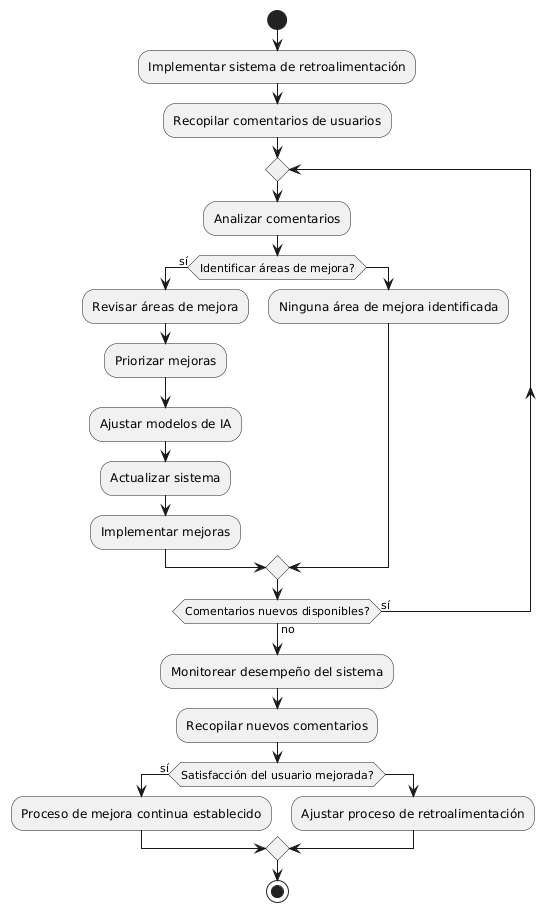
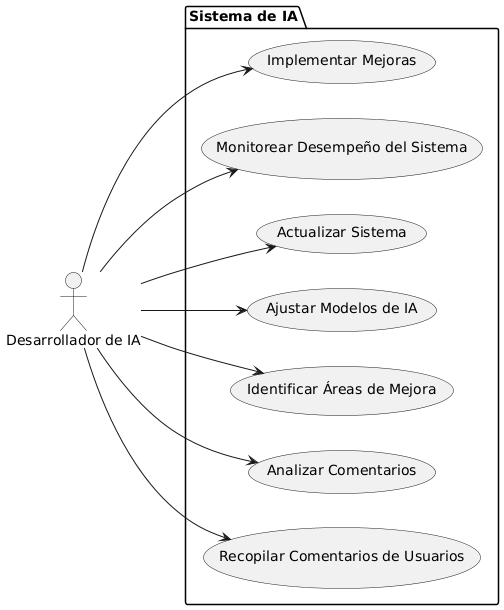

# Epica de Análisis

------
## Diagrama de Actividades
[Creado con plantuml](https://plantuml.com/es/)

{ align=center }
---
Este diagrama ilustra el proceso de implementación de un mecanismo de retroalimentación y mejora continua del sistema de IA, desde la recopilación de comentarios hasta la implementación de mejoras y monitoreo del sistema.
---

###
###

## Escenario MACP-57
El sistema debe generar recomendaciones de productos basadas en las preferencias del pepito perez como color, estilo y material. El sistema debe ajustar las recomendaciones de pepito  basándose en el historial de búsqueda y compra como usuario de la página. Por ende, pepito pérez tendrá varios resultados que coincidan exactamente o se aproximen a los criterios de búsqueda.  El sistema debe enviar notificaciones personalizadas sobre nuevos productos, ofertas y promociones basadas en las preferencias de PEPITO, El sistema debe aprender de las interacciones implícitas del usuario (como el tiempo de permanencia en ciertas páginas) para afinar las recomendaciones de productos.

<table id="customers">
  <tr class="idtext principal">
    <td>ID MACP-67</td>
  </tr>
  <tr class="single text">
    <td><strong>Requerimiento</strong>: implementar retroalimentación y mejora continua del sistema de ia ID MACP-67</td>
  </tr>
  <tr class="single gray">
    <td><strong>Historia de usuario</strong></td>
  </tr>
  <tr class="single text">
    <td>Como desarrollador de IA, quiero implementar un mecanismo de retroalimentación y mejora continua para el sistema de IA, permitiendo recopilar comentarios de los usuarios, identificar áreas de mejora y realizar ajustes iterativos en los modelos de aprendizaje automático para optimizar el rendimiento del sistema y la satisfacción del usuario.</td>
  </tr>
  <tr class="duo">
    <th class="gray"><strong>Estado de la tarea</strong></th>
    <th>En desarrollo</th>
    <th>En desarrollo</th>
  </tr>
  <tr class="single gray">
    <td><strong>Caso de uso (Pasos)</strong></td>
  </tr>
  <tr class="single text">
    <td>
        <ol>
            <li>Recopilación de Comentarios.</li>
            <li>Análisis de Retroalimentación.</li>
            <li>Identificación de Áreas de Mejora.</li>
            <li>Ajuste de Modelos.</li>
            <li>Implementación de Mejoras.</li>
            <li>Evaluación Continua.</li>     
        </ol>
    </td>
  </tr>
  <tr class="single gray">
    <td><strong>Criterios de aceptación</strong></td>
  </tr>
  <tr class="single text">
    <td>
        <ol>
            <li>Sistema de Retroalimentación Implementado: Debe existir un mecanismo funcional para recopilar comentarios de los usuarios.</li>
            <li>Análisis Efectivo: El sistema debe analizar y clasificar la retroalimentación para identificar áreas de mejora.</li>
            <li>Ajustes Realizados: Los ajustes en los modelos de IA deben basarse en la retroalimentación y mejorar el rendimiento del sistema.</li>
            <li>Pruebas y Validación: Las mejoras deben ser probadas y validadas para asegurar que aborden las áreas de mejora identificadas.</li>
            <li>Ciclo de Mejora Continua: Debe haber un proceso continuo de evaluación y ajuste basado en la retroalimentación reciente.</li>
            <li>Satisfacción del Usuario:La satisfacción del usuario con el sistema de IA debe mostrar una mejora tras implementar las mejoras.</li>                          
        </ol>
    </td>
  </tr>
 <tr class="duo">
    <th class="gray"><strong>Calidad</strong></th>
    <th>En desarrollo</th>
  </tr>
  <tr class="duo">
    <th class="gray"><strong>Versionamiento</strong></th>
    <th>En desarrollo</th>
  </tr>
</table>

---
## Diagrama de Caso de uso
[Creado con plantuml](https://plantuml.com/es/)

{ align=center }
---
Este diagrama muestra el rol del "Desarrollador de IA" y los casos de uso asociados al proceso de retroalimentación y mejora continua del sistema de IA, abarcando desde la recopilación de comentarios hasta la implementación de mejoras y monitoreo del sistema.
---
