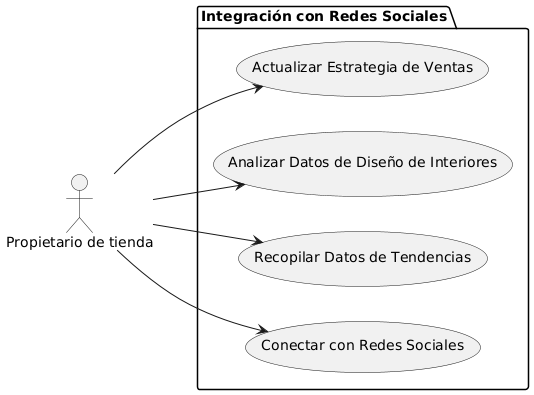

# Epica de Análisis

------
## Diagrama de Actividades
[Creado con plantuml](https://plantuml.com/es/)

{ align=center }
---
Este diagrama sigue el flujo de actividades del proceso de integración con redes sociales para el análisis de tendencias, y refleja los pasos principales de recopilación, análisis y utilización de datos para mejorar la estrategia de ventas.
---

###
###

## Escenario MACP-57
El sistema debe generar recomendaciones de productos basadas en las preferencias del pepito perez como color, estilo y material. El sistema debe ajustar las recomendaciones de pepito  basándose en el historial de búsqueda y compra como usuario de la página. Por ende, pepito pérez tendrá varios resultados que coincidan exactamente o se aproximen a los criterios de búsqueda.  El sistema debe enviar notificaciones personalizadas sobre nuevos productos, ofertas y promociones basadas en las preferencias de PEPITO, El sistema debe aprender de las interacciones implícitas del usuario (como el tiempo de permanencia en ciertas páginas) para afinar las recomendaciones de productos.

<table id="customers">
  <tr class="idtext principal">
    <td>ID MACP-68</td>
  </tr>
  <tr class="single text">
    <td><strong>Requerimiento</strong>: implementar integración con redes sociales para análisis de tendencias ID MACP-68</td>
  </tr>
  <tr class="single gray">
    <td><strong>Historia de usuario</strong></td>
  </tr>
  <tr class="single text">
    <td>Como propietario de una tienda en línea de muebles para el hogar, quiero implementar una integración con redes sociales, para analizar las tendencias de diseño de interiores y mobiliario en tiempo real y mejorar nuestra estrategia de ventas.</td>
  </tr>
  <tr class="duo">
    <th class="gray"><strong>Estado de la tarea</strong></th>
    <th>En desarrollo</th>
    <th>En desarrollo</th>
  </tr>
  <tr class="single gray">
    <td><strong>Caso de uso (Pasos)</strong></td>
  </tr>
  <tr class="single text">
    <td>
        <ol>
            <li>El propietario de la tienda accede al sistema de análisis de tendencias.</li>
            <li>El sistema se conecta con las redes sociales a través de APIs.</li>
            <li>El sistema recopila datos relacionados con diseño de interiores y mobiliario.</li>
            <li>El sistema analiza las menciones y tendencias en redes sociales utilizando algoritmos de análisis de datos.</li>
            <li>El sistema genera un informe con las tendencias emergentes y los temas más populares.</li>
            <li>El propietario revisa el informe y obtiene insights sobre las preferencias de los clientes.</li>
            <li>El propietario ajusta la estrategia de ventas y marketing en función de las tendencias identificadas</li>     
        </ol>
    </td>
  </tr>
  <tr class="single gray">
    <td><strong>Criterios de aceptación</strong></td>
  </tr>
  <tr class="single text">
    <td>
        <ol>
            <li>Conexión Exitosa: El sistema debe ser capaz de conectarse y autenticar las cuentas de redes sociales de forma efectiva.</li>
            <li>Recopilación de Datos: El sistema debe recopilar datos relevantes sobre tendencias de diseño y mobiliario en tiempo real desde las redes sociales.</li>
            <li>Análisis de Tendencias: El sistema debe analizar los datos recopilados y proporcionar un informe detallado sobre las tendencias emergentes.</li>
            <li>Precisión del Informe: El informe generado debe ser preciso y reflejar las verdaderas tendencias de diseño y mobiliario basadas en los datos recopilados.</li>
            <li>Usabilidad del Informe: El informe debe ser claro, comprensible y útil para la toma de decisiones estratégicas.</li>
            <li>Actualización en Tiempo Real: El sistema debe actualizarse con nueva información en tiempo real o con la frecuencia especificada</li>
            <li>Manejo de Errores: El sistema debe manejar errores de conexión o problemas con datos de manera efectiva y notificar al propietario con claridad.</li>                          
        </ol>
    </td>
  </tr>
 <tr class="duo">
    <th class="gray"><strong>Calidad</strong></th>
    <th>En desarrollo</th>
  </tr>
  <tr class="duo">
    <th class="gray"><strong>Versionamiento</strong></th>
    <th>En desarrollo</th>
  </tr>
</table>

---
## Diagrama de Caso de uso
[Creado con plantuml](https://plantuml.com/es/)

{ align=center }
---
Este diagrama muestra al propietario de la tienda como el actor principal, interactuando con los casos de uso para conectar con redes sociales, recopilar y analizar datos de tendencias, y actualizar la estrategia de ventas en función de los análisis realizados.
---
