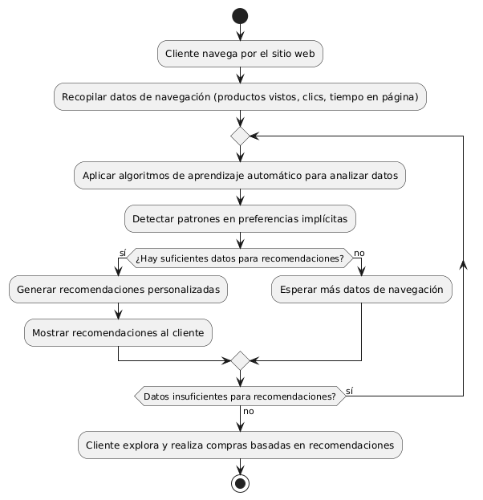
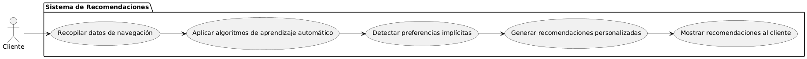

# Epica de Análisis

------
## Diagrama de Actividades
[Creado con plantuml](https://plantuml.com/es/)

{ align=center }
---
Este diagrama muestra el flujo de actividades para implementar un sistema de aprendizaje automático que detecta las preferencias implícitas de los clientes y ofrece recomendaciones personalizadas en función de sus interacciones en el sitio web.
---

###
###

## Escenario MACP-57
El sistema debe generar recomendaciones de productos basadas en las preferencias del pepito perez como color, estilo y material. El sistema debe ajustar las recomendaciones de pepito  basándose en el historial de búsqueda y compra como usuario de la página. Por ende, pepito pérez tendrá varios resultados que coincidan exactamente o se aproximen a los criterios de búsqueda.  El sistema debe enviar notificaciones personalizadas sobre nuevos productos, ofertas y promociones basadas en las preferencias de PEPITO, El sistema debe aprender de las interacciones implícitas del usuario (como el tiempo de permanencia en ciertas páginas) para afinar las recomendaciones de productos.

<table id="customers">
  <tr class="idtext principal">
    <td>ID MACP-69</td>
  </tr>
  <tr class="single text">
    <td><strong>Requerimiento</strong>: implementar aprendizaje automático para detectar preferencias implícitas ID MACP-69</td>
  </tr>
  <tr class="single gray">
    <td><strong>Historia de usuario</strong></td>
  </tr>
  <tr class="single text">
    <td>Como cliente de una tienda de muebles, quiero que la tienda utilice aprendizaje automático para detectar mis preferencias implícitas para ofrecerme recomendaciones de productos personalizadas y relevantes.</td>
  </tr>
  <tr class="duo">
    <th class="gray"><strong>Estado de la tarea</strong></th>
    <th>En desarrollo</th>
    <th>En desarrollo</th>
  </tr>
  <tr class="single gray">
    <td><strong>Caso de uso (Pasos)</strong></td>
  </tr>
  <tr class="single text">
    <td>
        <ol>
            <li>El cliente navega por el sitio web de la tienda de muebles.</li>
            <li>El sistema de la tienda recopila datos sobre las interacciones del cliente (p. ej., productos vistos, tiempo en página, clics).</li>
            <li>El sistema aplica algoritmos de aprendizaje automático para analizar los datos de navegación y detectar patrones en las preferencias implícitas del cliente.</li>
            <li>El sistema genera recomendaciones de productos basadas en el análisis de preferencias implícitas.</li>
            <li>El cliente recibe recomendaciones personalizadas en su perfil o en la página de inicio.</li>
            <li>El cliente explora las recomendaciones y realiza compras según sus intereses.</li>     
        </ol>
    </td>
  </tr>
  <tr class="single gray">
    <td><strong>Criterios de aceptación</strong></td>
  </tr>
  <tr class="single text">
    <td>
        <ol>
            <li>Recopilación de Datos: El sistema debe recopilar datos precisos sobre la navegación del cliente en tiempo real.</li>
            <li>Análisis de Preferencias: EEl sistema debe usar algoritmos de aprendizaje automático para detectar patrones en los datos de navegación y preferencias.</li>
            <li>Generación de Recomendaciones: Las recomendaciones deben ser personalizadas y relevantes, actualizándose en tiempo real según el comportamiento del cliente.</li>
            <li>Presentación de Recomendaciones: Las recomendaciones deben ser visibles y accesibles en el perfil y/o página de inicio del cliente, con información suficiente sobre los productos.</li>
            <li>Relevancia y Efectividad: Las recomendaciones deben ser precisas y alineadas con los intereses del cliente, mejorando la tasa de conversión y la satisfacción.</li>                          
        </ol>
    </td>
  </tr>
 <tr class="duo">
    <th class="gray"><strong>Calidad</strong></th>
    <th>En desarrollo</th>
  </tr>
  <tr class="duo">
    <th class="gray"><strong>Versionamiento</strong></th>
    <th>En desarrollo</th>
  </tr>
</table>

---
## Diagrama de Caso de uso
[Creado con plantuml](https://plantuml.com/es/)

{ align=center }
---
Este diagrama de casos de uso muestra cómo el cliente interactúa con el sistema de recomendaciones, desde la recopilación de datos hasta la visualización de recomendaciones personalizadas basadas en el aprendizaje automático.
---
