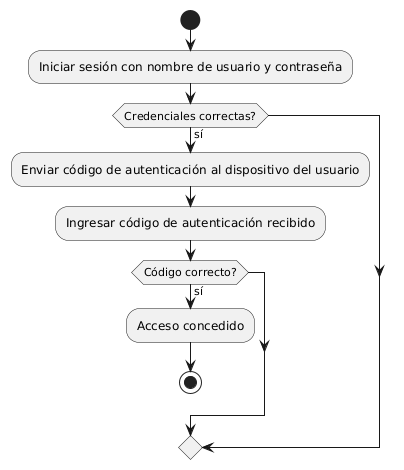
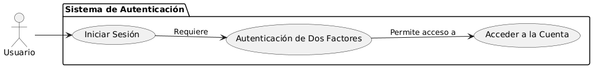

# Seguridad en frontend y backend MACP-70

------
## Diagrama de Actividades
[Creado con plantuml](https://plantuml.com/es/)

{ align=center}

En un sistema de autenticación de dos factores, los usuarios deben proporcionar dos formas de verificación para acceder a sus cuentas. Este proceso aumenta la seguridad, combinando algo que el usuario sabe (contraseña) con algo que posee (código enviado al dispositivo). A continuación, se detalla el flujo de este proceso.
---

###

## Escenario MACP-70
Como usuario del software de muebles, quiero que se implemente una autenticación de dos factores para acceder a mi cuenta, para garantizar una capa adicional de seguridad. Seguido quiero que todos mis datos sensibles, como información de pago y detalles personales, estén encriptados tanto en tránsito como en reposo, para evitar accesos no autorizados. Y viéndolo como equipo de desarrollo, proporcionaremos recursos educativos y capacitación sobre seguridad cibernética a todos los usuarios del software de muebles, para promover prácticas seguras y mitigar el riesgo de vulnerabilidades causadas por el factor humano

<table id="customers">
  <tr class="idtext principal">
    <td>ID MACP-71</td>
  </tr>
  <tr class="single text">
    <td><strong>Requerimiento</strong>: Diseñar refuerzo de la autenticación de usuario ID MACP-71</td>
  </tr>
  <tr class="single gray">
    <td><strong>Historia de usuario</strong></td>
  </tr>
  <tr class="single text">
    <td>Como usuario del software de muebles, quiero que se implemente una autenticación de dos factores para acceder a mi cuenta, para garantizar una capa adicional de seguridad y proteger mi información personal y financiera</td>
  </tr>
  <tr class="duo">
    <th class="gray"><strong>Estado de la tarea</strong></th>
    <th>En desarrollo</th>
  </tr>
  <tr class="single gray">
    <td><strong>Caso de uso (Pasos)</strong></td>
  </tr>
  <tr class="single text">
       <td>
         </ol>
          <li>El usuario accede a la página de inicio de sesión.</li>
          <li>El usuario ingresa su nombre de usuario y contraseña.</li>
          <li>El sistema verifica la contraseña. Si es correcta, solicita el segundo factor de autenticación.</li>
          <li>El usuario proporciona el segundo factor (código recibido por SMS o generado por una aplicación).</li>
          <li>El sistema valida el segundo factor.</li>
           <li>Si el segundo factor es válido, el usuario es autenticado y accede a su cuenta</li>
        <ol>
  </td>
  </tr>
  <tr class="single gray">
    <td><strong>Criterios de aceptación</strong></td>
  </tr>
  <tr class="single text">
    <td>
        <ol>
           <li>	Autenticación de Dos Factores:El sistema debe requerir dos formas de autenticación para acceder a la cuenta del usuario: la contraseña y un segundo factor (por ejemplo, un código enviado por SMS o una aplicación de autenticación).</li>
<li>Configuración del 2FA:Los usuarios deben poder habilitar y configurar la autenticación de dos factores desde su perfil en la plataforma.El proceso de configuración debe incluir una opción para elegir el método de autenticación adicional (SMS, aplicación de autenticación)</li>
<li>Proceso de Inicio de Sesión:Tras ingresar la contraseña correctamente, el sistema debe solicitar el segundo factor de autenticación.El segundo factor debe ser validado antes de conceder el acceso a la cuenta.</li>
<li>Recuperación de Cuenta:Los usuarios deben tener un proceso claro para recuperar el acceso a su cuenta en caso de pérdida del segundo factor, como un número de teléfono de respaldo o un correo electrónico para recuperación.</li>
<li>Notificaciones:Los usuarios deben recibir notificaciones por correo electrónico o SMS cuando se habilite o deshabilite la autenticación de dos factores.</li>
<li>Compatibilidad y Usabilidad:La funcionalidad de 2FA debe ser compatible con todos los navegadores y dispositivos soportados por el software.</li>
        </ol>
    </td>
  </tr>
 <tr class="duo">
    <th class="gray"><strong>Calidad</strong></th>
    <th>En desarrollo</th>
  </tr>
  <tr class="duo">
    <th class="gray"><strong>Versionamiento</strong></th>
    <th>En desarrollo</th>
  </tr>
</table>

---
## Diagrama de Caso de uso
[Creado con plantuml](https://plantuml.com/es/)

{align=center}

Este diagrama de casos de uso ilustra el proceso de autenticación en un sistema. Muestra cómo un usuario inicia sesión, requiere autenticación de dos factores para mayor seguridad y, finalmente, accede a su cuenta. Cada caso de uso está claramente definido, destacando las interacciones y dependencias entre ellos
---
