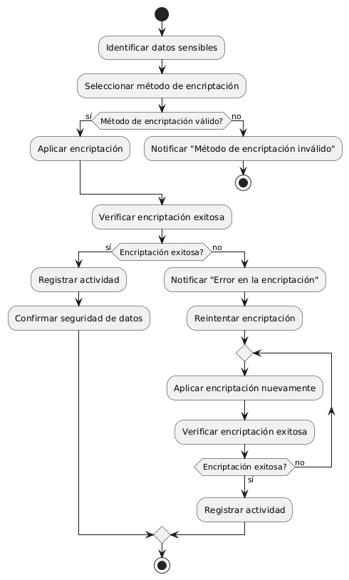
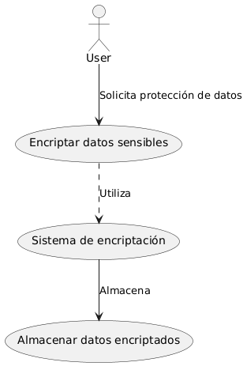

# Seguridad en frontend y backend MACP-70

------
## Diagrama de Actividades
[Creado con plantuml](https://plantuml.com/es/)

{ align=center }

Para garantizar la protección de datos sensibles, es crucial implementar un proceso robusto de encriptación. Este diagrama de actividad detalla el flujo desde la identificación de los datos hasta la verificación de la encriptación, abordando validaciones y posibles errores para asegurar la confidencialidad y seguridad de la información
---

###
###

## 
## 

## Escenario MACP-70
Como usuario del software de muebles, quiero que se implemente una autenticación de dos factores para acceder a mi cuenta, para garantizar una capa adicional de seguridad. Seguido quiero que todos mis datos sensibles, como información de pago y detalles personales, estén encriptados tanto en tránsito como en reposo, para evitar accesos no autorizados. Y viéndolo como equipo de desarrollo, proporcionaremos recursos educativos y capacitación sobre seguridad cibernética a todos los usuarios del software de muebles, para promover prácticas seguras y mitigar el riesgo de vulnerabilidades causadas por el factor humano

<table id="customers">
  <tr class="idtext principal">
    <td>ID MACP-72</td>
  </tr>
  <tr class="single text">
    <td><strong>Requerimiento</strong>: Implementar encriptación de datos sensibles ID MACP-72</td>
  </tr>
  <tr class="single gray">
    <td><strong>Historia de usuario</strong></td>
  </tr>
  <tr class="single text">
    <td>Como usuario del software, quiero la tranquilidad de saber que mis datos confidenciales, como información de pago y detalles personales, están completamente protegidos contra accesos no autorizados</td>
  </tr>
  <tr class="duo">
    <th class="gray"><strong>Estado de la tarea</strong></th>
    <th>En desarrollo</th>
  </tr>
  <tr class="single gray">
    <td><strong>Caso de uso (Pasos)</strong></td>
  </tr>
  <tr class="single text">
       <td>
         </ol>
         <li>El usuario solicita acceso a datos sensibles.</li>
         <li>El sistema verifica los permisos del usuario.</li>
         <li>El sistema desencripta los datos utilizando la clave correspondiente.</li>
         <li>Los datos desencriptados son mostrados al usuario</li>
        <ol>
    </td>
  </tr>
  <tr class="single gray">
    <td><strong>Criterios de aceptación</strong></td>
  </tr>
  <tr class="single text">
    <td>
        <ol>
           <li>Tipo de Encriptación: Los datos sensibles deben ser encriptados utilizando un algoritmo de encriptación robusto y aceptado, como AES-256. Se debe utilizar una clave de encriptación segura y gestionada adecuadamente.</li>
 <li>Almacenamiento de Claves: Las claves de encriptación deben ser almacenadas de manera segura, utilizando un gestor de claves o un módulo de seguridad de hardware (HSM)</li>
 <li>Protección de Datos en Tránsito: Los datos sensibles deben ser encriptados durante la transmisión entre el cliente y el servidor utilizando TLS (Transport Layer Security)</li>
 <li>Protección de Datos en Reposo: Los datos sensibles deben estar encriptados cuando están almacenados en bases de datos o en sistemas de archivos</li>
 <li>Acceso No Autorizado: Los datos sensibles deben estar protegidos contra accesos no autorizados, asegurando que solo los usuarios o sistemas autorizados puedan descifrar la información.</li>
 <li>Registros de Auditoría: Deben existir registros de auditoría que documenten las operaciones de encriptación y desencriptación, así como el acceso a las claves de encriptación</li>
 <li>Cumplimiento Normativo: La implementación de la encriptación debe cumplir con las regulaciones y estándares aplicables (por ejemplo, GDPR, PCI-DSS)</li>
 <li>Desempeño: La encriptación no debe afectar significativamente el desempeño del sistema, asegurando tiempos de respuesta aceptables. Pruebas y Validación: Deben realizarse pruebas exhaustivas para garantizar que la encriptación se aplica correctamente y que no hay vulnerabilidades en la implementación</li>
        </ol>
    </td>
  </tr>
 <tr class="duo">
    <th class="gray"><strong>Calidad</strong></th>
    <th>En desarrollo</th>
  </tr>
  <tr class="duo">
    <th class="gray"><strong>Versionamiento</strong></th>
    <th>En desarrollo</th>
  </tr>
</table>

---
## Diagrama de Caso de uso
[Creado con plantuml](https://plantuml.com/es/)

{ align=center }

El diagrama de casos de uso muestra cómo un usuario interactúa con el sistema para garantizar la encriptación de datos sensibles. El usuario solicita protección para sus datos, que son encriptados por el sistema y almacenados de manera segura, asegurando así la confidencialidad y protección contra accesos no autorizados
---
