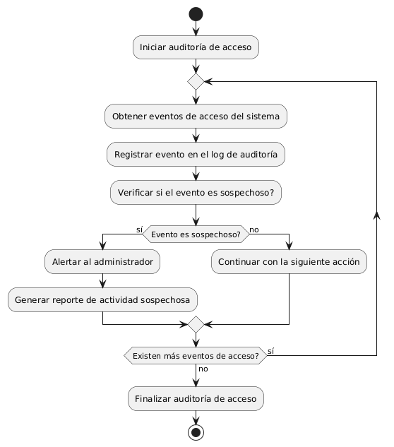
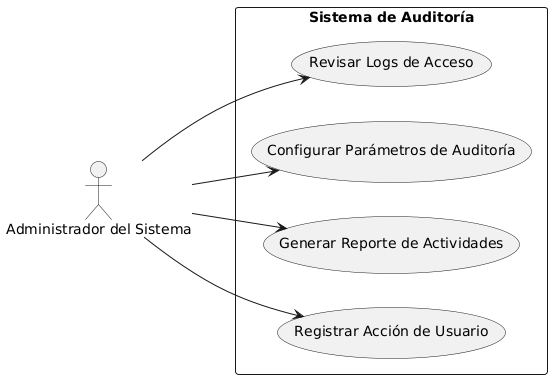

# Seguridad en frontend y backend MACP-70

------
## Diagrama de Actividades
[Creado con plantuml](https://plantuml.com/es/)

{ align=Center }

"Implementar auditoría de acceso permite a los administradores rastrear y revisar todas las acciones realizadas por los usuarios dentro del software. Este proceso ayuda a identificar y responder a comportamientos sospechosos, asegurando la integridad del sistema y protegiendo contra accesos no autorizados o actividades maliciosas.
---

## Escenario MACP-70
Como usuario del software de muebles, quiero que se implemente una autenticación de dos factores para acceder a mi cuenta, para garantizar una capa adicional de seguridad. Seguido quiero que todos mis datos sensibles, como información de pago y detalles personales, estén encriptados tanto en tránsito como en reposo, para evitar accesos no autorizados. Y viéndolo como equipo de desarrollo, proporcionaremos recursos educativos y capacitación sobre seguridad cibernética a todos los usuarios del software de muebles, para promover prácticas seguras y mitigar el riesgo de vulnerabilidades causadas por el factor humano

<table id="customers">
  <tr class="idtext principal">
    <td>ID MACP-73</td>
  </tr>
  <tr class="single text">
    <td><strong>Requerimiento</strong>: Implementar auditoría de acceso ID MACP-73</td>
  </tr>
  <tr class="single gray">
    <td><strong>Historia de usuario</strong></td>
  </tr>
  <tr class="single text">
    <td>Como administrador del sistema, quiero tener la capacidad de rastrear y auditar todas las acciones realizadas por los usuarios dentro del software, para identificar y responder a cualquier actividad sospechosa.</td>
  </tr>
  <tr class="duo">
    <th class="gray"><strong>Estado de la tarea</strong></th>
    <th>En desarrollo</th>
  </tr>
  <tr class="single gray">
    <td><strong>Caso de uso (Pasos)</strong></td>
  </tr>
  <tr class="single text">
       <td>
         </ol>
         <li>El usuario introduce sus credenciales y solicita iniciar sesión.</li>
         <li>El sistema valida las credenciales y concede acceso.</li>
         <li>El sistema registra la acción de inicio de sesión en el log de auditoría, incluyendo la fecha, hora y el usuario.</li>
         <li>El usuario realiza cambios en los datos</li>
         <li>El sistema actualiza los datos y registra la acción de modificación en el log de auditoría</li>
        <ol>
    </td>
  </tr>
  <tr class="single gray">
    <td><strong>Criterios de aceptación</strong></td>
  </tr>
  <tr class="single text">
    <td>
        <ol>
           <li>Registro de Actividades:El sistema debe registrar todas las acciones realizadas por los usuarios, incluyendo inicio de sesión, cierre de sesión, creación, modificación y eliminación de datos.
Los registros deben incluir detalles como la fecha y hora, el usuario que realizó la acción, y el tipo de acción realizada

<li>Acceso a los Registros:Los administradores deben poder acceder a los registros de auditoría a través de una interfaz de administración segura.
El acceso a los registros debe estar restringido a usuarios con privilegios de administrador

<li>Visualización de Registros:La interfaz de administración debe permitir filtrar y buscar registros por fecha, usuario, tipo de acción, y otros parámetros relevantes. Los registros deben poder exportarse en formatos comunes como CSV o PDF para su análisis y reporte.</li>

<li>Notificaciones de Actividad Sospechosa:El sistema debe permitir la configuración de alertas para actividades sospechosas, como múltiples intentos fallidos de inicio de sesión o modificaciones no autorizadas de datos.
Las alertas deben ser enviadas a los administradores mediante notificaciones por correo electrónico o dentro del sistema</li>

<li>Integridad de los Registros:Los registros de auditoría deben estar protegidos contra modificaciones no autorizadas y deben ser inalterables.
Debe haber mecanismos para asegurar la integridad de los registros, como firmas digitales o hashes.</li>

<li>Conformidad con Regulaciones:El sistema debe cumplir con las regulaciones y normativas de privacidad y seguridad de datos aplicables, como GDPR, CCPA, etc.</li>
        </ol>
    </td>
  </tr>
 <tr class="duo">
    <th class="gray"><strong>Calidad</strong></th>
    <th>En desarrollo</th>
  </tr>
  <tr class="duo">
    <th class="gray"><strong>Versionamiento</strong></th>
    <th>En desarrollo</th>
  </tr>
</table>

---
## Diagrama de Caso de uso
[Creado con plantuml](https://plantuml.com/es/)

{ align=center }

El diagrama de casos de uso muestra cómo un Administrador del Sistema interactúa con el Sistema de Auditoría para rastrear y controlar las acciones de los usuarios. Incluye la capacidad de registrar actividades, generar reportes, configurar parámetros y revisar logs, garantizando una supervisión efectiva y la seguridad del sistema
---
