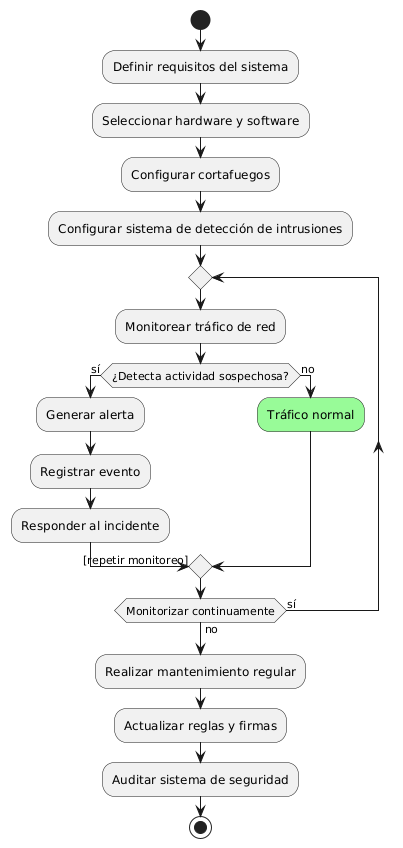
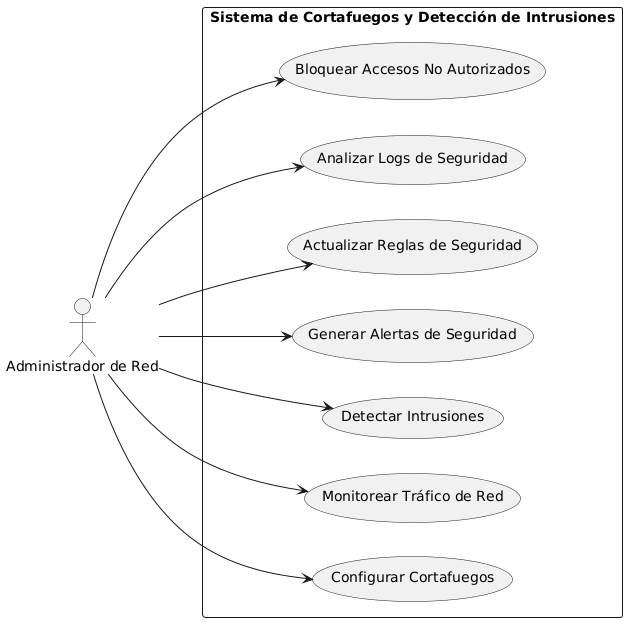

# Seguridad en frontend y backend MACP-70

------
## Diagrama de Actividades
[Creado con plantuml](https://plantuml.com/es/)

{ align=Center }

Implementar un sistema de cortafuegos y detección de intrusiones es esencial para proteger una red de accesos no autorizados y ciberataques. Este proceso incluye definir requisitos, seleccionar herramientas adecuadas, configurar sistemas de seguridad, monitorear tráfico y realizar mantenimientos regulares para garantizar la integridad y disponibilidad de los sistemas críticos.
---

###

## Escenario MACP-70
Como usuario del software de muebles, quiero que se implemente una autenticación de dos factores para acceder a mi cuenta, para garantizar una capa adicional de seguridad. Seguido quiero que todos mis datos sensibles, como información de pago y detalles personales, estén encriptados tanto en tránsito como en reposo, para evitar accesos no autorizados. Y viéndolo como equipo de desarrollo, proporcionaremos recursos educativos y capacitación sobre seguridad cibernética a todos los usuarios del software de muebles, para promover prácticas seguras y mitigar el riesgo de vulnerabilidades causadas por el factor humano

<table id="customers">
  <tr class="idtext principal">
    <td>ID MACP-74</td>
  </tr>
  <tr class="single text">
    <td><strong>Requerimiento</strong>: Implementación de cortafuegos y detección de intrusiones ID MACP-74</td>
  </tr>
  <tr class="single gray">
    <td><strong>Historia de usuario</strong></td>
  </tr>
  <tr class="single text">
    <td>Como administrador de red, quiero implementar un sistema de cortafuegos y detección de intrusiones para proteger mi red de accesos no autorizados, ataques cibernéticos y malware, garantizar la seguridad de la información y el buen funcionamiento de los sistemas críticos</td>
  </tr>
  <tr class="duo">
    <th class="gray"><strong>Estado de la tarea</strong></th>
    <th>En desarrollo</th>
  </tr>
  <tr class="single gray">
    <td><strong>Caso de uso (Pasos)</strong></td>
  </tr>
  <tr class="single text">
       <td>
         </ol>
  <li>El administrador accede a la interfaz de configuración del cortafuegos.</li>
        <li>Define las reglas de filtrado de tráfico</li>
        <li>Aplica y guarda la configuración</li>
        <li>Verifica que las reglas estén funcionando correctament</li>
  <li>Realiza pruebas para asegurar que el IDS detecta adecuadamente las amenazas</li>
        <ol>
    </td>
  </tr>
  <tr class="single gray">
    <td><strong>Criterios de aceptación</strong></td>
  </tr>
  <tr class="single text">
    <td>
        <ol>
             <li>Configuración del Cortafuegos:Reglas de Filtrado: El cortafuegos debe estar configurado con reglas de filtrado       adecuadas que permitan o bloqueen el tráfico según las políticas definidas</li>
             <li>Actualización de Reglas: Las reglas del cortafuegos deben ser actualizables de forma sencilla para adaptarse a nuevas  amenazas y requisitos</li>
             <li>Registro de Actividades: El cortafuegos debe registrar las actividades de tráfico y los eventos relevantes para su análisis posterior</li>
             <li>Implementación del Sistema de Detección de Intrusiones (IDS):
             Detección de Amenazas: El IDS debe ser capaz de identificar patrones de tráfico que indiquen posibles intrusiones<l/i>
             ataques o comportamientos anómalos.
             <li>Alertas: Debe generar alertas en tiempo real cuando se detecte un comportamiento sospechoso o una amenaza.
            Registro de Incidentes: Debe registrar todos los eventos y alertas para un análisis detallado y auditoría posterior.</li>
            <li>Integración y Pruebas:
            Compatibilidad: El cortafuegos y el IDS deben integrarse sin problemas con la infraestructura de red existente.</li>
            <li>Pruebas de Funcionamiento: Deben realizarse pruebas exhaustivas para asegurarse de que el cortafuegos y el IDS funcionan correctamente y no interrumpen los servicios legítimos.</li>
            <li>Documentación: Debe haber documentación completa sobre la configuración, las políticas de seguridad y los procedimientos de respuesta a incidentes</li>
            <li>Seguridad y Mantenimiento:
            Actualizaciones de Seguridad: Los sistemas deben recibir actualizaciones regulares para protegerse contra las amenazas emergentes</li>
            <li>Revisión de Políticas: Las políticas de cortafuegos y de IDS deben ser revisadas y ajustadas periódicamente para mantener la eficacia</li>
        </ol>
    </td>
  </tr>
 <tr class="duo">
    <th class="gray"><strong>Calidad</strong></th>
    <th>En desarrollo</th>
  </tr>
  <tr class="duo">
    <th class="gray"><strong>Versionamiento</strong></th>
    <th>En desarrollo</th>
  </tr>
</table>

---
## Diagrama de Caso de uso
[Creado con plantuml](https://plantuml.com/es/)

{ align=center }

"Este diagrama de casos de uso ilustra el sistema de cortafuegos y detección de intrusiones para una red. Destinado a administradores de red, muestra las principales funciones del sistema, como configurar cortafuegos, monitorear tráfico, detectar intrusiones y gestionar alertas, asegurando así la protección y seguridad de la red.
---
