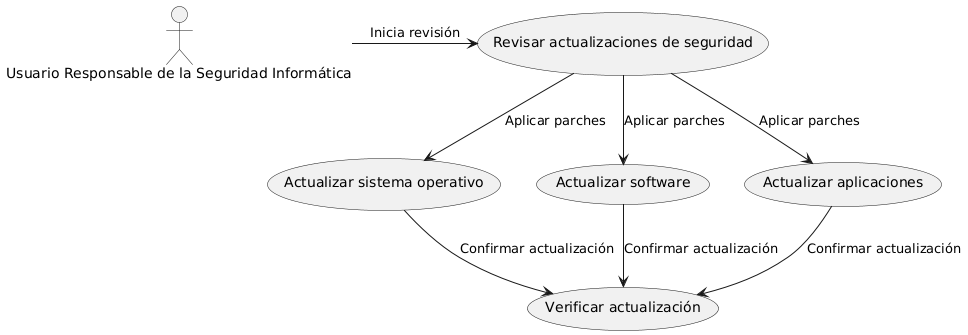

# Seguridad en frontend y backend MACP-70

------
## Diagrama de Actividades
[Creado con plantuml](https://plantuml.com/es/)

{ align=Center }

Para mantener la seguridad informática, es crucial implementar actualizaciones regulares en sistemas operativos y aplicaciones. Este proceso asegura que el dispositivo esté protegido contra vulnerabilidades y amenazas emergentes. El siguiente diagrama de actividad ilustra el flujo de trabajo necesario para verificar, descargar, y aplicar estas actualizaciones de manera efectiva
---

###

## Escenario MACP-70
Como usuario del software de muebles, quiero que se implemente una autenticación de dos factores para acceder a mi cuenta, para garantizar una capa adicional de seguridad. Seguido quiero que todos mis datos sensibles, como información de pago y detalles personales, estén encriptados tanto en tránsito como en reposo, para evitar accesos no autorizados. Y viéndolo como equipo de desarrollo, proporcionaremos recursos educativos y capacitación sobre seguridad cibernética a todos los usuarios del software de muebles, para promover prácticas seguras y mitigar el riesgo de vulnerabilidades causadas por el factor humano

<table id="customers">
  <tr class="idtext principal">
    <td>ID MACP-75</td>
  </tr>
  <tr class="single text">
    <td><strong>Requerimiento</strong>: Implemantar actualizaciones de seguridad regulares ID MACP-75</td>
  </tr>
  <tr class="single gray">
    <td><strong>Historia de usuario</strong></td>
  </tr>
  <tr class="single text">
    <td>Como usuario responsable de la seguridad informática, quiero asegurarme de que mi sistema operativo, software y aplicaciones estén actualizados con los últimos parches de seguridad para proteger mi dispositivo y mis datos de vulnerabilidades, exploits y malware conocidos.</td>
  </tr>
  <tr class="duo">
    <th class="gray"><strong>Estado de la tarea</strong></th>
    <th>En desarrollo</th>
  </tr>
  <tr class="single gray">
    <td><strong>Caso de uso (Pasos)</strong></td>
  </tr>
  <tr class="single text">
       <td>
         </ol>
  <li>El sistema operativo detecta que hay actualizaciones de seguridad disponibles</li>
  <li>El sistema notifica al usuario de la disponibilidad de las actualizaciones.</li>
  <li>El usuario selecciona la opción para aplicar las actualizaciones.</li>
  <li>El sistema descarga e instala las actualizaciones.</li>
  <li>El sistema notifica al usuario que las actualizaciones se han instalado correctamente y, si es necesario, solicita un reinicio.</li>
        <ol>
    </td>
  </tr>
  <tr class="single gray">
    <td><strong>Criterios de aceptación</strong></td>
  </tr>
  <tr class="single text">
    <td>
        <ol>
   Actualizaciones del Sistema Operativo<td>
<li>Frecuencia: Las actualizaciones de seguridad deben aplicarse al menos una vez al mes.
<li>Confirmación de Aplicación: Después de aplicar una actualización, el sistema debe confirmar que la actualización se ha instalado correctamente sin errores.<li>
Reinicio Necesario: El sistema debe notificar si se requiere un reinicio para completar la instalación de la actualización y debe reiniciarse automáticamente o permitir que el usuario lo haga de manera fácil.</li>
<td>
Actualizaciones de Software y Aplicaciones:<td>
<li>Frecuencia: Las actualizaciones deben verificarse al menos una vez al mes o en función de la política del software.
<li>Notificaciones: El sistema debe notificar al usuario cuando haya una nueva actualización disponible para el software y aplicaciones.
<li>Instalación Automática: Las actualizaciones deben poder instalarse automáticamente o con un solo clic, reduciendo el esfuerzo manual del usuario.
<li>Compatibilidad: Las actualizaciones deben ser compatibles con la versión actual del software y no deben causar problemas de compatibilidad o errores.
<td>
Registro y Reportes:<td>
<li>Registro de Actividades: Debe haber un registro detallado de todas las actualizaciones aplicadas, incluyendo fecha, hora, y tipo de actualización.
<li>Informes de Estado: El sistema debe generar informes periódicos sobre el estado de las actualizaciones y alertar sobre cualquier fallo en la aplicación de las mismas.
<td>
Seguridad y Privacidad:<td>
<li>Verificación de Fuente: Las actualizaciones deben provenir de fuentes verificadas y confiables para evitar la instalación de parches maliciosos.
<li>Integridad de Actualizaciones: Debe haber mecanismos para verificar la integridad de las actualizaciones antes de su instalación para asegurar que no han sido comprometidas.
        </ol>
    </td>
  </tr>
 <tr class="duo">
    <th class="gray"><strong>Calidad</strong></th>
    <th>En desarrollo</th>
  </tr>
  <tr class="duo">
    <th class="gray"><strong>Versionamiento</strong></th>
    <th>En desarrollo</th>
  </tr>
</table>

---
## Diagrama de Caso de uso
[Creado con plantuml](https://plantuml.com/es/)

{ align=center }

"En la gestión de la seguridad informática, es crucial implementar actualizaciones regulares para proteger sistemas contra vulnerabilidades y malware. Este diagrama de casos de uso ilustra cómo un usuario responsable revisa, aplica y verifica actualizaciones de seguridad en el sistema operativo, software y aplicaciones para mantener la protección continua..
---
