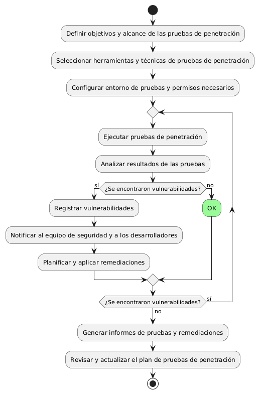
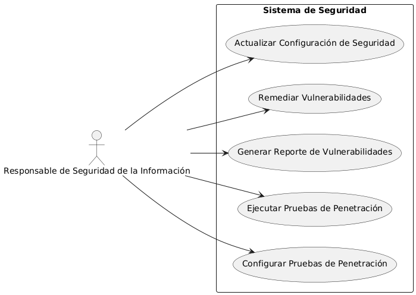

# Seguridad en frontend y backend MACP-70

------
## Diagrama de Actividades
[Creado con plantuml](https://plantuml.com/es/)

{ align=Center }

Este diagrama ilustra el proceso de pruebas de penetración, que comienza con la definición de objetivos y selección de herramientas. Incluye la ejecución de pruebas, análisis de resultados, y manejo de vulnerabilidades. Finaliza con la generación de informes y la actualización del plan de pruebas, asegurando una seguridad robusta.
---

## Escenario MACP-70
Como usuario del software de muebles, quiero que se implemente una autenticación de dos factores para acceder a mi cuenta, para garantizar una capa adicional de seguridad. Seguido quiero que todos mis datos sensibles, como información de pago y detalles personales, estén encriptados tanto en tránsito como en reposo, para evitar accesos no autorizados. Y viéndolo como equipo de desarrollo, proporcionaremos recursos educativos y capacitación sobre seguridad cibernética a todos los usuarios del software de muebles, para promover prácticas seguras y mitigar el riesgo de vulnerabilidades causadas por el factor humano

<table id="customers">
  <tr class="idtext principal">
    <td>ID MACP-76</td>
  </tr>
  <tr class="single text">
    <td><strong>Requerimiento</strong>: Diseñar pruebas de penetración continuas ID MACP-76</td>
  </tr>
  <tr class="single gray">
    <td><strong>Historia de usuario</strong></td>
  </tr>
  <tr class="single text">
    <td>Como responsable de la seguridad de la información, quiero implementar pruebas de penetración continuas en mis sistemas y aplicaciones para identificar y remediar vulnerabilidades de forma proactiva, reducir el riesgo de ataques cibernéticos y garantizar la seguridad de la información confidencial.</td>
  </tr>
  <tr class="duo">
    <th class="gray"><strong>Estado de la tarea</strong></th>
    <th>En desarrollo</th>
  </tr>
  <tr class="single gray">
    <td><strong>Caso de uso (Pasos)</strong></td>
  </tr>
  <tr class="single text">
       <td>
         </ol>
<li>El administrador inicia sesión en la plataforma de pruebas de penetración.</li>
<li>Selecciona la opción para configurar una nueva prueba.</li>
<li>Define los parámetros de la prueba, como la frecuencia, el alcance y las aplicaciones a evaluar.</li>
<li>Configura las notificaciones y los umbrales de severidad.</li>
<li>Guarda y activa la configuración.</li>
        <ol>
    </td>
  </tr>
  <tr class="single gray">
    <td><strong>Criterios de aceptación</strong></td>
  </tr>
  <tr class="single text">
    <td>
        <ol>
   Cobertura Integral:<td>
<li>Las pruebas de penetración deben cubrir todos los sistemas y aplicaciones relevantes dentro del entorno
<li>Debe incluir tanto la infraestructura (servidores, redes) como las aplicaciones (web, móviles).
<td>
Automatización:<td>
<li>Las pruebas deben ser automatizadas y ejecutadas de forma continua o en intervalos regulares definidos (por ejemplo, diariamente, semanalmente).
<li>Debe haber integración con el sistema de CI/CD para asegurar que las pruebas se ejecuten cada vez que se despliegue una nueva versión.
<td>
Detección de Vulnerabilidades:<td>
<li>El sistema debe identificar y reportar vulnerabilidades de forma precisa, clasificándolas según su severidad (crítica, alta, media, baja).
<li>Las pruebas deben ser capaces de detectar vulnerabilidades conocidas y emergentes.
<td>
Generación de Informes:<td>
<li>Los informes generados deben ser claros, comprensibles y detallados, proporcionando información suficiente para que el equipo de desarrollo pueda remediar las vulnerabilidades.
<li>Deben incluir recomendaciones específicas para la mitigación de riesgos.
<td>
Integración con Herramientas de Gestión:<td>
<li>Los resultados de las pruebas deben integrarse con las herramientas de gestión de vulnerabilidades y tickets para facilitar el seguimiento y resolución de problemas.
<td>
Escalabilidad y Rendimiento:<td>
<li>La solución de pruebas de penetración debe ser escalable y no debe afectar negativamente el rendimiento del sistema durante las pruebas.
<td>
Cumplimiento Normativo:<td>
La solución debe cumplir con los requisitos normativos y de cumplimiento aplicables (por ejemplo, GDPR, HIPAA, PCI-DSS).<li>
<td>
Acceso y Control:<td>
<li>El acceso a las herramientas de prueba y a los informes debe estar restringido y controlado para asegurar que solo personal autorizado pueda ver los resultados y realizar acciones basadas en ellos.
        </ol>
    </td>
  </tr>
 <tr class="duo">
    <th class="gray"><strong>Calidad</strong></th>
    <th>En desarrollo</th>
  </tr>
  <tr class="duo">
    <th class="gray"><strong>Versionamiento</strong></th>
    <th>En desarrollo</th>
  </tr>
</table>

---
## Diagrama de Caso de uso
[Creado con plantuml](https://plantuml.com/es/)

{ align=center }

Para asegurar la integridad de los sistemas y aplicaciones, es crucial implementar pruebas de penetración continuas. Este proceso proactivo permite identificar y remediar vulnerabilidades de manera constante, reduciendo el riesgo de ataques cibernéticos y protegiendo la información confidencial. A continuación, se describe el flujo de trabajo para llevar a cabo estas pruebas
---
