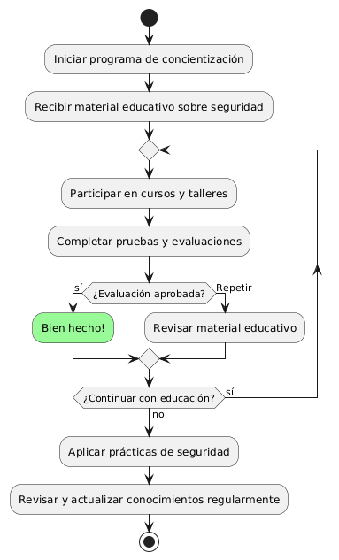
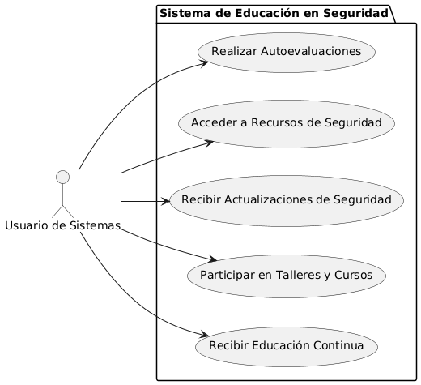

# Seguridad en frontend y backend MACP-70

------
## Diagrama de Actividades
[Creado con plantuml](https://plantuml.com/es/)

{ align=Center }

La educación y concientización en seguridad informática son esenciales para proteger a los usuarios de ciberamenazas y fraudes. Implementar un programa continuo de formación asegura que los usuarios adquieran conocimientos actualizados y prácticas seguras, promoviendo un uso responsable de la tecnología y reduciendo el riesgo de robos de información.
---

## Escenario MACP-70
Como usuario del software de muebles, quiero que se implemente una autenticación de dos factores para acceder a mi cuenta, para garantizar una capa adicional de seguridad. Seguido quiero que todos mis datos sensibles, como información de pago y detalles personales, estén encriptados tanto en tránsito como en reposo, para evitar accesos no autorizados. Y viéndolo como equipo de desarrollo, proporcionaremos recursos educativos y capacitación sobre seguridad cibernética a todos los usuarios del software de muebles, para promover prácticas seguras y mitigar el riesgo de vulnerabilidades causadas por el factor humano

<table id="customers">
  <tr class="idtext principal">
    <td>ID MACP-77</td>
  </tr>
  <tr class="single text">
    <td><strong>Requerimiento</strong>: implementar educación y concientización sobre seguridad ID MACP-77</td>
  </tr>
  <tr class="single gray">
    <td><strong>Historia de usuario</strong></td>
  </tr>
  <tr class="single text">
    <td>Como usuario de sistemas informáticos y dispositivos electrónicos, quiero recibir educación y concientización continua sobre las mejores prácticas de seguridad para protegerme de ciberamenazas, fraudes y robos de información, y utilizar la tecnología de manera responsable y segura.</td>
  </tr>
  <tr class="duo">
    <th class="gray"><strong>Estado de la tarea</strong></th>
    <th>En desarrollo</th>
  </tr>
  <tr class="single gray">
    <td><strong>Caso de uso (Pasos)</strong></td>
  </tr>
  <tr class="single text">
       <td>
         </ol>
    <li>El usuario completa un módulo educativo.</li>
    <li>El sistema ofrece una evaluación relacionada con el módulo.</li>
    <li>El usuario responde a las preguntas del cuestionario.</li>
    <li>El sistema proporciona retroalimentación sobre las respuestas y muestra los resultados</li>
        <ol>
    </td>
  </tr>
  <tr class="single gray">
    <td><strong>Criterios de aceptación</strong></td>
  </tr>
  <tr class="single text">
    <td>
        <ol>
   Contenido Relevante y Actualizado:<td>
<li>El material educativo debe cubrir temas relevantes como protección contra ciberamenazas, fraudes, robos de información, y prácticas seguras de uso de tecnología.
<li>El contenido debe estar actualizado con las últimas amenazas y mejores prácticas.
<td>
Formatos Diversos:<td>
<li>La educación debe estar disponible en diversos formatos como módulos de e-learning, webinars, videos, infografías y guías escritas.
<li>El contenido debe ser accesible en diferentes dispositivos (PC, móviles, tabletas).
<td>
Accesibilidad y Usabilidad:<td>
<li>El material debe ser accesible para usuarios con diferentes niveles de habilidad técnica.
Debe ofrecerse en varios idiomas si es necesario.
<td>
Evaluación y Retroalimentación:<td>
<li>Debe haber evaluaciones para medir el entendimiento y la retención del contenido (ej. cuestionarios, encuestas).
<li>Se debe proporcionar retroalimentación inmediata y recursos adicionales para aquellos que necesiten más ayuda.
<td>
Integración y Seguimiento:<td>
<li>La educación debe integrarse en los procesos de onboarding para nuevos usuarios y ser parte de la formación continua para usuarios existentes.
<li>Debe haber un sistema de seguimiento para asegurar que los usuarios completen los cursos y se actualicen periódicamente.
<td>
Registro y Reportes:<td>
<li>Debe haber un sistema de registro para seguir el progreso de los usuarios en los cursos de seguridad.
<li>Los administradores deben tener acceso a reportes sobre la participación y el desempeño de los usuarios.
        </ol>
    </td>
  </tr>
 <tr class="duo">
    <th class="gray"><strong>Calidad</strong></th>
    <th>En desarrollo</th>
  </tr>
  <tr class="duo">
    <th class="gray"><strong>Versionamiento</strong></th>
    <th>En desarrollo</th>
  </tr>
</table>

---
## Diagrama de Caso de uso
[Creado con plantuml](https://plantuml.com/es/)

{ align=center }

"El diagrama de casos de uso presentado ilustra cómo un usuario interactúa con un sistema diseñado para ofrecer educación y concientización sobre seguridad. Este sistema incluye funcionalidades para recibir educación continua, participar en talleres, recibir actualizaciones de seguridad, acceder a recursos y realizar autoevaluaciones para mejorar la protección contra ciberamenazas."
---
