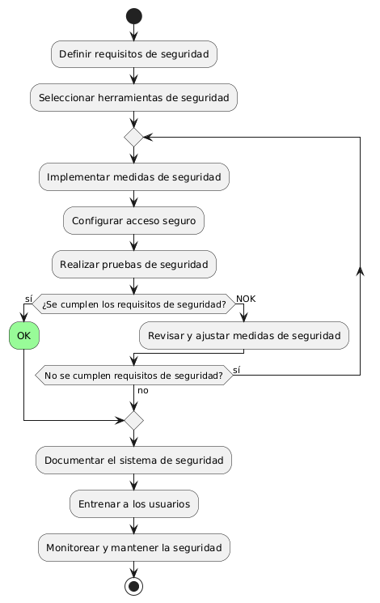
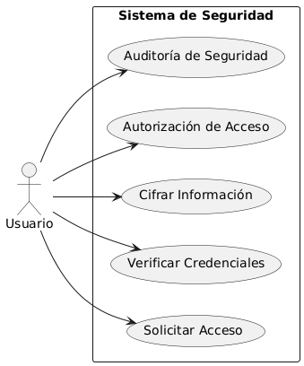

# Seguridad en frontend y backend MACP-70

------
## Diagrama de Actividades
[Creado con plantuml](https://plantuml.com/es/)

{ align=Center }

"Para garantizar la protección de información confidencial y un acceso seguro al sistema, es esencial implementar un robusto sistema de seguridad. Este diagrama de actividad detalla el proceso desde la definición de requisitos hasta la monitorización continua, asegurando que todas las medidas de seguridad sean efectivas y adecuadas.".
---

## Escenario MACP-70
Como usuario del software de muebles, quiero que se implemente una autenticación de dos factores para acceder a mi cuenta, para garantizar una capa adicional de seguridad. Seguido quiero que todos mis datos sensibles, como información de pago y detalles personales, estén encriptados tanto en tránsito como en reposo, para evitar accesos no autorizados. Y viéndolo como equipo de desarrollo, proporcionaremos recursos educativos y capacitación sobre seguridad cibernética a todos los usuarios del software de muebles, para promover prácticas seguras y mitigar el riesgo de vulnerabilidades causadas por el factor humano

<table id="customers">
  <tr class="idtext principal">
    <td>ID MACP-78</td>
  </tr>
  <tr class="single text">
    <td><strong>Requerimiento</strong>: implementar criterio de aceptación ID MACP-78</td>
  </tr>
  <tr class="single gray">
    <td><strong>Historia de usuario</strong></td>
  </tr>
  <tr class="single text">
    <td>Como usuario quiero proteger la información confidencial y garantizar el acceso seguro al sistema. Para ello solicito un buen sistema de seguridad.</td>
  </tr>
  <tr class="duo">
    <th class="gray"><strong>Estado de la tarea</strong></th>
    <th>En desarrollo</th>
  </tr>
  <tr class="single gray">
    <td><strong>Caso de uso (Pasos)</strong></td>
  </tr>
  <tr class="single text">
       <td>
         </ol>
      <li>El usuario ingresa su nombre de usuario y contraseña.</li>
      <li>El sistema valida las credenciales.</li>
      <li>Si las credenciales son correctas, el usuario recibe acceso al sistema.</li>
      <li>Si se requiere, el usuario completa la autenticación de dos factores</li>
      <li>El sistema actualiza los permisos del usuario</li>
        <ol>
    </td>
  </tr>
  <tr class="single gray">
    <td><strong>Criterios de aceptación</strong></td>
  </tr>
  <tr class="single text">
    <td>
        <ol>
   Autenticación Segura:<td>
<li>El sistema debe soportar múltiples métodos de autenticación como contraseñas, autenticación de dos factores (2FA) y autenticación biométrica (si es aplicable).
<li>Las contraseñas deben ser almacenadas de manera segura, utilizando técnicas de hash y salting.
<td>
Autorización:<td>
<li>El sistema debe permitir la asignación de roles y permisos a los usuarios, asegurando que solo puedan acceder a los datos y funciones para los que están autorizados.
<li>Debe haber un mecanismo para la gestión y revisión de permisos de los usuarios, permitiendo ajustes cuando sea necesario.
<td>
Cifrado de Datos:<td>
<li>Todos los datos sensibles deben estar cifrados tanto en tránsito como en reposo utilizando estándares de cifrado reconocidos (por ejemplo, AES-256).
<li>El sistema debe tener un método seguro para la gestión y almacenamiento de claves de cifrado.
<td>
Registro y Monitoreo:<td>
<li>El sistema debe registrar todas las actividades de acceso y cambios importantes, como inicios de sesión, modificaciones de datos y cambios de configuración.
<li>Debe haber herramientas de monitoreo y alertas que notifiquen sobre actividades sospechosas o no autorizadas.
<td>
Seguridad en la Red<td>
<li>El sistema debe emplear firewalls y otras medidas de seguridad de red para protegerse contra ataques externos.
<li>Todas las comunicaciones entre el cliente y el servidor deben estar cifradas (por ejemplo, usando HTTPS).
<td>
Protección Contra Vulnerabilidades<td>
<li>El sistema debe estar protegido contra vulnerabilidades comunes, como inyecciones SQL, cross-site scripting (XSS) y cross-site request forgery (CSRF).
<li>Debe haber un proceso de pruebas de seguridad y auditorías regulares para identificar y remediar posibles vulnerabilidades.
<td>
Respaldo y Recuperación:<td>
<li>Debe haber un mecanismo para la realización periódica de respaldos de datos, que permita la recuperación en caso de pérdida o daño.<li>El sistema debe tener un plan de recuperación ante desastres que se pruebe regularmente.
        </ol>
    </td>
  </tr>
 <tr class="duo">
    <th class="gray"><strong>Calidad</strong></th>
    <th>En desarrollo</th>
  </tr>
  <tr class="duo">
    <th class="gray"><strong>Versionamiento</strong></th>
    <th>En desarrollo</th>
  </tr>
</table>

---
## Diagrama de Caso de uso
[Creado con plantuml](https://plantuml.com/es/)

{ align=center }

"Este diagrama de casos de uso ilustra cómo un sistema de seguridad protege la información confidencial y garantiza el acceso seguro. Los actores interactúan con el sistema a través de casos de uso esenciales como la verificación de credenciales y la auditoría de seguridad, asegurando la integridad y protección de datos."
---
