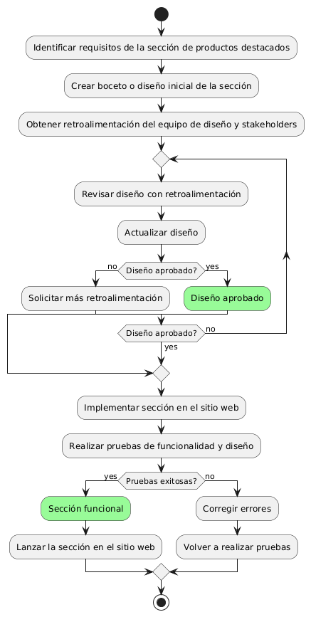

# CREAR UNA SECCION DE PRODUCTOS DESTACADOS EN LA PAGINA DE INCIO 

------
## Diagrama de Actividades
[Creado con plantuml](https://plantuml.com/es/)

{ align=center }

Este diagrama de actividad ilustra el proceso para diseñar e implementar una sección de productos destacados en una página de inicio. Incluye identificar requisitos, crear y revisar el diseño con retroalimentación, implementar la sección, realizar pruebas y corregir errores antes de lanzar la sección en el sitio web.
---
###

## Caso de uso historia Crear paginas de Inicio 
El usuario que quiere comprar muebles puede entrar a un menú principal o una página de inicio , el cual tiene enlaces a otras  páginas principales como inicio, catálogos, contactos entre otros más. Dentro de la misma página cuando el usuario pase el ratón sobre las opciones del menú principal se desplegará los submenús con más opciones; la página le proporcionará enlaces rápidos para iniciar sesión o registrarse; si la persona quiere entrar a la página desde su móvil, lo podrá hacer con toda comodidad ya que el menú es responsivo para móviles. También si el usuario quiere consultar las redes sociales lo podrá hacer ya que el menú de inicio tiene enlaces  a las mismas, y no menos importante la capacidad de ver todos los productos recomendados o más vendidos de la página.

<table id="customers">
  <tr class="idtext principal">
    <td>ID MACP-8</td>
  </tr>
  <tr class="single text">
    <td><strong>Requerimiento</strong>:Diseñar una sección de productos destacados en la página de inicio ID MACP-8</td>
  </tr>
  <tr class="single gray">
    <td><strong>Historia de usuario</strong></td>
  </tr>
  <tr class="single text">
    <td>Como usuario, quiero encontrar una sección de productos destacados en la página de inicio del sitio web Para descubrir nuevos productos que podrían ser de mi interés y explorar las ofertas actuales de la empresa.</td>
  </tr>
  <tr class="duo">
    <th class="gray"><strong>Estado de la tarea</strong></th>
    <th>En desarrollo</th>
  </tr>
  <tr class="single gray">
    <td><strong>Caso de uso (Pasos)</strong></td>
  </tr>
  <tr class="single text">
    <td>
        <ol>
            <li> El usuario accede a la página de inicio del sitio web.</li>
            <li>El sistema muestra una sección de productos destacados en la página de inicio.</li>
            <li>El usuario puede interactuar con los productos destacados.</li>
        </ol>
    </td>
  </tr>
  <tr class="single gray">
    <td><strong>Criterios de aceptación</strong></td>
  </tr>
  <tr class="single text">
    <td>
        <ol>
               <li>Diseño Visual Atractivo: La sección de productos destacados debe tener un diseño visual atractivo y coherente con la estética general del sitio web. Debe incluir imágenes de alta calidad y textos descriptivos claros.</li>
               <li>Organización y Presentación: Los productos deben estar organizados de manera que faciliten la navegación, Deben estar claramente etiquetados como "destacados" o "ofertas especiales".</li>
               <li>Información del Producto: Cada producto destacado debe mostrar al menos una imagen, el nombre del producto y el precio. Debe haber un enlace claro a la página de detalles del producto.</li>
               <li>Interactividad: Los usuarios deben poder hacer clic en los productos destacados para ver más detalles. Los enlaces deben funcionar correctamente y llevar a la página del producto seleccionado.</li>
               <li>Adaptabilidad: La sección debe ser completamente funcional en diferentes dispositivos y tamaños de pantalla (escritorio, tabletas, móviles).</li>
               <li>Actualización de Contenido: La sección debe poder actualizarse fácilmente para reflejar nuevos productos destacados, ofertas o cambios en el inventario.</li>
               <li>Accesibilidad: La sección debe cumplir con las pautas de accesibilidad web para asegurar que sea utilizable por personas con discapacidades.</li>
        </ol>
    </td>
  </tr>
 <tr class="duo">
    <th class="gray"><strong>Calidad</strong></th>
    <th>En desarrollo</th>
  </tr>
  <tr class="duo">
    <th class="gray"><strong>Versionamiento</strong></th>
    <th>En desarrollo</th>
  </tr>
</table>

---
## Diagrama de Caso de uso
[Creado con plantuml](https://plantuml.com/es/)

{ align=center }

La sección de productos destacados en la página de inicio permite a los usuarios visualizar productos destacados, descubrir nuevos artículos de interés y explorar ofertas actuales. Esto facilita la navegación del sitio, destacando productos relevantes y promociones, y mejorando la experiencia del usuario al facilitar el acceso a lo más reciente y atractivo
---
