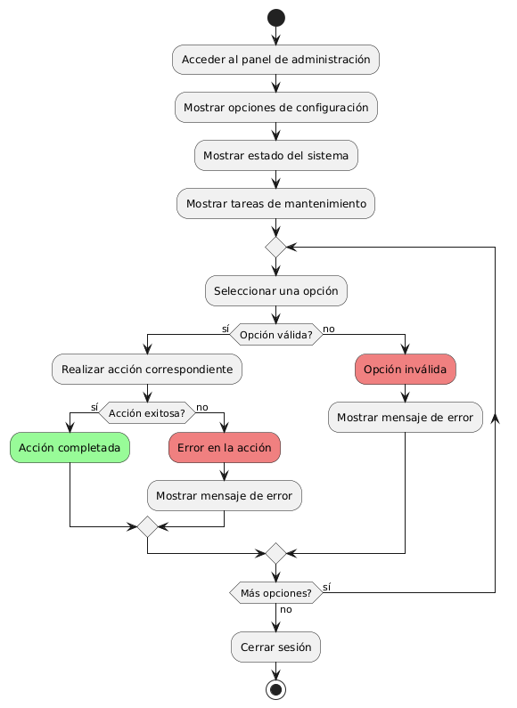
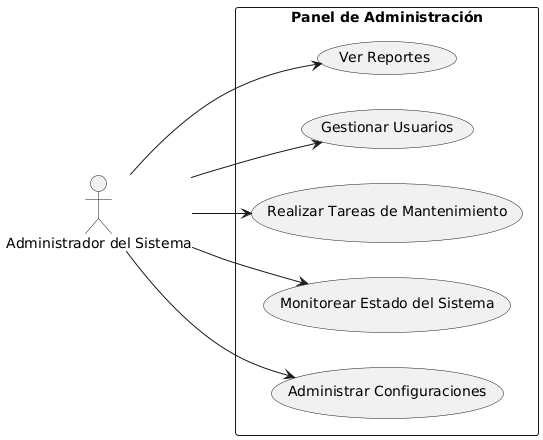

# Administración del Sitio MACP-79

------
## Diagrama de Actividades
[Creado con plantuml](https://plantuml.com/es/)

{ align=Center }

administración diseñado ofrece una interfaz intuitiva y fácil de usar para los administradores del sistema. Permite gestionar configuraciones, monitorear el estado del sistema y realizar tareas de mantenimiento sin requerir conocimientos técnicos avanzados, garantizando eficiencia y simplicidad en la administración del entorno.
---

## Escenario MACP-79
Queremos un backend intuitivo para la gestión del sitio, con diferentes niveles de acceso para diferentes tipos de usuarios (admin, editor, etc.) y la capacidad para ofrecer el contenido del sitio en varios idiomas y  copias de seguridad automáticas de la información del sitio. Ejemplo: Backups diarios automatizados. Luego y como para terminar una medidas de seguridad para proteger la información del usuario y del sitio.

<table id="customers">
  <tr class="idtext principal">
    <td>ID MACP-80</td>
  </tr>
  <tr class="single text">
    <td><strong>Requerimiento</strong>: implementar panel de administración fácil de usar ID MACP-80</td>
  </tr>
  <tr class="single gray">
    <td><strong>Historia de usuario</strong></td>
  </tr>
  <tr class="single text">
    <td>Como administrador del sistema, quiero un panel de administración fácil de usar e intuitivo que me permita administrar de manera eficiente las configuraciones, monitorear el estado del sistema y realizar tareas de mantenimiento sin necesidad de conocimientos técnicos avanzados.</td>
  </tr>
  <tr class="duo">
    <th class="gray"><strong>Estado de la tarea</strong></th>
    <th>En desarrollo</th>
  </tr>
  <tr class="single gray">
    <td><strong>Caso de uso (Pasos)</strong></td>
  </tr>
  <tr class="single text">
       <td>
         </ol>
      <li>Inicio de Sesión</li>
      <li>Visualización del Panel de Administración</li>
      <li>Configuración del Sistema</li>
      <li>Monitoreo del Estado del Sistema</li>
      <li>Realización de Tareas de Mantenimiento</li>
      <li>Gestión de Usuarios</li>
      <li>Recepción de Notificaciones y Alertas</li>
        <ol>
    </td>
  </tr>
  <tr class="single gray">
    <td><strong>Criterios de aceptación</strong></td>
  </tr>
  <tr class="single text">
    <td>
        <ol>
 <li>Interfaz Intuitiva: El panel de administración debe tener una interfaz gráfica clara y fácil de navegar, con elementos de diseño que faciliten su uso, como menús desplegables, botones visibles y mensajes de ayuda</li>
 <li>Acceso Controlado: Solo los usuarios con privilegios de administrador deben poder acceder al panel de administración. El sistema debe manejar roles y permisos de manera efectiva</li>
 <li>Configuración del Sistema: Debe permitir a los administradores ajustar todas las configuraciones del sistema necesarias para su funcionamiento, tales como configuración de usuarios, ajustes de seguridad y parámetros del sistema</li>
 <li>Monitoreo del Estado: Debe proporcionar una visión general del estado del sistema en tiempo real, incluyendo métricas clave como uso de CPU, memoria, espacio en disco y actividad de usuarios.</li>
 <li>Tareas de Mantenimiento: Debe ofrecer herramientas para realizar tareas de mantenimiento rutinarias, como limpieza de logs, gestión de backups y actualización del sistema.</li>
 <li>Facilidad de Uso: El panel debe permitir a los administradores realizar tareas comunes con un mínimo de clics. Debe haber asistencia integrada como tutoriales o guías rápidas.</li>
 <li>Compatibilidad de Navegadores: Debe ser accesible y funcional en los navegadores web más comunes (Chrome, Firefox, Edge, Safari) sin problemas de compatibilidad.</li>
 <li>Feedback y Notificaciones: El sistema debe proporcionar retroalimentación clara sobre las acciones realizadas, incluyendo confirmaciones de éxito o mensajes de error comprensibles.</li>
 <li>Seguridad: Las comunicaciones con el panel deben estar protegidas mediante HTTPS, y el panel debe tener medidas para prevenir ataques comunes como inyecciones SQL o XSS.</li>
        </ol>
    </td>
  </tr>
 <tr class="duo">
    <th class="gray"><strong>Calidad</strong></th>
    <th>En desarrollo</th>
  </tr>
  <tr class="duo">
    <th class="gray"><strong>Versionamiento</strong></th>
    <th>En desarrollo</th>
  </tr>
</table>

---
## Diagrama de Caso de uso
[Creado con plantuml](https://plantuml.com/es/)

{ align=center }

Este diagrama de casos de uso ilustra las funcionalidades clave de un panel de administración intuitivo. Diseñado para administradores del sistema, incluye casos de uso como la gestión de configuraciones, monitoreo del estado del sistema, mantenimiento, gestión de usuarios y visualización de reportes. Facilita una administración eficiente sin conocimientos técnicos avanzados.
---
