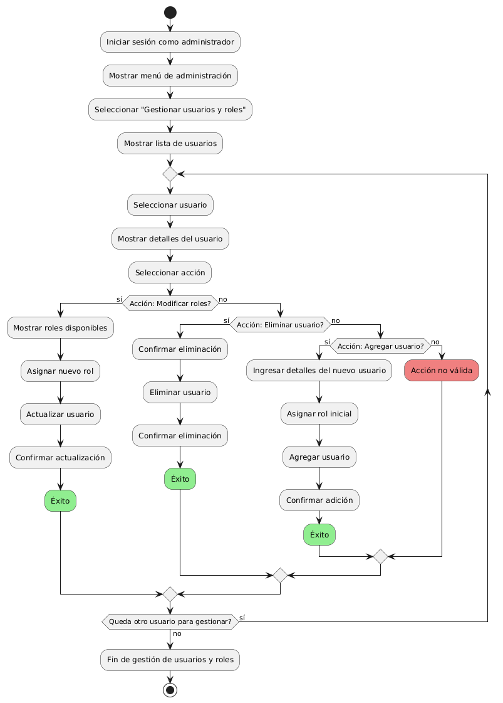
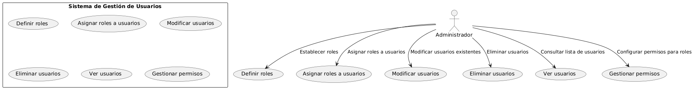

# Administración del Sitio MACP-79

------
## Diagrama de Actividades
[Creado con plantuml](https://plantuml.com/es/)

{ align=left }

El diagrama de actividad para la gestión de usuarios y roles ilustra cómo un administrador del sistema puede gestionar accesos y permisos dentro de una aplicación. Permite la asignación de roles, la adición y eliminación de usuarios, y asegura la correcta administración de los niveles de acceso para proteger la información confidencial."
---

## Escenario MACP-79
Queremos un backend intuitivo para la gestión del sitio, con diferentes niveles de acceso para diferentes tipos de usuarios (admin, editor, etc.) y la capacidad para ofrecer el contenido del sitio en varios idiomas y  copias de seguridad automáticas de la información del sitio. Ejemplo: Backups diarios automatizados. Luego y como para terminar una medidas de seguridad para proteger la información del usuario y del sitio.

<table id="customers">
  <tr class="idtext principal">
    <td>ID MACP-82</td>
  </tr>
  <tr class="single text">
    <td><strong>Requerimiento</strong>: Crear gestión de usuarios y roles ID MACP-82</td>
  </tr>
  <tr class="single gray">
    <td><strong>Historia de usuario</strong></td>
  </tr>
  <tr class="single text">
    <td>Como administrador del sistema, quiero establecer diferentes niveles de acceso para distintos tipos de usuarios (administrador, editor, etc.), para controlar las acciones que pueden realizar dentro de la aplicación y proteger la información confidencial.</td>
  </tr>
  <tr class="duo">
    <th class="gray"><strong>Estado de la tarea</strong></th>
    <th>En desarrollo</th>
  </tr>
  <tr class="single gray">
    <td><strong>Caso de uso (Pasos)</strong></td>
  </tr>
  <tr class="single text">
       <td>
         </ol>
      <li>El administrador accede a la sección de gestión de roles</li>
      <li>Selecciona la opción para crear un nuevo rol.</li>
      <li>Introduce el nombre y descripción del rol.</li>
      <li>Guarda el nuevo rol.</li>
      <li>El nuevo rol aparece en la lista de roles disponibles.</li>
        <ol>
  
    </td>
  </tr>
  <tr class="single gray">
    <td><strong>Criterios de aceptación</strong></td>
  </tr>
  <tr class="single text">
    <td>
        <ol>
Creación de Roles<td>
Criterio: El sistema debe permitir a los administradores crear nuevos roles con nombres y descripciones personalizados.
Aprobación: Se ha creado un rol con un nombre y descripción específicos, y el rol se muestra correctamente en la lista de roles disponibles.
<td>
Gestión de Roles<td>
<li>Criterio: El sistema debe permitir a los administradores editar y eliminar roles existentes.
<li>Aprobación: Los cambios realizados en los roles se reflejan en la interfaz de usuario y las modificaciones se aplican correctamente.
<td>
Asignación de Permisos a Roles<td>
<li>Criterio: El sistema debe permitir a los administradores asignar y revocar permisos para cada rol.
<li>Aprobación: Los permisos asignados a un rol afectan las acciones que los usuarios con ese rol pueden realizar dentro de la aplicación.
<td>
Gestión de Usuarios<td>
<li>Criterio: El sistema debe permitir a los administradores crear, editar y eliminar usuarios.
<li>Aprobación: Los usuarios se crean, actualizan y eliminan correctamente, y los cambios se reflejan en la interfaz de usuario.
<td>
Asignación de Roles a Usuarios<td>
<li>Criterio: El sistema debe permitir a los administradores asignar y cambiar roles de los usuarios.
<li>Aprobación: Los usuarios tienen el rol correcto asignado y los permisos correspondientes a su rol.
<td>
Acceso Basado en Roles<td>
<li>Criterio: Los usuarios deben poder realizar solo las acciones permitidas por sus roles.
<li>Aprobación: Los usuarios sólo pueden acceder y ejecutar funcionalidades basadas en los permisos asignados a su rol.
<td>
Interfaz de Usuario<td>
<li>Criterio: La interfaz de gestión de usuarios y roles debe ser intuitiva y fácil de usar.
<li>Aprobación: Los administradores pueden navegar por la interfaz sin dificultad y realizar las tareas de gestión sin problemas.
<td>
Seguridad<td>
<li>Criterio: Los cambios en roles y permisos deben registrarse y auditarse adecuadamente.
<li>Aprobación: Los registros de auditoría muestran los cambios realizados y los usuarios responsables de dichos cambios.
        </ol>
    </td>
  </tr>
 <tr class="duo">
    <th class="gray"><strong>Calidad</strong></th>
    <th>En desarrollo</th>
  </tr>
  <tr class="duo">
    <th class="gray"><strong>Versionamiento</strong></th>
    <th>En desarrollo</th>
  </tr>
</table>

---
## Diagrama de Caso de uso
[Creado con plantuml](https://plantuml.com/es/)

{ align=center }

El diagrama de casos de uso muestra cómo un administrador del sistema gestiona usuarios y roles. Permite definir roles, asignar permisos, modificar y eliminar usuarios, y visualizar la lista de usuarios. Este diagrama ayuda a entender las interacciones clave entre el administrador y las funcionalidades del sistema de gestión."
---
