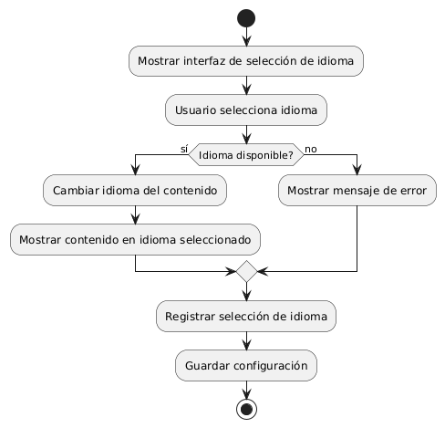
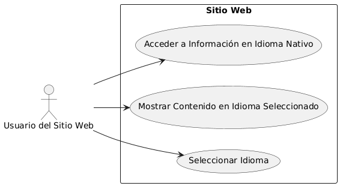

# Administración del Sitio MACP-79

------
## Diagrama de Actividades
[Creado con plantuml](https://plantuml.com/es/)

{ align=left }

"Implementar soporte para múltiples idiomas en un sitio web mejora la accesibilidad y la experiencia del usuario global. Permitir a los visitantes seleccionar su idioma nativo no solo facilita la comprensión del contenido, sino que también refuerza la inclusión y el valor que se le otorga a cada usuario internacional
---

## Escenario MACP-79
Queremos un backend intuitivo para la gestión del sitio, con diferentes niveles de acceso para diferentes tipos de usuarios (admin, editor, etc.) y la capacidad para ofrecer el contenido del sitio en varios idiomas y  copias de seguridad automáticas de la información del sitio. Ejemplo: Backups diarios automatizados. Luego y como para terminar una medidas de seguridad para proteger la información del usuario y del sitio.

<table id="customers">
  <tr class="idtext principal">
    <td>ID MACP-83</td>
  </tr>
  <tr class="single text">
    <td><strong>Requerimiento</strong>: implementar soporte para múltiples idiomasID MACP-83</td>
  </tr>
  <tr class="single gray">
    <td><strong>Historia de usuario</strong></td>
  </tr>
  <tr class="single text">
    <td>Como usuario del sitio web, quiero tener la opción de cambiar el idioma del contenido a mi idioma nativo para poder acceder y comprender fácilmente la información, y sentirme incluido y valorado como visitante internacional.</td>
  </tr>
  <tr class="duo">
    <th class="gray"><strong>Estado de la tarea</strong></th>
    <th>En desarrollo</th>
  </tr>
  <tr class="single gray">
    <td><strong>Caso de uso (Pasos)</strong></td>
  </tr>
  <tr class="single text">
       <td>
         </ol>
      <li>El usuario hace clic en el menú de idiomas</li>
      <li>El usuario selecciona el idioma deseado</li>
      <li>El sistema carga el contenido en el idioma seleccionado.</li>
      <li>El sistema guarda la preferencia de idioma para futuras visitas.</li>
        <ol>
  
    </td>
  </tr>
  <tr class="single gray">
    <td><strong>Criterios de aceptación</strong></td>
  </tr>
  <tr class="single text">
    <td>
        <ol>
Cambio de Idioma<td>
<li>El usuario debe poder cambiar el idioma del sitio web a través de una opción visible en la interfaz (como un menú desplegable en la parte superior o inferior de la página).
<li>Los idiomas disponibles deben estar claramente indicados en el menú de selección.
<td>
Persistencia del Idioma Seleccionado<td>
<li>El idioma seleccionado por el usuario debe persistir durante la sesión y también debe recordarse en futuras visitas, preferentemente a través de cookies o almacenamiento local.
<td>
Traducción Completa<td>
<li>Todo el contenido del sitio web (texto, botones, menús, mensajes de error, etc.) debe estar traducido correctamente en todos los idiomas soportados.
<li>El sitio debe ofrecer traducciones en los idiomas especificados sin errores gramaticales o de contexto.
<td>
Soporte de Idiomas Adicionales<td>
<li>El sistema debe permitir agregar nuevos idiomas en el futuro sin requerir una reestructuración significativa.
<td>
Interfaz Adaptativa<td>
<li>La interfaz del sitio web debe adaptarse correctamente a los diferentes idiomas, manejando adecuadamente el formato de fecha, hora y números según las convenciones del idioma seleccionado.
<td>
Accesibilidad y Usabilidad:<td>
<li>La función de cambio de idioma debe ser accesible y fácil de usar para todos los usuarios, incluidos aquellos con discapacidades.
<li>La opción de cambio de idioma debe ser visible y fácil de encontrar en todas las páginas del sitio.
<td>
Desempeño<td>
<li>El cambio de idioma no debe causar tiempos de carga excesivos ni afectar negativamente el desempeño del sitio web.
<td>
Consistencia en el Contexto<td>
<li>Las traducciones deben mantener la coherencia con el contexto original, asegurando que el significado y la intención sean claros en todos los idiomas.
        </ol>
    </td>
  </tr>
 <tr class="duo">
    <th class="gray"><strong>Calidad</strong></th>
    <th>En desarrollo</th>
  </tr>
  <tr class="duo">
    <th class="gray"><strong>Versionamiento</strong></th>
    <th>En desarrollo</th>
  </tr>
</table>

---
## Diagrama de Caso de uso
[Creado con plantuml](https://plantuml.com/es/)

{ align=center }

La implementación de soporte para múltiples idiomas en un sitio web mejora la accesibilidad y la experiencia del usuario al permitir que los visitantes elijan su idioma preferido. Esto asegura que el contenido sea comprendido fácilmente y que los usuarios internacionales se sientan incluidos y valorados.
---
