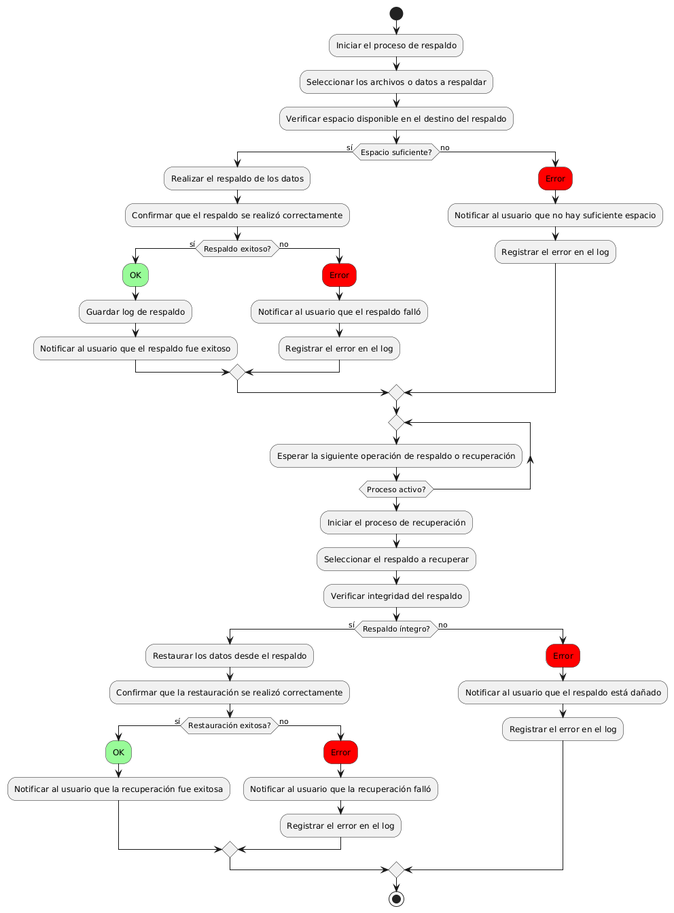
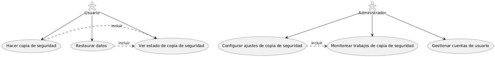

# Administración del Sitio MACP-79

------
## Diagrama de Actividades
[Creado con plantuml](https://plantuml.com/es/)

{ align=left }

"El sistema de respaldo y recuperación asegura la protección de datos cruciales, permitiendo su restauración en caso de pérdida o fallos del sistema. Este proceso involucra seleccionar datos, verificar el espacio disponible, realizar el respaldo, y confirmar su integridad, garantizando así la seguridad y disponibilidad de la información."
---

## Escenario MACP-79
Queremos un backend intuitivo para la gestión del sitio, con diferentes niveles de acceso para diferentes tipos de usuarios (admin, editor, etc.) y la capacidad para ofrecer el contenido del sitio en varios idiomas y  copias de seguridad automáticas de la información del sitio. Ejemplo: Backups diarios automatizados. Luego y como para terminar una medidas de seguridad para proteger la información del usuario y del sitio.

<table id="customers">
  <tr class="idtext principal">
    <td>ID MACP-84</td>
  </tr>
  <tr class="single text">
    <td><strong>Requerimiento</strong>: crear sistema de respaldo y recuperación ID MACP-84</td>
  </tr>
  <tr class="single gray">
    <td><strong>Historia de usuario</strong></td>
  </tr>
  <tr class="single text">
    <td>Como usuario, quiero proteger mis datos y archivos importantes para poder recuperarlos en caso de pérdida accidental o fallas del sistema, y tener la tranquilidad de que mi información está segura.</td>
  </tr>
  <tr class="duo">
    <th class="gray"><strong>Estado de la tarea</strong></th>
    <th>En desarrollo</th>
  </tr>
  <tr class="single gray">
    <td><strong>Caso de uso (Pasos)</strong></td>
  </tr>
  <tr class="single text">
       <td>
         </ol>
      <li>El usuario selecciona la opción para crear un respaldo manual.</li>
      <li>El usuario elige los archivos y configuraciones que desea respaldar.</li>
      <li>El usuario selecciona la ubicación de almacenamiento del respaldo.</li>
      <li>El sistema inicia el proceso de respaldo.</li>
      <li>El sistema notifica al usuario cuando el respaldo se completa exitosamente.</li>
        <ol>
  
    </td>
  </tr>
  <tr class="single gray">
    <td><strong>Criterios de aceptación</strong></td>
  </tr>
  <tr class="single text">
    <td>
        <ol>
Funcionalidad de Respaldo<td>
<li>El sistema debe permitir a los usuarios crear respaldos de datos de manera automática y manual.
Los respaldos deben incluir archivos y configuraciones de usuario especificados.
<li>El sistema debe ofrecer opciones para programar respaldos periódicos (diarios, semanales, mensuales).
<td>
Almacenamiento de Respaldos<td>
<li>Los respaldos deben almacenarse en un lugar seguro, ya sea en un disco local, una unidad externa, o en la nube.
<li>El sistema debe permitir a los usuarios seleccionar la ubicación de almacenamiento y debe manejar de manera adecuada la capacidad disponible.
<td>
Recuperación de Datos<td>
<li>El sistema debe permitir a los usuarios recuperar archivos individuales o todos los datos respaldados de forma completa.
<li>La recuperación debe ser sencilla, con una interfaz clara que guíe al usuario en el proceso.
<td>
Seguridad<td>
Los datos respaldados deben estar cifrados para proteger la información durante el almacenamiento y la transferencia.
El sistema debe requerir autenticación para acceder y recuperar los datos respaldados.
<td>
Integridad y Verificación<td>
<li>El sistema debe realizar verificaciones de integridad para asegurar que los datos respaldados no estén corruptos.
<li>Debe ofrecer una funcionalidad para que los usuarios puedan verificar que sus respaldos se han completado correctamente.
<td>
Notificaciones y Alertas<td>
<li>El sistema debe notificar a los usuarios sobre el éxito o fallo de los respaldos.
<li>Debe alertar a los usuarios si hay problemas con el espacio de almacenamiento o errores durante el proceso de respaldo.
<td>
Interfaz de Usuario<td>
<li>La interfaz debe ser intuitiva y fácil de usar, permitiendo a los usuarios configurar y gestionar los respaldos y recuperaciones sin dificultad.
<li>Debe ofrecer una vista clara del estado de los respaldos y las opciones de recuperación disponibles.
<td>
Documentación y Soporte<td>
<li>El sistema debe incluir documentación y soporte para guiar a los usuarios en la configuración y uso del sistema de respaldo y recuperación.
<li>Debe haber recursos disponibles para resolver problemas comunes y responder preguntas frecuentes.
        </ol>
    </td>
  </tr>
 <tr class="duo">
    <th class="gray"><strong>Calidad</strong></th>
    <th>En desarrollo</th>
  </tr>
  <tr class="duo">
    <th class="gray"><strong>Versionamiento</strong></th>
    <th>En desarrollo</th>
  </tr>
</table>

---
## Diagrama de Caso de uso
[Creado con plantuml](https://plantuml.com/es/)

{ align=center }

"El sistema de respaldo y recuperación permite a los usuarios proteger sus datos importantes mediante copias de seguridad automáticas y manuales. En caso de pérdida o fallo del sistema, el usuario puede restaurar sus archivos fácilmente. Los administradores configuran y supervisan las copias para asegurar una gestión eficiente y segura."
---
