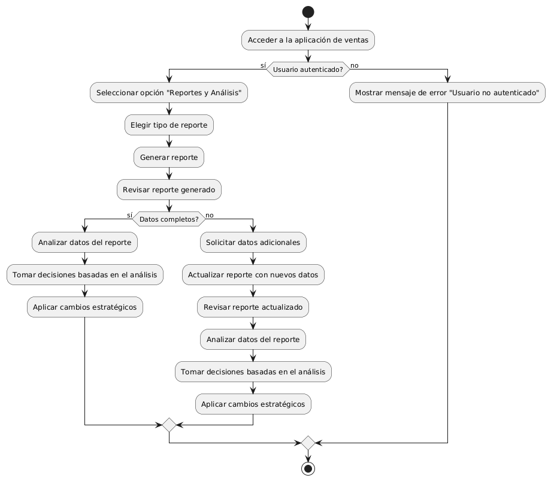
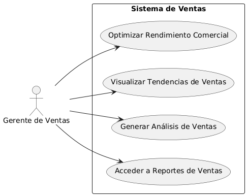

# Administración del Sitio MACP-79

------
## Diagrama de Actividades
[Creado con plantuml](https://plantuml.com/es/)

{ align=left }

Como gerente de ventas, acceder a reportes detallados es crucial para tomar decisiones informadas. Este diagrama de actividad describe el proceso para generar y analizar reportes de ventas, desde la autenticación del usuario hasta la aplicación de cambios estratégicos, asegurando decisiones basadas en datos precisos y completos.
---

## Escenario MACP-79
Queremos un backend intuitivo para la gestión del sitio, con diferentes niveles de acceso para diferentes tipos de usuarios (admin, editor, etc.) y la capacidad para ofrecer el contenido del sitio en varios idiomas y  copias de seguridad automáticas de la información del sitio. Ejemplo: Backups diarios automatizados. Luego y como para terminar una medidas de seguridad para proteger la información del usuario y del sitio.

<table id="customers">
  <tr class="idtext principal">
    <td>ID MACP-85</td>
  </tr>
  <tr class="single text">
    <td><strong>Requerimiento</strong>: crear reportes y análisis de ventas ID MACP-85</td>
  </tr>
  <tr class="single gray">
    <td><strong>Historia de usuario</strong></td>
  </tr>
  <tr class="single text">
    <td>Como gerente de ventas, quiero acceder a reportes y análisis detallados de las ventas realizadas dentro de la aplicación, para poder tomar decisiones estratégicas informadas y optimizar el rendimiento comercial.</td>
  </tr>
  <tr class="duo">
    <th class="gray"><strong>Estado de la tarea</strong></th>
    <th>En desarrollo</th>
  </tr>
  <tr class="single gray">
    <td><strong>Caso de uso (Pasos)</strong></td>
  </tr>
  <tr class="single text">
       <td>
         </ol>
      <li>El gerente accede al panel de reportes</li>
      <li>Selecciona "Ventas Diarias" del menú de tipos de reportes.</li>
      <li>Define el rango de fechas para el reporte (por ejemplo, fecha actual).</li>
      <li>El sistema genera el reporte con datos visualizados en gráficos y tablas.</li>
      <li>El gerente revisa el reporte y, si es necesario, lo exporta en formato PDF o Excel.</li>
        <ol>
  
    </td>
  </tr>
  <tr class="single gray">
    <td><strong>Criterios de aceptación</strong></td>
  </tr>
  <tr class="single text">
    <td>
        <ol>
Acceso a Reportes<td>
El gerente de ventas debe poder acceder a un panel o sección específica en la aplicación donde se encuentran los reportes y análisis de ventas.
<td>
Tipos de Reportes<td>
Deben estar disponibles reportes estándar como ventas diarias, ventas semanales, ventas mensuales, y ventas por producto o categoría.
<td>
Filtros y Personalización<td>
Los reportes deben permitir aplicar filtros por rango de fechas, región, vendedor, producto, y otras variables relevantes.
El usuario debe poder personalizar los reportes para incluir o excluir datos según sea necesario.
<td>
Visualización de Datos<td>
Los reportes deben presentarse en formatos visuales claros, como gráficos de barras, líneas, y pasteles, así como tablas detalladas.
Debe haber opciones para exportar los reportes en formatos comunes como PDF y Excel.
<td>
Actualización de Datos<td>
Los reportes deben reflejar los datos más recientes, con actualizaciones automáticas o la opción de refrescar manualmente.
<td>
Análisis Predictivo y Tendencias<td>
Los reportes deben incluir análisis predictivo o de tendencias si están disponibles, para prever patrones futuros basados en datos históricos.
<td>
Seguridad y Permisos<td>
El acceso a los reportes debe estar restringido según el rol del usuario, asegurando que solo el gerente de ventas y otros usuarios autorizados puedan ver o generar reportes detallados.
<td>
Interactividad<td>
Debe haber funcionalidades interactivas, como la posibilidad de hacer clic en un gráfico para obtener detalles adicionales o ver información relacionada.
        </ol>
    </td>
  </tr>
 <tr class="duo">
    <th class="gray"><strong>Calidad</strong></th>
    <th>En desarrollo</th>
  </tr>
  <tr class="duo">
    <th class="gray"><strong>Versionamiento</strong></th>
    <th>En desarrollo</th>
  </tr>
</table>

---
## Diagrama de Caso de uso
[Creado con plantuml](https://plantuml.com/es/)

{ align=center }

El diagrama de casos de uso describe las interacciones entre el gerente de ventas y el sistema de ventas. Permite al gerente acceder a reportes detallados, generar análisis, visualizar tendencias y optimizar el rendimiento comercial, facilitando decisiones estratégicas informadas para mejorar el desempeño de ventas.
---
