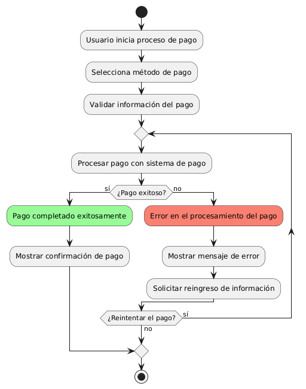
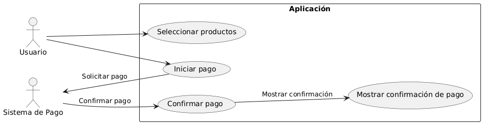

# Administración del Sitio MACP-79

------
## Diagrama de Actividades
[Creado con plantuml](https://plantuml.com/es/)

{ align=left }

En la era digital, facilitar pagos rápidos y seguros es crucial para cualquier aplicación. Este diagrama de actividad describe el proceso de integración con sistemas de pago, desde la selección del método hasta la validación y procesamiento. Asegura una experiencia de usuario fluida y confiable, manejando errores y reintentos eficazmente.
---

## Escenario MACP-79
Queremos un backend intuitivo para la gestión del sitio, con diferentes niveles de acceso para diferentes tipos de usuarios (admin, editor, etc.) y la capacidad para ofrecer el contenido del sitio en varios idiomas y  copias de seguridad automáticas de la información del sitio. Ejemplo: Backups diarios automatizados. Luego y como para terminar una medidas de seguridad para proteger la información del usuario y del sitio.

<table id="customers">
  <tr class="idtext principal">
    <td>ID MACP-86</td>
  </tr>
  <tr class="single text">
    <td><strong>Requerimiento</strong>: diseñar integración con sistemas de pago ID MACP-86</td>
  </tr>
  <tr class="single gray">
    <td><strong>Historia de usuario</strong></td>
  </tr>
  <tr class="single text">
    <td>Como usuario, quiero realizar pagos de forma rápida y segura dentro de la aplicación, para poder completar mis compras sin necesidad de salir a otras plataformas.</td>
  </tr>
  <tr class="duo">
    <th class="gray"><strong>Estado de la tarea</strong></th>
    <th>En desarrollo</th>
  </tr>
  <tr class="single gray">
    <td><strong>Caso de uso (Pasos)</strong></td>
  </tr>
  <tr class="single text">
       <td>
         </ol>
      <li>El usuario selecciona la opción de "Pagar" en el carrito de compras.</li>
      <li>El usuario elige el método de pago deseado (por ejemplo, tarjeta de crédito).</li>
      <li>El usuario introduce la información de pago requerida.</li>
      <li>El sistema valida la información de pago y procesa la transacción.</li>
      <li>El usuario recibe una confirmación de pago y un resumen del pedido.</li>
        <ol>
  
    </td>
  </tr>
  <tr class="single gray">
    <td><strong>Criterios de aceptación</strong></td>
  </tr>
  <tr class="single text">
    <td>
        <ol>
Seguridad de Datos<td>
<li>Los datos de pago deben ser encriptados durante la transmisión y el almacenamiento.
<li>La integración debe cumplir con las normativas de PCI-DSS (Payment Card Industry Data Security Standard).
<td>
Experiencia del Usuario<td>
<li>El proceso de pago debe ser intuitivo y fluido, con una interfaz clara y fácil de usar.
<li>Los usuarios deben poder seleccionar entre múltiples métodos de pago (tarjeta de crédito/débito, PayPal, etc.).
<td>
Confirmación de Pago<td>
<li>Una vez realizado el pago, el usuario debe recibir una confirmación clara y detallada (en pantalla y por correo electrónico si es aplicable).
<li>El sistema debe mostrar un resumen del pedido y el estado del pago.
<td>
Gestión de Errores<td>
<li>En caso de fallo en el pago (por ejemplo, tarjeta rechazada), el usuario debe recibir un mensaje de error claro con instrucciones sobre los siguientes pasos.
<li>Debe haber un proceso de recuperación o reintento para los pagos fallidos.
<td>
Compatibilidad y Desempeño<td>
<li>La integración debe ser compatible con los principales navegadores web y dispositivos móviles.
<li>La transacción debe completarse en un tiempo razonable sin afectar el rendimiento general de la aplicación.
<td>
Pruebas y Validación<td>
<li>Se deben realizar pruebas exhaustivas del proceso de pago con diferentes métodos y escenarios de pago.
<li>La integración debe ser verificada en entornos de prueba y en producción para asegurar que todos los casos de uso se manejan adecuadamente.
        </ol>
    </td>
  </tr>
 <tr class="duo">
    <th class="gray"><strong>Calidad</strong></th>
    <th>En desarrollo</th>
  </tr>
  <tr class="duo">
    <th class="gray"><strong>Versionamiento</strong></th>
    <th>En desarrollo</th>
  </tr>
</table>

---
## Diagrama de Caso de uso
[Creado con plantuml](https://plantuml.com/es/)

{ align=center }

"Este diagrama de casos de uso ilustra el proceso de integración con sistemas de pago en una aplicación. Muestra cómo los usuarios seleccionan productos, inician y confirman pagos, y reciben confirmación de transacciones, detallando la interacción entre la aplicación y el sistema de pago para asegurar una experiencia fluida y segura."
---
