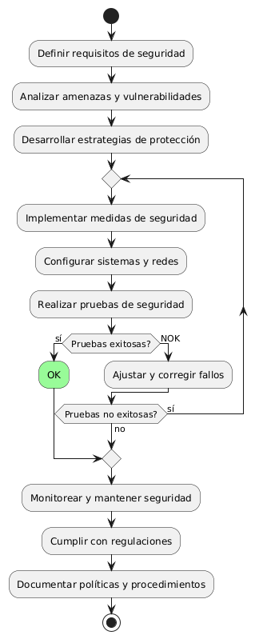
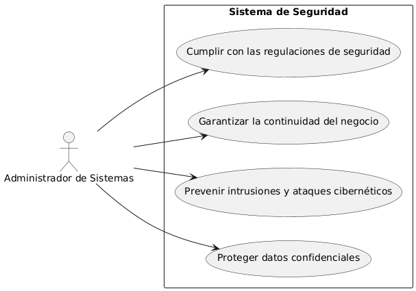

# Administración del Sitio MACP-79

------
## Diagrama de Actividades
[Creado con plantuml](https://plantuml.com/es/)

{ align=left }

##
Este diagrama de actividad describe el proceso para crear un sistema de seguridad robusto. Incluye la definición de requisitos, análisis de amenazas, desarrollo e implementación de estrategias de protección, y pruebas de seguridad. El objetivo es asegurar la protección de datos, prevenir ataques, y cumplir con las regulaciones.
---

## Escenario MACP-79
Queremos un backend intuitivo para la gestión del sitio, con diferentes niveles de acceso para diferentes tipos de usuarios (admin, editor, etc.) y la capacidad para ofrecer el contenido del sitio en varios idiomas y  copias de seguridad automáticas de la información del sitio. Ejemplo: Backups diarios automatizados. Luego y como para terminar una medidas de seguridad para proteger la información del usuario y del sitio.

<table id="customers">
  <tr class="idtext principal">
    <td>ID MACP-87</td>
  </tr>
  <tr class="single text">
    <td><strong>Requerimiento</strong>: crear seguridad robusta ID MACP-87</td>
  </tr>
  <tr class="single gray">
    <td><strong>Historia de usuario</strong></td>
  </tr>
  <tr class="single text">
    <td>Como administrador de sistemas, quiero un sistema de seguridad robusto que me permita proteger los datos confidenciales, prevenir intrusiones y ataques cibernéticos, garantizar la continuidad del negocio y cumplir con las regulaciones de seguridad, para proteger la organización de amenazas cibernéticas y salvaguardar su reputación.</td>
  </tr>
  <tr class="duo">
    <th class="gray"><strong>Estado de la tarea</strong></th>
    <th>En desarrollo</th>
  </tr>
  <tr class="single gray">
    <td><strong>Caso de uso (Pasos)</strong></td>
  </tr>
  <tr class="single text">
       <td>
         </ol>
      <li>El administrador inicia sesión en el sistema de gestión de usuarios.</li>
      <li>El administrador crea o actualiza roles de usuario y asigna permisos basados en el principio de mínima privilegio.</li>
      <li>El administrador verifica que los controles de acceso estén correctamente implementados y que los permisos sean adecuados</li>
      <li>El sistema registra los cambios realizados en los controles de acceso.</li>
        <ol>
  
    <td>
  </tr>
  <tr class="single gray">
    <td><strong>Criterios de aceptación</strong></td>
  </tr>
  <tr class="single text">
    <td>
        <ol>
Protección de Datos Confidenciales<td>
<li>Los datos confidenciales deben ser cifrados tanto en reposo como en tránsito utilizando estándares de cifrado actuales (por ejemplo, AES-256).
<li>Debe haber controles de acceso estrictos para los datos confidenciales, con permisos basados en roles y principios de mínima privilegio.
<td>
Prevención de Intrusiones y Ataques Cibernéticos<td>
<li>El sistema debe tener un firewall actualizado y configurado adecuadamente.
<li>Deben implementarse y mantenerse actualizadas las soluciones de detección y prevención de intrusiones (IDS/IPS).
<li>Debe haber un sistema de monitoreo continuo para detectar actividades sospechosas.
<td>
Garantía de la Continuidad del Negocio<td>
<li>Debe haber un plan de recuperación ante desastres documentado y probado periódicamente.
<li>El sistema debe incluir copias de seguridad regulares y verificables.
<td>
Cumplimiento con las Regulaciones de Seguridad<td>
<li>El sistema debe cumplir con las regulaciones y estándares aplicables (por ejemplo, GDPR, HIPAA, ISO 27001).
<li>Debe haber auditorías periódicas para asegurar el cumplimiento continuo con las regulaciones.
<td>
Documentación y Formación<td>
<li>Debe haber documentación completa sobre políticas de seguridad, procedimientos de emergencia y guías de usuario.
<li>Los empleados deben recibir formación regular en prácticas de seguridad y manejo de datos confidenciales.
        </ol>
    </td>
  </tr>
 <tr class="duo">
    <th class="gray"><strong>Calidad</strong></th>
    <th>En desarrollo</th>
  </tr>
  <tr class="duo">
    <th class="gray"><strong>Versionamiento</strong></th>
    <th>En desarrollo</th>
  </tr>
</table>

---
## Diagrama de Caso de uso
[Creado con plantuml](https://plantuml.com/es/)

{ align=center }

El diagrama de casos de uso describe las funcionalidades clave para un sistema de seguridad robusto. En él, el "Administrador de Sistemas" gestiona aspectos cruciales como la protección de datos, prevención de ataques, continuidad del negocio y cumplimiento normativo, garantizando así una sólida defensa contra amenazas cibernéticas.
---
