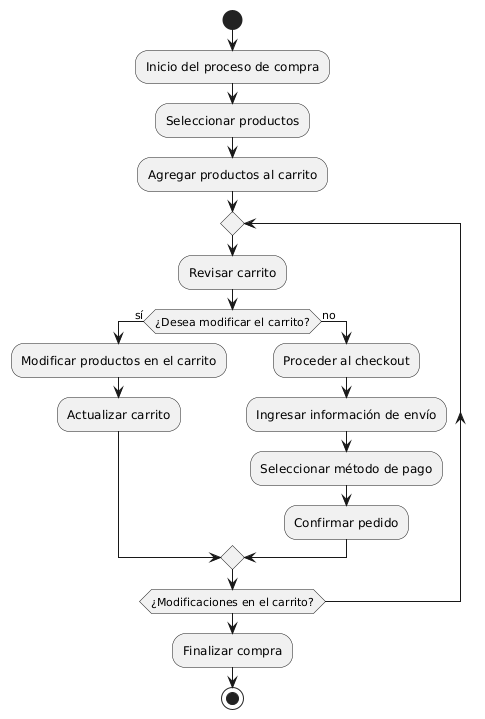
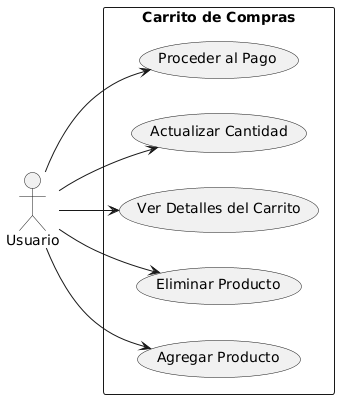

# Diseñar Carrito de Compras MACP-88

------
## Diagrama de Actividades
[Creado con plantuml](https://plantuml.com/es/)

{ align=left }

Este diagrama de actividad ilustra el proceso de compra en un sitio web. Muestra los pasos desde la selección de productos hasta la finalización de la compra, incluyendo la revisión y modificación del carrito. Facilita la comprensión del flujo de interacción del usuario y los pasos.
---

## Escenario MACP-88
Para pepito perez el carrito debe ser visible en todas las páginas. Cuan pepito este en el listado de productos cada imagen debe tener un carrito visible para que el producto sea añadido. También la opción para quitar productos directamente desde el carrito. El carrito debe darle la opción de cambiar la cantidad de cada producto y el total se debe actualizar al modificar cantidades o eliminar productos. La opción para guardar el carrito y continuar la compra más tarde es una ventaja que tiene pepito por si debe realizar algo más importante (eso sí pepito debe tener un usuario y haber accedido al mismo). Tiene también el botón para iniciar el proceso de compra desde el carrito, permite marcar productos como regalos y añadir mensajes y calcular impuestos y costos de envío basados en la ubicación del usuario.
---

<table id="customers">
  <tr class="idtext principal">
    <td>ID MACP-89</td>
  </tr>
  <tr class="single text">
    <td><strong>Requerimiento</strong>: diseñar ilustración de carrito ID MACP-89</td>
  </tr>
  <tr class="single gray">
    <td><strong>Historia de usuario</strong></td>
  </tr>
  <tr class="single text">
    <td>Como usuario, quiero tener una ilustración de carrito que represente el proceso de compra en mi sitio web, para que pueda guiar a los usuarios a través del proceso de compra de manera clara y eficiente.</td>
  </tr>
  <tr class="duo">
    <th class="gray"><strong>Estado de la tarea</strong></th>
    <th>En desarrollo</th>
  </tr>
  <tr class="single gray">
    <td><strong>Caso de uso (Pasos)</strong></td>
  </tr>
  <tr class="single text">
       <td>
         </ol>
      <li>El usuario carga la página del sitio web</li>
      <li>La ilustración del carrito aparece en la página.</li>
      <li>El usuario puede identificar fácilmente el proceso de compra representado</li>
      <li>El usuario pasa el cursor sobre o hace clic en la ilustración del carrito</li>
      <li>Aparecen detalles adicionales o se destacan ciertas áreas de la ilustración</li>
        <ol>
  
    <td>
  </tr>
  <tr class="single gray">
    <td><strong>Criterios de aceptación</strong></td>
  </tr>
  <tr class="single text">
    <td>
        <ol>
Claridad y Comprensibilidad<td>
<li>La ilustración debe ser fácilmente comprensible y representar claramente el proceso de compra.
<li>Los usuarios deben entender inmediatamente qué parte del proceso de compra está siendo representada por la ilustración.
<td>
Consistencia Visual<td>
<li>La ilustración debe estar alineada con el estilo visual general del sitio web (colores, tipografía, y diseño).
<li>Debe ser coherente con otros elementos gráficos y visuales del sitio.
<td>
Elementos Esenciales<td>
<li>Debe incluir los elementos clave del proceso de compra, como el carrito de compras, productos, y etapas del proceso (por ejemplo, selección, revisión, pago).
<li>Los elementos deben estar claramente diferenciados y etiquetados si es necesario.
<td>
Adaptabilidad<td>
<li>La ilustración debe ser adaptable a diferentes tamaños y resoluciones de pantalla (es decir, debe ser responsiva).
<li>Debe ser clara y legible tanto en dispositivos móviles como en pantallas de escritorio.
<td>
Interactividad (si aplica)<td>
<li>Si la ilustración es interactiva, los elementos interactivos deben responder adecuadamente a las acciones del usuario (por ejemplo, cambios de color al pasar el cursor sobre ellos).
<li>Debe haber retroalimentación visual clara para las interacciones del usuario.
<td>
Accesibilidad<td>
<li>La ilustración debe ser accesible para usuarios con discapacidades, por ejemplo, mediante el uso de descripciones alternativas o texto explicativo si es necesario.
<td>
Carga de la Página<td>
<li>La ilustración no debe afectar negativamente el tiempo de carga de la página. Debe estar optimizada para la web.
        </ol>
    </td>
  </tr>
 <tr class="duo">
    <th class="gray"><strong>Calidad</strong></th>
    <th>En desarrollo</th>
  </tr>
  <tr class="duo">
    <th class="gray"><strong>Versionamiento</strong></th>
    <th>En desarrollo</th>
  </tr>
</table>

---
## Diagrama de Caso de uso
[Creado con plantuml](https://plantuml.com/es/)

{ align=center }

"Este diagrama de casos de uso ilustra las interacciones clave entre el usuario y el carrito de compras en un sitio web. Muestra cómo el usuario puede agregar, eliminar productos, ver detalles, actualizar cantidades y proceder al pago, optimizando así la experiencia de compra en línea."
---
