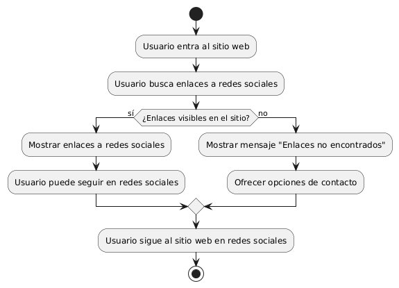

# DISEÑAR O IMPLEMENTAR UN ENLACE VISIBLE A REDES SOCIALES 
------
## Diagrama de Actividades
[Creado con plantuml](https://plantuml.com/es/)

{ align=center }

Este diagrama de actividad muestra el proceso para implementar enlaces a redes sociales visibles en un sitio web. El usuario busca estos enlaces y, si son visibles, puede seguir al sitio en sus redes favoritas. Si no son visibles, se le muestra un mensaje y se ofrecen alternativas de contacto.
---
###

## Caso de uso historia Crear paginas de Inicio 
El usuario que quiere comprar muebles puede entrar a un menú principal o una página de inicio , el cual tiene enlaces a otras  páginas principales como inicio, catálogos, contactos entre otros más. Dentro de la misma página cuando el usuario pase el ratón sobre las opciones del menú principal se desplegará los submenús con más opciones; la página le proporcionará enlaces rápidos para iniciar sesión o registrarse; si la persona quiere entrar a la página desde su móvil, lo podrá hacer con toda comodidad ya que el menú es responsivo para móviles. También si el usuario quiere consultar las redes sociales lo podrá hacer ya que el menú de inicio tiene enlaces  a las mismas, y no menos importante la capacidad de ver todos los productos recomendados o más vendidos de la página.

<table id="customers">
  <tr class="idtext principal">
    <td>ID MACP-9</td>
  </tr>
  <tr class="single text">
    <td><strong>Requerimiento</strong>:Implementar un enlace a redes sociales visibles ID MACP-9</td>
  </tr>
  <tr class="single gray">
    <td><strong>Historia de usuario</strong></td>
  </tr>
  <tr class="single text">
    <td>Como usuario, quiero encontrar una sección de productos destacados en la página de inicio del sitio web Para descubrir nuevos productos que podrían ser de mi interés y explorar las ofertas actuales de la empresa.</td>
  </tr>
  <tr class="duo">
    <th class="gray"><strong>Estado de la tarea</strong></th>
    <th>En desarrollo</th>
  </tr>
  <tr class="single gray">
    <td><strong>Caso de uso (Pasos)</strong></td>
  </tr>
  <tr class="single text">
    <td>
        <ol>
            <li> El usuario accede al sitio web.</li>
           <li> El usuario busca los enlaces a las redes sociales.</li>
           <li> El usuario encuentra los enlaces visibles en la ubicación esperada.</li>
            <li>El usuario hace clic en uno de los enlaces a las redes sociales.</li>
            <li>El usuario es redirigido a la página de la red social correspondiente.</li>
        </ol>
    </td>
  </tr>
  <tr class="single gray">
    <td><strong>Criterios de aceptación</strong></td>
  </tr>
  <tr class="single text">
    <td>
        <ol>
               <li>Visibilidad: Los enlaces a redes sociales deben ser claramente visibles en el sitio web. Los íconos de redes sociales deben ser fácilmente identificables.</li>
                  <li>Ubicación: Los enlaces deben estar ubicados en un lugar estándar y esperado, como el pie de página o la barra lateral.</li>
                  <li>Funcionalidad: Cada enlace debe redirigir al usuario a la página correcta de la red social asociada. Los enlaces deben abrirse en una nueva pestaña o ventana para no interrumpir la navegación del usuario en el sitio web.</li>
                  <li>Responsividad: Los enlaces a redes sociales deben ser visibles y funcionales en dispositivos móviles y de escritorio. Los íconos deben ajustarse adecuadamente al tamaño de la pantalla en dispositivos móviles.</li>
                  <li>Pruebas y Validación: Se deben realizar pruebas para verificar que los enlaces están correctos y no llevan a páginas de error.</li>
        </ol>
    </td>
  </tr>
 <tr class="duo">
    <th class="gray"><strong>Calidad</strong></th>
    <th>En desarrollo</th>
  </tr>
  <tr class="duo">
    <th class="gray"><strong>Versionamiento</strong></th>
    <th>En desarrollo</th>
  </tr>
</table>

---
## Diagrama de Caso de uso
[Creado con plantuml](https://plantuml.com/es/)

{ align=center }

El diagrama de casos de uso muestra cómo un usuario interactúa con un sitio web para visualizar enlaces a redes sociales y seguir al sitio en sus plataformas favoritas. Los casos de uso incluyen "Ver enlaces a redes sociales" y "Seguir en redes sociales", facilitando el acceso a actualizaciones y noticias.
---
