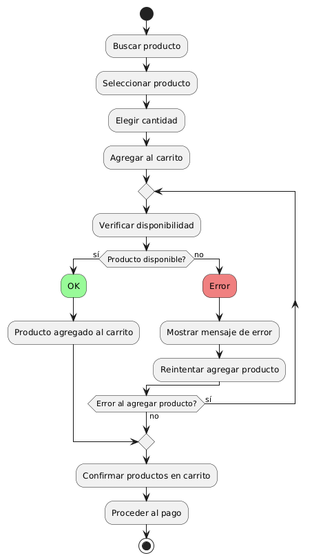
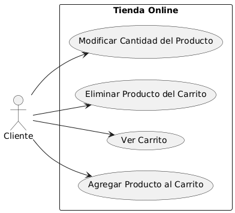

# Diseñar Carrito de Compras MACP-88

------
## Diagrama de Actividades
[Creado con plantuml](https://plantuml.com/es/)

{ align=left }

El diagrama de actividad presentado ilustra el proceso de agregar productos al carrito de compras en una tienda online. Muestra los pasos desde la búsqueda y selección de un producto hasta la confirmación en el carrito y la posibilidad de reintentar en caso de errores durante el proceso de adición.
---
---

## Escenario MACP-88
Para pepito perez el carrito debe ser visible en todas las páginas. Cuan pepito este en el listado de productos cada imagen debe tener un carrito visible para que el producto sea añadido. También la opción para quitar productos directamente desde el carrito. El carrito debe darle la opción de cambiar la cantidad de cada producto y el total se debe actualizar al modificar cantidades o eliminar productos. La opción para guardar el carrito y continuar la compra más tarde es una ventaja que tiene pepito por si debe realizar algo más importante (eso sí pepito debe tener un usuario y haber accedido al mismo). Tiene también el botón para iniciar el proceso de compra desde el carrito, permite marcar productos como regalos y añadir mensajes y calcular impuestos y costos de envío basados en la ubicación del usuario.
---

<table id="customers">
  <tr class="idtext principal">
    <td>ID MACP-90</td>
  </tr>
  <tr class="single text">
    <td><strong>Requerimiento</strong>: diseñar la opción agregar productos al carrito ID MACP-90</td>
  </tr>
  <tr class="single gray">
    <td><strong>Historia de usuario</strong></td>
  </tr>
  <tr class="single text">
    <td>Como cliente de la tienda online quiero agregar productos a mi carrito de compras para poder comprarlos más tarde.</td>
  </tr>
  <tr class="duo">
    <th class="gray"><strong>Estado de la tarea</strong></th>
    <th>En desarrollo</th>
  </tr>
  <tr class="single gray">
    <td><strong>Caso de uso (Pasos)</strong></td>
  </tr>
  <tr class="single text">
       <td>
         </ol>
      <li>El cliente selecciona el producto y la cantidad deseada</li>
      <li>El cliente hace clic en el botón "Agregar al carrito".</li>
      <li>El sistema verifica la disponibilidad del producto.</li>
      <li>El sistema muestra una confirmación visual de que el producto ha sido agregado.</li>
      <li>El icono del carrito se actualiza para reflejar el nuevo total de producto</li>
        <ol>
  
    <td>
  </tr>
  <tr class="single gray">
    <td><strong>Criterios de aceptación</strong></td>
  </tr>
  <tr class="single text">
    <td>
        <ol>
Accesibilidad del Botón de Agregar al Carrito<td>
<li>El botón "Agregar al carrito" debe estar visible y accesible en la página del producto.</li>
<li>Debe estar habilitado para productos disponibles, debe estar deshabilitado o mostrar un mensaje si el producto está fuera de stock.
<td>
Interacción del Usuario<td>
<li>Al hacer clic en el botón "Agregar al carrito", el producto debe ser añadido al carrito del usuario.
<li>Debe mostrarse una confirmación visual (por ejemplo, un mensaje emergente o un cambio en el icono del carrito) que indique que el producto ha sido agregado exitosamente.
<td>
Cantidad del Producto<td>
<li>Si el usuario selecciona una cantidad específica del producto, esta cantidad debe reflejarse en el carrito.
<li>Si se intenta agregar una cantidad superior a la disponible en stock, debe mostrarse un mensaje de error adecuado.
<td>
Persistencia del Carrito<td>
<li>El contenido del carrito debe persistir entre sesiones del usuario hasta que se complete la compra o el usuario vacíe el carrito.
<li>Los productos deben permanecer en el carrito si el usuario navega a otras páginas o cierra la sesión y vuelve a entrar.
<td>
Visualización del Carrito<td>
<li>El icono del carrito debe actualizarse automáticamente para mostrar el número de productos que contiene.
<li>Debe haber una opción visible para ver el contenido del carrito en cualquier momento.
<td>
Accesibilidad y Usabilidad<td>
<li>La funcionalidad debe ser accesible desde dispositivos móviles y de escritorio.
<li>El botón debe ser accesible y funcional con teclado y lectores de pantalla.
        </ol>
    </td>
  </tr>
 <tr class="duo">
    <th class="gray"><strong>Calidad</strong></th>
    <th>En desarrollo</th>
  </tr>
  <tr class="duo">
    <th class="gray"><strong>Versionamiento</strong></th>
    <th>En desarrollo</th>
  </tr>
</table>

---
## Diagrama de Caso de uso
[Creado con plantuml](https://plantuml.com/es/)

{ align=center }

"En una tienda online, la gestión eficiente del carrito de compras es esencial para una experiencia de usuario fluida. El diagrama de casos de uso que se presenta ilustra cómo un cliente puede agregar productos al carrito, visualizarlo, eliminar artículos y modificar cantidades, facilitando así un proceso de compra optimizado."
---
