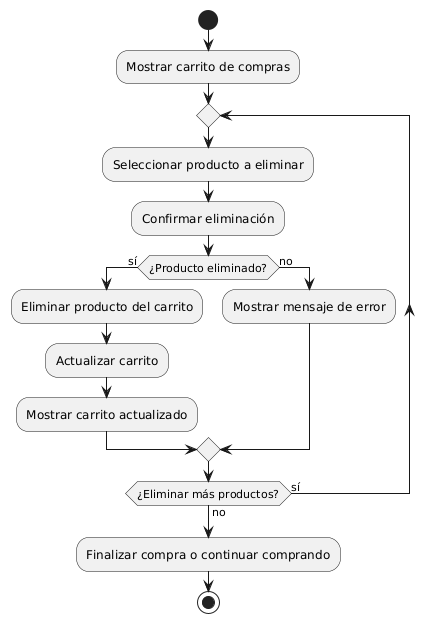
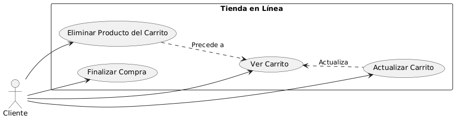

# Diseñar Carrito de Compras MACP-88

------
## Diagrama de Actividades
[Creado con plantuml](https://plantuml.com/es/)

{ align=left }

En el proceso de compras en línea, la capacidad de gestionar el carrito es crucial. Este diagrama de actividad ilustra cómo un cliente puede eliminar productos de su carrito, desde la selección del artículo hasta la confirmación de la eliminación y la actualización del carrito.
---

## Escenario MACP-88
Para pepito perez el carrito debe ser visible en todas las páginas. Cuan pepito este en el listado de productos cada imagen debe tener un carrito visible para que el producto sea añadido. También la opción para quitar productos directamente desde el carrito. El carrito debe darle la opción de cambiar la cantidad de cada producto y el total se debe actualizar al modificar cantidades o eliminar productos. La opción para guardar el carrito y continuar la compra más tarde es una ventaja que tiene pepito por si debe realizar algo más importante (eso sí pepito debe tener un usuario y haber accedido al mismo). Tiene también el botón para iniciar el proceso de compra desde el carrito, permite marcar productos como regalos y añadir mensajes y calcular impuestos y costos de envío basados en la ubicación del usuario.
---

<table id="customers">
  <tr class="idtext principal">
    <td>ID MACP-91</td>
  </tr>
  <tr class="single text">
    <td><strong>Requerimiento</strong>: diseñar eliminar productos del carrito ID MACP-91</td>
  </tr>
  <tr class="single gray">
    <td><strong>Historia de usuario</strong></td>
  </tr>
  <tr class="single text">
    <td>Como cliente que está comprando en línea, quiero poder eliminar productos de mi carrito de compras para ajustar mi pedido antes de finalizar la compra.</td>
  </tr>
  <tr class="duo">
    <th class="gray"><strong>Estado de la tarea</strong></th>
    <th>En desarrollo</th>
  </tr>
  <tr class="single gray">
    <td><strong>Caso de uso (Pasos)</strong></td>
  </tr>
  <tr class="single text">
       <td>
         </ol>
      <li>El usuario accede a su carrito de compras</li>
      <li>El usuario ubica el producto que desea eliminar.</li>
      <li>El usuario hace clic en el botón o enlace de eliminar junto al producto.</li>
      <li>El sistema muestra una confirmación de la acción (si es necesario).</li>
      <li>El producto es removido del carrito y el total del carrito se actualiza.</li>
      <li>El sistema muestra un mensaje de éxito de eliminación.</li>
        <ol>
  
    <td>
  </tr>
  <tr class="single gray">
    <td><strong>Criterios de aceptación</strong></td>
  </tr>
  <tr class="single text">
    <td>
        <ol>
Interfaz de Usuario<td>
<li>El botón o enlace para eliminar un producto debe ser claramente visible junto a cada producto en el carrito de compras.
<li>El diseño debe incluir un icono intuitivo (como una papelera) o un texto claro ("Eliminar").
<li>El usuario debe recibir una confirmación visual (como un mensaje emergente o un cambio en el diseño) de que el producto ha sido eliminado.
<td>
Funcionalidad<td>
<li>Al hacer clic en el botón de eliminar, el producto seleccionado debe ser removido del carrito inmediatamente.
<li>El total del carrito debe actualizarse automáticamente para reflejar la eliminación del producto.
<li>La eliminación del producto debe persistir cuando el usuario navegue a otras secciones del sitio o actualice la página.
<td>
Confirmación de Acción<td>
<li>Se debe mostrar una confirmación o mensaje que indique que el producto ha sido eliminado con éxito.
<li>Debe haber una opción para deshacer la acción de eliminación dentro de un intervalo de tiempo razonable (por ejemplo, 5 segundos).
<td>
Persistencia de Datos<td>
<li>La eliminación del producto debe ser persistente en la sesión del usuario y en la base de datos, es decir, el producto eliminado no debe reaparecer en el carrito en futuras sesiones hasta que el usuario lo agregue nuevamente.
<td>
Manejo de Errores<td>
<li>Si ocurre un error durante la eliminación (por ejemplo, problemas de conexión con el servidor), se debe mostrar un mensaje de error claro y comprensible.
<li>El producto no debe eliminarse si se detecta un error durante el proceso.
<td>
Compatibilidad y Accesibilidad<td>
<li>La funcionalidad debe ser accesible y usable en diferentes dispositivos y navegadores.
<li>Debe cumplir con los estándares de accesibilidad para usuarios con discapacidades.
        </ol>
    </td>
  </tr>
 <tr class="duo">
    <th class="gray"><strong>Calidad</strong></th>
    <th>En desarrollo</th>
  </tr>
  <tr class="duo">
    <th class="gray"><strong>Versionamiento</strong></th>
    <th>En desarrollo</th>
  </tr>
</table>

---
## Diagrama de Caso de uso
[Creado con plantuml](https://plantuml.com/es/)

{ align=center }

Este diagrama de casos de uso ilustra la funcionalidad de una tienda en línea permitiendo a los clientes gestionar su carrito de compras. Muestra cómo un cliente puede ver su carrito, eliminar productos, actualizar el contenido y finalmente proceder a la compra, facilitando así una experiencia de compra eficiente y flexible.
---
