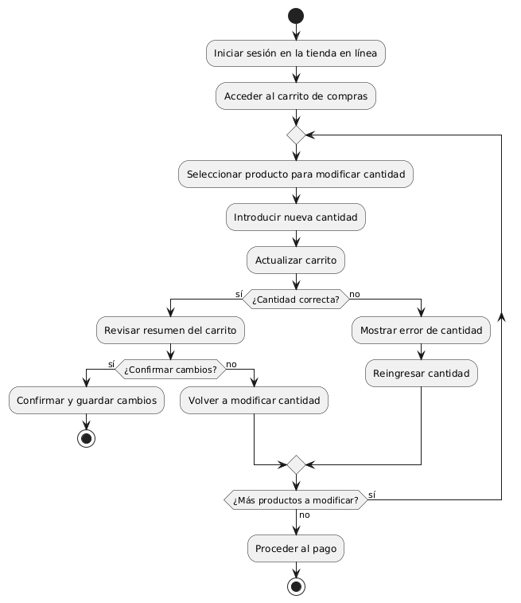
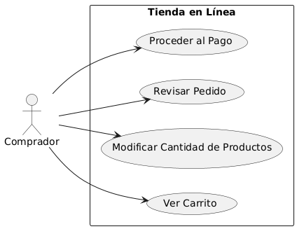

# Diseñar Carrito de Compras MACP-88

------
## Diagrama de Actividades
[Creado con plantuml](https://plantuml.com/es/)

{ align=left }

El diagrama de actividad describe el proceso para ajustar la cantidad de productos en un carrito de compras en línea. Permite a los compradores modificar cantidades antes del pago, asegurando que el pedido sea correcto. Incluye pasos para seleccionar productos, actualizar el carrito y proceder al pago tras revisar los cambios.
---

## Escenario MACP-88
Para pepito perez el carrito debe ser visible en todas las páginas. Cuan pepito este en el listado de productos cada imagen debe tener un carrito visible para que el producto sea añadido. También la opción para quitar productos directamente desde el carrito. El carrito debe darle la opción de cambiar la cantidad de cada producto y el total se debe actualizar al modificar cantidades o eliminar productos. La opción para guardar el carrito y continuar la compra más tarde es una ventaja que tiene pepito por si debe realizar algo más importante (eso sí pepito debe tener un usuario y haber accedido al mismo). Tiene también el botón para iniciar el proceso de compra desde el carrito, permite marcar productos como regalos y añadir mensajes y calcular impuestos y costos de envío basados en la ubicación del usuario.
---

<table id="customers">
  <tr class="idtext principal">
    <td>ID MACP-92</td>
  </tr>
  <tr class="single text">
    <td><strong>Requerimiento</strong>: Diseñar Modificación cantidad de productos ID MACP-92</td>
  </tr>
  <tr class="single gray">
    <td><strong>Historia de usuario</strong></td>
  </tr>
  <tr class="single text">
    <td>Como comprador en una tienda en línea, quiero poder ajustar la cantidad de productos en mi carrito de compras, para revisar y modificar mi pedido antes de proceder al pago y asegurarme de que estoy comprando la cantidad correcta de cada artículo</td>
  </tr>
  <tr class="duo">
    <th class="gray"><strong>Estado de la tarea</strong></th>
    <th>En desarrollo</th>
  </tr>
  <tr class="single gray">
    <td><strong>Caso de uso (Pasos)</strong></td>
  </tr>
  <tr class="single text">
       <td>
         </ol>
      <li>El usuario accede a su carrito de compras</li>
      <li>El sistema muestra la lista de productos en el carrito con sus respectivas cantidades</li>
      <li>El usuario selecciona el producto cuya cantidad desea modificar.</li>
      <li>El usuario ajusta la cantidad usando el campo de entrada o los botones de incremento/decremento.</li>
      <li>El sistema valida la nueva cantidad (verificando disponibilidad de stock y entrada válida)</li>
      <li>El sistema actualiza la cantidad del producto y recalcula el precio total del carrito</li>
      <li>El sistema muestra el carrito actualizado con la nueva cantidad y precio total.</li>
        <ol>
  
    <td>
  </tr>
  <tr class="single gray">
    <td><strong>Criterios de aceptación</strong></td>
  </tr>
  <tr class="single text">
    <td>
        <ol>
Interfaz de Usuario<tf>
<li>Visualización de Cantidad: El sistema debe mostrar la cantidad actual de cada producto en el carrito de compras.
<li>Campo de Modificación: Debe haber un campo o botón (incremento y decremento) que permita ajustar la cantidad de cada producto en el carrito.
<li>Confirmación Visual: Los cambios en la cantidad deben actualizarse visualmente en el carrito de compras de inmediato.
<td>
Validación de Entrada<td>
<li>Entrada Válida: El sistema debe permitir solo números enteros positivos para la cantidad de productos.
<li>Límites: La cantidad mínima debe ser 1, y la cantidad máxima no debe exceder el stock disponible del producto.
<td>
Cálculo de Precios<td>
<li>Actualización de Precio: El sistema debe recalcular el precio total del carrito en función de las cantidades modificadas.
<li>Impuestos y Envío: Los cálculos de impuestos y costos de envío también deben actualizarse conforme a los cambios en la cantidad.
<td>
Persistencia<td>
<li>Guardar Cambios: Los cambios en la cantidad deben guardarse de forma persistente en el carrito hasta que el usuario finalice la compra o elimine los artículos del carrito.
<li>Recuperación: Si el usuario vuelve a la tienda después de un cierre o actualización, los cambios en el carrito deben mantenerse.
<td>
Mensajes de Error<td>
<li>Exceso de Stock: El sistema debe mostrar un mensaje de error si se intenta agregar una cantidad que excede el stock disponible.
<li>Cantidad No Permitida: Debe haber una validación y un mensaje de error si se introduce una cantidad no válida (por ejemplo, números negativos o decimales).
        </ol>
    </td>
  </tr>
 <tr class="duo">
    <th class="gray"><strong>Calidad</strong></th>
    <th>En desarrollo</th>
  </tr>
  <tr class="duo">
    <th class="gray"><strong>Versionamiento</strong></th>
    <th>En desarrollo</th>
  </tr>
</table>

---
## Diagrama de Caso de uso
[Creado con plantuml](https://plantuml.com/es/)

{ align=center }

"Este diagrama de casos de uso ilustra el proceso de modificación de la cantidad de productos en el carrito de compras de una tienda en línea. Muestra las interacciones del comprador con las funcionalidades del sistema, permitiéndole ajustar, revisar y finalizar su pedido antes del pago."
---
