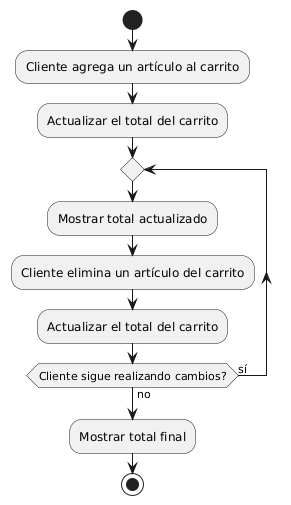
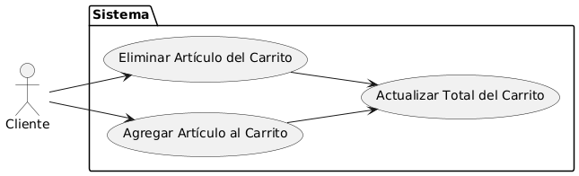

# Diseñar Carrito de Compras MACP-88

------
## Diagrama de Actividades
[Creado con plantuml](https://plantuml.com/es/)

{ align=left }

El diagrama de actividad describe cómo se actualiza automáticamente el total del carrito de compras en tiempo real. Cada vez que un cliente agrega o elimina un artículo, el sistema recalcula y muestra el total actualizado, asegurando una visualización precisa y actual del costo total de la compra.
---

## Escenario MACP-88
Para pepito perez el carrito debe ser visible en todas las páginas. Cuan pepito este en el listado de productos cada imagen debe tener un carrito visible para que el producto sea añadido. También la opción para quitar productos directamente desde el carrito. El carrito debe darle la opción de cambiar la cantidad de cada producto y el total se debe actualizar al modificar cantidades o eliminar productos. La opción para guardar el carrito y continuar la compra más tarde es una ventaja que tiene pepito por si debe realizar algo más importante (eso sí pepito debe tener un usuario y haber accedido al mismo). Tiene también el botón para iniciar el proceso de compra desde el carrito, permite marcar productos como regalos y añadir mensajes y calcular impuestos y costos de envío basados en la ubicación del usuario.
---

<table id="customers">
  <tr class="idtext principal">
    <td>ID MACP-93</td>
  </tr>
  <tr class="single text">
    <td><strong>Requerimiento</strong>: diseñar actualizaciones automáticas en el total del carrito ID MACP-93</td>
  </tr>
  <tr class="single gray">
    <td><strong>Historia de usuario</strong></td>
  </tr>
  <tr class="single text">
    <td>Como cliente, quiero que el total del carrito se actualice automáticamente cada vez que se agrega o se elimina un artículo, para que pueda ver el costo total de mi compra en tiempo real.</td>
  </tr>
  <tr class="duo">
    <th class="gray"><strong>Estado de la tarea</strong></th>
    <th>En desarrollo</th>
  </tr>
  <tr class="single gray">
    <td><strong>Caso de uso (Pasos)</strong></td>
  </tr>
  <tr class="single text">
       <td>
         </ol>
      <li>El cliente selecciona un artículo y lo agrega al carrito</li>
      <li>El sistema actualiza automáticamente el total del carrito para reflejar el nuevo artículo.</li>
      <li>El total actualizado se muestra al cliente sin necesidad de refrescar la página.</li>
        <ol>
  
    <td>
  </tr>
  <tr class="single gray">
    <td><strong>Criterios de aceptación</strong></td>
  </tr>
  <tr class="single text">
    <td>
        <ol>
Actualización en Tiempo Real<td>
<li>Criterio: El total del carrito debe actualizarse automáticamente cada vez que se agregue o se elimine un artículo.
<li>Prueba: Agregar un artículo al carrito y verificar que el total se actualiza de inmediato. Hacer lo mismo al eliminar un artículo.
<td>
Precisión del Cálculo<td>
<li>Criterio: El total del carrito debe reflejar la suma exacta de los precios de los artículos en el carrito, teniendo en cuenta cualquier <li>descuento aplicable, impuestos, y costos de envío.
<li>Prueba: Realizar cálculos manuales y comparar con el total mostrado en el carrito.
<td>
Actualización en Diferentes Navegadores y Dispositivos<td>
<li>Criterio: La funcionalidad debe funcionar correctamente en todos los navegadores web compatibles y en dispositivos móviles.
<li>Prueba: Verificar el comportamiento en diferentes navegadores (Chrome, Firefox, Safari) y en diferentes dispositivos (móvil, tablet, escritorio).
<td>
Sin Interrupciones en la Experiencia del Usuario<td>
<li>Criterio: La actualización automática no debe causar retrasos o interrupciones en la navegación o en el rendimiento del sitio web.
<li>Prueba: Monitorear el tiempo de respuesta y el rendimiento del sitio durante la adición y eliminación de artículos.
<td>
Interfaz de Usuario Clara<td>
<li>Criterio: El total actualizado debe ser claramente visible y destacado en el carrito de compras.
<li>Prueba: Comprobar que el total actualizado sea legible y fácil de encontrar en la interfaz del carrito.
        </ol>
    </td>
  </tr>
 <tr class="duo">
    <th class="gray"><strong>Calidad</strong></th>
    <th>En desarrollo</th>
  </tr>
  <tr class="duo">
    <th class="gray"><strong>Versionamiento</strong></th>
    <th>En desarrollo</th>
  </tr>
</table>

---
## Diagrama de Caso de uso
[Creado con plantuml](https://plantuml.com/es/)

{ align=center }

"El diagrama de casos de uso presentado ilustra el proceso de actualización automática del total del carrito en un sistema de compras en línea. El cliente interactúa con el sistema al agregar o eliminar artículos, lo que desencadena una actualización en tiempo real del costo total del carrito para una experiencia de compra fluida.
---
