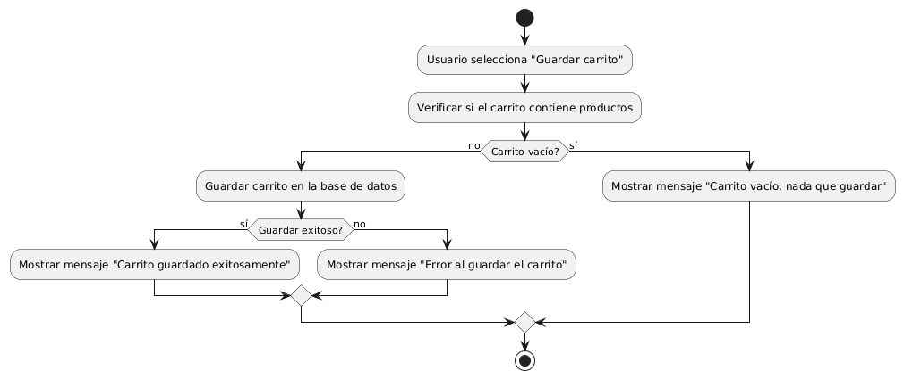
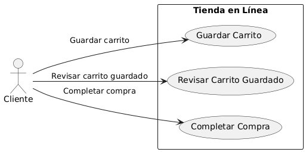

# Diseñar Carrito de Compras MACP-88

------
## Diagrama de Actividades
[Creado con plantuml](https://plantuml.com/es/)

{ align=left }

En una tienda en línea, guardar un carrito de compras permite a los clientes conservar sus selecciones para futuras compras. Este diagrama de actividad muestra el proceso de verificar y guardar el carrito, manejar errores y proporcionar retroalimentación, facilitando una experiencia de compra más flexible y eficiente.
---

## Escenario MACP-88
Para pepito perez el carrito debe ser visible en todas las páginas. Cuan pepito este en el listado de productos cada imagen debe tener un carrito visible para que el producto sea añadido. También la opción para quitar productos directamente desde el carrito. El carrito debe darle la opción de cambiar la cantidad de cada producto y el total se debe actualizar al modificar cantidades o eliminar productos. La opción para guardar el carrito y continuar la compra más tarde es una ventaja que tiene pepito por si debe realizar algo más importante (eso sí pepito debe tener un usuario y haber accedido al mismo). Tiene también el botón para iniciar el proceso de compra desde el carrito, permite marcar productos como regalos y añadir mensajes y calcular impuestos y costos de envío basados en la ubicación del usuario.
---

<table id="customers">
  <tr class="idtext principal">
    <td>ID MACP-94</td>
  </tr>
  <tr class="single text">
    <td><strong>Requerimiento</strong>: diseñar guardar carrito ID MACP-94</td>
  </tr>
  <tr class="single gray">
    <td><strong>Historia de usuario</strong></td>
  </tr>
  <tr class="single text">
    <td>Como cliente de una tienda en línea, quiero guardar mi carrito de compras para poder revisarlo y completar la compra más tarde, para tener la flexibilidad de comprar los productos en otro momento sin tener que volver a agregarlos manualmente.</td>
  </tr>
  <tr class="duo">
    <th class="gray"><strong>Estado de la tarea</strong></th>
    <th>En desarrollo</th>
  </tr>
  <tr class="single gray">
    <td><strong>Caso de uso (Pasos)</strong></td>
  </tr>
  <tr class="single text">
       <td>
         </ol>
      <li>El cliente navega por el sitio y añade productos al carrito.</li>
      <li>El cliente decide guardar el carrito.</li>
      <li>El cliente selecciona la opción para guardar el carrito</li>
      <li>El sistema guarda el carrito y muestra una confirmación.</li>
        <ol>
  
    <td>
  </tr>
  <tr class="single gray">
    <td><strong>Criterios de aceptación</strong></td>
  </tr>
  <tr class="single text">
    <td>
        <ol>
Guardar el Carrito<td>
El usuario puede guardar su carrito de compras actual para su uso futuro.
El carrito guardado debe persistir entre sesiones, es decir, el usuario debe poder cerrar sesión y volver más tarde para encontrar el carrito guardado intacto.
<td>
Recuperar el Carrito Guardado<td>
<li>El usuario puede recuperar su carrito guardado en cualquier momento.
<li>El carrito debe estar disponible para el usuario una vez que inicie sesión en su cuenta.
<td>
Visualización del Carrito Guardado<td>
<li>El usuario puede ver una lista de carritos guardados si hay múltiples opciones disponibles.
<li>El carrito guardado debe mostrar todos los artículos que estaban presentes en el momento de guardarlo.
<td>
Editar el Carrito Guardado<td>
<li>El usuario puede editar el carrito guardado (añadir o eliminar artículos) antes de proceder a la compra.
<li>Los cambios realizados en el carrito guardado se deben guardar correctamente y reflejarse en futuras visualizaciones del carrito.
<td>
Eliminar el Carrito Guardado<td>
<li>El usuario puede eliminar un carrito guardado si ya no lo necesita.
<li>El sistema debe confirmar la eliminación y eliminar el carrito de la lista de carritos guardados.
<td>
Notificaciones y Mensajes<td>
<li>El sistema debe notificar al usuario cuando un carrito se ha guardado exitosamente.
<li>El sistema debe informar al usuario si hay problemas al guardar o recuperar el carrito.
        </ol>
    </td>
  </tr>
 <tr class="duo">
    <th class="gray"><strong>Calidad</strong></th>
    <th>En desarrollo</th>
  </tr>
  <tr class="duo">
    <th class="gray"><strong>Versionamiento</strong></th>
    <th>En desarrollo</th>
  </tr>
</table>

---
## Diagrama de Caso de uso
[Creado con plantuml](https://plantuml.com/es/)

{ align=center }

En una tienda en línea, el caso de uso "Guardar Carrito" permite a los clientes almacenar sus selecciones de productos para una compra futura. Esto brinda flexibilidad al cliente para revisar y completar su compra en otro momento sin tener que volver a agregar los productos manualmente
---
