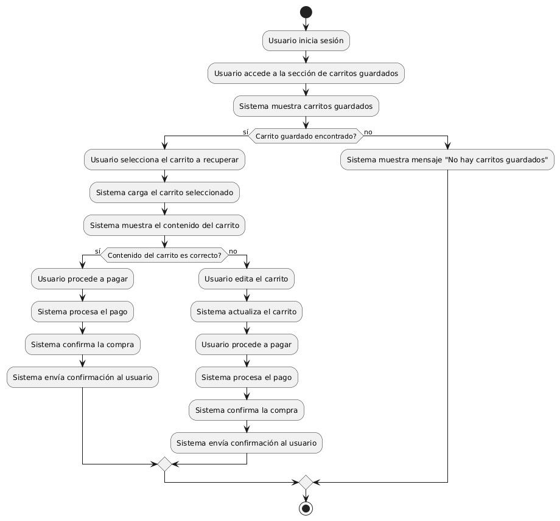
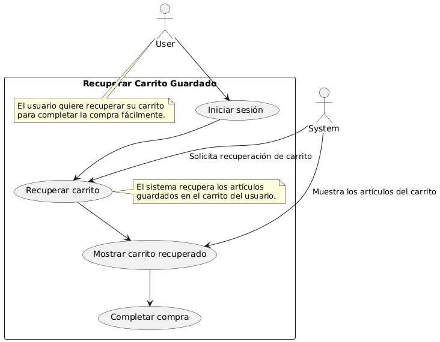

# Diseñar Carrito de Compras MACP-88

------
## Diagrama de Actividades
[Creado con plantuml](https://plantuml.com/es/)

{ align=left }

El diagrama de actividad ilustra el proceso para recuperar un carrito de compras guardado. Desde el inicio de sesión hasta la finalización de la compra, se detallan las etapas clave: acceder al carrito guardado, verificar y actualizar su contenido, y completar el pago, asegurando una experiencia de compra eficiente.
---

## Escenario MACP-88
Para pepito perez el carrito debe ser visible en todas las páginas. Cuan pepito este en el listado de productos cada imagen debe tener un carrito visible para que el producto sea añadido. También la opción para quitar productos directamente desde el carrito. El carrito debe darle la opción de cambiar la cantidad de cada producto y el total se debe actualizar al modificar cantidades o eliminar productos. La opción para guardar el carrito y continuar la compra más tarde es una ventaja que tiene pepito por si debe realizar algo más importante (eso sí pepito debe tener un usuario y haber accedido al mismo). Tiene también el botón para iniciar el proceso de compra desde el carrito, permite marcar productos como regalos y añadir mensajes y calcular impuestos y costos de envío basados en la ubicación del usuario.
---

<table id="customers">
  <tr class="idtext principal">
    <td>ID MACP-95</td>
  </tr>
  <tr class="single text">
    <td><strong>Requerimiento</strong>: diseñar recuperar carrito guardado ID MACP-95</td>
  </tr>
  <tr class="single gray">
    <td><strong>Historia de usuario</strong></td>
  </tr>
  <tr class="single text">
    <td>Quiero recuperar mi carrito de compras guardado para poder completar mi compra sin tener que volver a agregar todos los artículos manualmente. Para poder ahorrar tiempo y esfuerzo al realizar mi compra.</td>
  </tr>
  <tr class="duo">
    <th class="gray"><strong>Estado de la tarea</strong></th>
    <th>En desarrollo</th>
  </tr>
  <tr class="single gray">
    <td><strong>Caso de uso (Pasos)</strong></td>
  </tr>
  <tr class="single text">
       <td>
         </ol>
      <li>El usuario inicia sesión en el sistema.</li>
      <li>El usuario accede a la sección de su cuenta o al área de carritos guardados.</li>
      <li>El usuario selecciona la opción para recuperar un carrito guardado.</li>
      <li>El sistema muestra una lista de carritos guardados disponibles (si hay más de uno).</li>
      <li>El usuario selecciona el carrito que desea recuperar.</li>
      <li>El sistema carga el carrito seleccionado y muestra los artículos en el carrito de compras.</li>
      <li>El usuario puede revisar el carrito, realizar modificaciones si es necesario y proceder al proceso de compra.</li>
        <ol>
  
    <td>
  </tr>
  <tr class="single gray">
    <td><strong>Criterios de aceptación</strong></td>
  </tr>
  <tr class="single text">
    <td>
        <ol>
Autenticación del Usuario<td>
<li>El usuario debe estar autenticado (haber iniciado sesión) para poder recuperar un carrito guardado.
<td>
Recuperación del Carrito<td>
<li>El sistema debe permitir al usuario recuperar el carrito guardado asociado a su cuenta.
<li>Los artículos guardados deben aparecer en el carrito exactamente como estaban antes de ser guardados (misma cantidad, opciones seleccionadas, etc.).
<td>
Persistencia de Datos<td>
<li>Los carritos guardados deben persistir en el sistema durante un período de tiempo predefinido o hasta que el usuario decida eliminarlos.
<td>
Interfaz de Usuario<td>
<li>La opción para recuperar un carrito guardado debe ser claramente visible y accesible en la interfaz de usuario.
<li>Debe haber un mensaje de confirmación o notificación que informe al usuario cuando el carrito ha sido recuperado exitosamente.
<td>
Integración con el Proceso de Compra<td>
<li>Una vez recuperado el carrito, el usuario debe poder proceder a la compra sin problemas.
<li>Deben estar disponibles todas las funciones de edición del carrito (modificar cantidades, eliminar artículos, etc.) después de la recuperación.
<td>
Error Handling<td>
<li>Si el carrito guardado no se puede recuperar (por ejemplo, debido a un error de red o problemas con la cuenta), debe mostrarse un mensaje de error claro y útil.
        </ol>
    </td>
  </tr>
 <tr class="duo">
    <th class="gray"><strong>Calidad</strong></th>
    <th>En desarrollo</th>
  </tr>
  <tr class="duo">
    <th class="gray"><strong>Versionamiento</strong></th>
    <th>En desarrollo</th>
  </tr>
</table>

---
## Diagrama de Caso de uso
[Creado con plantuml](https://plantuml.com/es/)

{ align=center }

"Este diagrama de casos de uso ilustra el proceso de recuperación de un carrito de compras guardado. Permite a los usuarios iniciar sesión, recuperar sus artículos guardados, visualizarlos y completar la compra sin tener que reingresar manualmente los productos, ahorrando tiempo y esfuerzo
---
