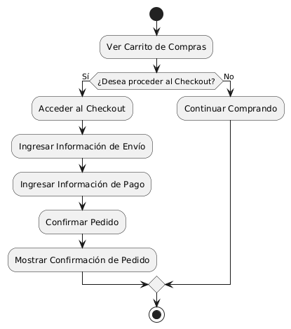
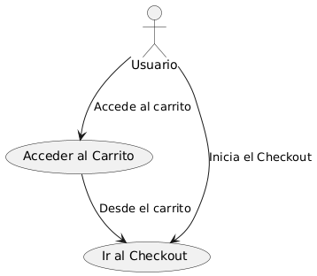

# Diseñar Carrito de Compras MACP-88

------
## Diagrama de Actividades
[Creado con plantuml](https://plantuml.com/es/)

{ align=left }

Este diagrama de actividad ilustra el proceso de checkout accesible desde el carrito de compras. Permite a los usuarios proceder directamente al proceso de pago, ingresando información de envío y pago, y confirmando su pedido. Este flujo simplifica y agiliza la experiencia de compra, facilitando una compra más eficiente.
---

## Escenario MACP-88
Para pepito perez el carrito debe ser visible en todas las páginas. Cuan pepito este en el listado de productos cada imagen debe tener un carrito visible para que el producto sea añadido. También la opción para quitar productos directamente desde el carrito. El carrito debe darle la opción de cambiar la cantidad de cada producto y el total se debe actualizar al modificar cantidades o eliminar productos. La opción para guardar el carrito y continuar la compra más tarde es una ventaja que tiene pepito por si debe realizar algo más importante (eso sí pepito debe tener un usuario y haber accedido al mismo). Tiene también el botón para iniciar el proceso de compra desde el carrito, permite marcar productos como regalos y añadir mensajes y calcular impuestos y costos de envío basados en la ubicación del usuario.
---

<table id="customers">
  <tr class="idtext principal">
    <td>ID MACP-96</td>
  </tr>
  <tr class="single text">
    <td><strong>Requerimiento</strong>: diseñar checkout visible desde el carrito ID MACP-96</td>
  </tr>
  <tr class="single gray">
    <td><strong>Historia de usuario</strong></td>
  </tr>
  <tr class="single text">
    <td>Como usuario, quiero poder acceder al proceso de pago (Checkout) directamente desde mi carrito de compras para agilizar el proceso de compra y finalizar mi pedido de manera rápida y sencilla.</td>
  </tr>
  <tr class="duo">
    <th class="gray"><strong>Estado de la tarea</strong></th>
    <th>En desarrollo</th>
  </tr>
  <tr class="single gray">
    <td><strong>Caso de uso (Pasos)</strong></td>
  </tr>
  <tr class="single text">
       <td>
         </ol>
      <li>El usuario navega a la página del carrito de compras</li>
      <li>El usuario localiza el botón de "Checkout" en la página del carrito</li>
      <li>El usuario hace clic en el botón de "Checkout".</li>
      <li>El sistema redirige al usuario a la página de checkout.</li>
      <li>El usuario revisa la página de checkout.</li>
      <li>El sistema muestra los productos del carrito en la página de checkout</li>
      <li>El usuario confirma que los productos y cantidades son correctos.</li>
        <ol>
  
    <td>
  </tr>
  <tr class="single gray">
    <td><strong>Criterios de aceptación</strong></td>
  </tr>
  <tr class="single text">
    <td>
        <ol>
Accesibilidad del Checkout desde el Carrito<td>
<li>Dado que el usuario está en la página del carrito de compras,
<li>Cuando el usuario revisa el carrito de compras,
<li>Entonces debe haber un botón o enlace claramente visible que permita al usuario acceder al proceso de pago (Checkout).
<td>
Visualización del Botón de Checkout<td>
<li>Dado que el usuario tiene productos en el carrito,
<li>Cuando la página del carrito se muestra,
<li>Entonces el botón de checkout debe estar ubicado en un lugar destacado (por ejemplo, en la parte superior o inferior del carrito), con un diseño que lo haga fácilmente identificable.
<td>
Funcionalidad del Botón de Checkout<td>
<li>Dado que el usuario hace clic en el botón de checkout,
<li>Cuando el sistema procesa la solicitud,
<li>Entonces el usuario debe ser redirigido a la página del checkout sin problemas y sin perder el contenido del carrito.
<td>
Persistencia del Carrito<td>
<li>Dado que el usuario ha accedido al checkout desde el carrito,
<li>Cuando el usuario navega por el proceso de pago,
<li>Entonces el carrito debe permanecer visible en la sesión y mostrar todos los productos seleccionados previamente.
<td>
Validación del Proceso de Pago<td>
<li>Dado que el usuario ha iniciado el proceso de checkout,
<li>Cuando el usuario completa el proceso de pago,
<li>Entonces el sistema debe confirmar la finalización de la compra y proporcionar una confirmación de pedido
        </ol>
    </td>
  </tr>
 <tr class="duo">
    <th class="gray"><strong>Calidad</strong></th>
    <th>En desarrollo</th>
  </tr>
  <tr class="duo">
    <th class="gray"><strong>Versionamiento</strong></th>
    <th>En desarrollo</th>
  </tr>
</table>

---
## Diagrama de Caso de uso
[Creado con plantuml](https://plantuml.com/es/)

{ align=center }

Este diagrama de casos de uso ilustra cómo un usuario puede acceder al proceso de pago (Checkout) directamente desde su carrito de compras. La representación muestra las interacciones necesarias para agilizar el proceso de compra, permitiendo al usuario finalizar su pedido de manera rápida y sencilla."
---
