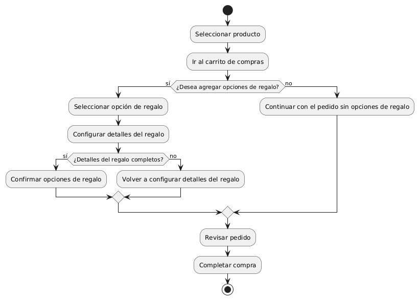
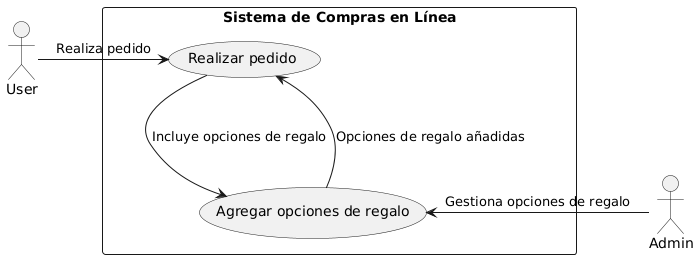

# Diseñar Carrito de Compras MACP-88

------
## Diagrama de Actividades
[Creado con plantuml](https://plantuml.com/es/)

{ align=left }

"Este diagrama de actividad ilustra el proceso de agregar opciones de regalo a un pedido en línea. Permite a los usuarios personalizar sus compras añadiendo detalles de regalo, asegurando una experiencia de compra más conveniente y personalizada para enviar obsequios a amigos y familiares."
---

## Escenario MACP-88
Para pepito perez el carrito debe ser visible en todas las páginas. Cuan pepito este en el listado de productos cada imagen debe tener un carrito visible para que el producto sea añadido. También la opción para quitar productos directamente desde el carrito. El carrito debe darle la opción de cambiar la cantidad de cada producto y el total se debe actualizar al modificar cantidades o eliminar productos. La opción para guardar el carrito y continuar la compra más tarde es una ventaja que tiene pepito por si debe realizar algo más importante (eso sí pepito debe tener un usuario y haber accedido al mismo). Tiene también el botón para iniciar el proceso de compra desde el carrito, permite marcar productos como regalos y añadir mensajes y calcular impuestos y costos de envío basados en la ubicación del usuario.
---

<table id="customers">
  <tr class="idtext principal">
    <td>ID MACP-97</td>
  </tr>
  <tr class="single text">
    <td><strong>Requerimiento</strong>: Crear opciones de regalos ID MACP-97</td>
  </tr>
  <tr class="single gray">
    <td><strong>Historia de usuario</strong></td>
  </tr>
  <tr class="single text">
    <td>Como usuario, quiero tener la opción de agregar opciones de regalo a mi pedido al realizar una compra en línea, para poder enviar regalos a amigos y familiares de manera conveniente y personalizada.</td>
  </tr>
  <tr class="duo">
    <th class="gray"><strong>Estado de la tarea</strong></th>
    <th>En desarrollo</th>
  </tr>
  <tr class="single gray">
    <td><strong>Caso de uso (Pasos)</strong></td>
  </tr>
  <tr class="single text">
       <td>
         </ol>
      <li>El usuario accede al carrito de compras</li>
      <li>El sistema muestra una opción para "Agregar regalo" para cada artículo en el carrito</li>
      <li>El usuario selecciona la opción de regalo para un artículo específico.</li>
      <li>EEl sistema ofrece opciones predefinidas o un campo para ingresar un mensaje personalizado.</li>
      <li>El usuario elige una opción predefinida o ingresa un mensaje personalizado.</li>
      <li>El sistema muestra una vista previa del regalo y el mensaje en el resumen del pedido.</li>
      <li>El usuario confirma la selección del regalo.</li>
      <li>El sistema actualiza el carrito de compras y el total del pedido.</li>
      <li>El usuario completa la compra.</li>
        <ol>
  
    <td>
  </tr>
  <tr class="single gray">
    <td><strong>Criterios de aceptación</strong></td>
  </tr>
  <tr class="single text">
    <td>
        <ol>
Disponibilidad de la Opción de Regalo<td>
<li>La opción de agregar un regalo debe estar claramente visible y accesible durante el proceso de compra, ya sea en el carrito de compras o en la página de confirmación de pedido.
<td>
Selección de Opciones de Regalo<td>
<li>El usuario debe poder seleccionar una opción de regalo para cada artículo en el carrito, con la posibilidad de elegir entre varias opciones predefinidas o personalizar su propio mensaje de regalo.
<td>
Mensaje Personalizado<td>
<li>Si se ofrece la opción de incluir un mensaje de regalo, el usuario debe tener la posibilidad de escribir un mensaje personalizado que se adjuntará al regalo.
<td>
Confirmación de Regalo<td>
<li>Una vez que el usuario ha seleccionado una opción de regalo y/o añadido un mensaje personalizado, debe recibir una confirmación visual en el resumen del pedido o en una pantalla de confirmación.
<td>
Entrega de Regalo<td>
<li>La opción de regalo debe ser claramente indicada en la orden de compra para que el personal de envío la maneje adecuadamente. El sistema debe garantizar que la información de regalo (opciones seleccionadas y mensajes) sea visible para el equipo de embalaje.
<td>
Actualización del Total del Pedido<td>
<li>El sistema debe actualizar el total del pedido para reflejar cualquier costo adicional asociado con la opción de regalo, si es aplicable.
<td>
Política de Regalo<td>
<li>La opción de regalo debe seguir las políticas de la tienda, como restricciones en el tipo de productos que se pueden regalar, costos adicionales, o cualquier otra limitación.
<td>
<li>Experiencia del Usuario<td>
La funcionalidad debe ser intuitiva y fácil de usar. Los usuarios deben poder agregar, modificar o eliminar la opción de regalo antes de completar la compra.
        </ol>
    </td>
  </tr>
 <tr class="duo">
    <th class="gray"><strong>Calidad</strong></th>
    <th>En desarrollo</th>
  </tr>
  <tr class="duo">
    <th class="gray"><strong>Versionamiento</strong></th>
    <th>En desarrollo</th>
  </tr>
</table>

---
## Diagrama de Caso de uso
[Creado con plantuml](https://plantuml.com/es/)

{ align=center }

En un sistema de compras en línea, el proceso de agregar opciones de regalo permite a los usuarios personalizar sus pedidos para enviarlos a amigos y familiares. Este diagrama de casos de uso ilustra cómo los usuarios interactúan con el sistema para incluir opciones de regalo y cómo el administrador gestiona estas opciones.
---
