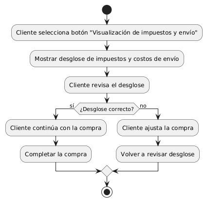
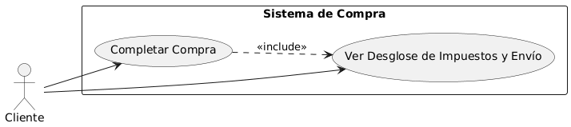

# Diseñar Carrito de Compras MACP-88

------
## Diagrama de Actividades
[Creado con plantuml](https://plantuml.com/es/)

{ align=left }

Este diagrama de actividad en PlantUML ilustra el proceso que sigue un cliente al interactuar con el botón "Visualización de impuestos y envío" en una tienda en línea. Permite al cliente revisar un desglose detallado de impuestos y costos de envío antes de completar la compra, asegurando transparencia y precisión.
---

## Escenario MACP-88
Para pepito perez el carrito debe ser visible en todas las páginas. Cuan pepito este en el listado de productos cada imagen debe tener un carrito visible para que el producto sea añadido. También la opción para quitar productos directamente desde el carrito. El carrito debe darle la opción de cambiar la cantidad de cada producto y el total se debe actualizar al modificar cantidades o eliminar productos. La opción para guardar el carrito y continuar la compra más tarde es una ventaja que tiene pepito por si debe realizar algo más importante (eso sí pepito debe tener un usuario y haber accedido al mismo). Tiene también el botón para iniciar el proceso de compra desde el carrito, permite marcar productos como regalos y añadir mensajes y calcular impuestos y costos de envío basados en la ubicación del usuario.
---

<table id="customers">
  <tr class="idtext principal">
    <td>ID MACP-98</td>
  </tr>
  <tr class="single text">
    <td><strong>Requerimiento</strong>: crear botón Visualización de impuestos y envío ID MACP-98</td>
  </tr>
  <tr class="single gray">
    <td><strong>Historia de usuario</strong></td>
  </tr>
  <tr class="single text">
    <td>Como cliente, quiero un botón "Visualización de impuestos y envío" para que pueda ver el desglose de los impuestos y costos de envío antes de completar mi compra.</td>
  </tr>
  <tr class="duo">
    <th class="gray"><strong>Estado de la tarea</strong></th>
    <th>En desarrollo</th>
  </tr>
  <tr class="single gray">
    <td><strong>Caso de uso (Pasos)</strong></td>
  </tr>
  <tr class="single text">
       <td>
         </ol>
      <li>El cliente hace clic en el botón "Visualización de impuestos y envío".</li>
      <li>Se abre una ventana emergente o se despliega una sección en la misma página.</li>
      <li>El cliente ve el desglose detallado de los impuestos y costos de envío.</li>
      <li>El cliente puede cerrar la ventana emergente o la sección desplegable para regresar a la página principal de checkout.</li>
      <li>El cliente cambia la cantidad de productos en el carrito, o actualiza la dirección de envío.</li>
      <li>La visualización de impuestos y envío se actualiza automáticamente para reflejar los cambios.</li>
        <ol>
  
    <td>
  </tr>
  <tr class="single gray">
    <td><strong>Criterios de aceptación</strong></td>
  </tr>
  <tr class="single text">
    <td>
        <ol>
Ubicación del Botón<td>
<li>El botón "Visualización de impuestos y envío" debe estar claramente visible en la página de checkout o en la página de resumen del pedido, antes de que el cliente complete la compra.
<td>
Texto del Botón<td>
<li>El texto del botón debe decir exactamente "Visualización de impuestos y envío" y ser fácilmente legible.
<td>
Funcionalidad del Botón<td>
<li>Al hacer clic en el botón, debe abrirse una ventana emergente (modal) o desplegarse una sección en la misma página que muestre un desglose detallado de los impuestos y los costos de envío aplicables.
<td>
Desglose de Información<td>
<li>La ventana emergente o sección desplegable debe mostrar de forma clara:
<li>El monto total de los impuestos aplicados.
<li>El costo total del envío.
<li>El desglose de cualquier otro cargo adicional relevante.
<li>El subtotal de los productos antes de impuestos y envío.
<td>
Accesibilidad<td>
<li>El botón debe ser accesible para usuarios con discapacidades, siguiendo las pautas de accesibilidad web (WCAG).
<td>
Diseño Responsivo<td>
<li>La visualización debe ser correcta en diferentes dispositivos y tamaños de pantalla (móviles, tabletas, y escritorios).
<td>
Actualización Dinámica<td>
<li>La información mostrada debe actualizarse automáticamente si se realizan cambios en la cantidad de productos, dirección de envío, o cualquier otro factor que afecte los impuestos o el costo de envío.
<td>
Comportamiento en Diferentes Navegadores<td>
<li>El botón y la visualización deben funcionar correctamente en los principales navegadores web (Chrome, Firefox, Safari, Edge).
        </ol>
    </td>
  </tr>
 <tr class="duo">
    <th class="gray"><strong>Calidad</strong></th>
    <th>En desarrollo</th>
  </tr>
  <tr class="duo">
    <th class="gray"><strong>Versionamiento</strong></th>
    <th>En desarrollo</th>
  </tr>
</table>

---
## Diagrama de Caso de uso
[Creado con plantuml](https://plantuml.com/es/)

{ align=center }

Este diagrama de casos de uso describe el proceso para agregar un botón "Visualización de impuestos y envío" en el sistema de compras. Permite a los clientes ver un desglose detallado de impuestos y costos de envío antes de completar la compra, asegurando transparencia y satisfacción en la experiencia de compra.

---
