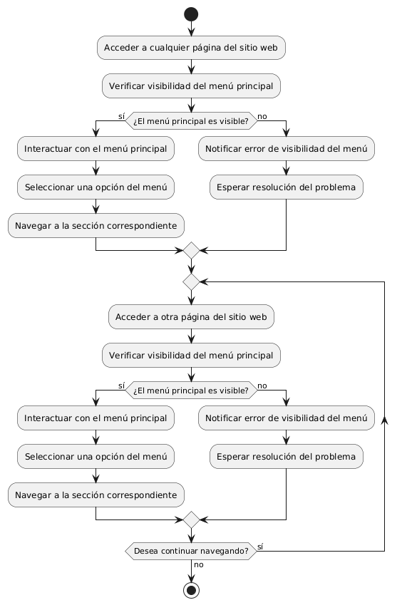

# DISEÑAR MENÚ PRINCIPAL VISIBLE EN TODAS LAS PAGINAS

------
## Diagrama de Actividades
[Creado con plantuml](https://plantuml.com/es/)

{ align=center }

Este diagrama de actividad ilustra el proceso para asegurar que un menú principal sea visible en todas las páginas de un sitio web. Muestra cómo los usuarios interactúan con el menú y maneja errores de visibilidad.
---
###

## Caso de uso historia Crear paginas de Inicio 
El usuario que quiere comprar muebles puede entrar a un menú principal o una página de inicio , el cual tiene enlaces a otras  páginas principales como inicio, catálogos, contactos entre otros más. Dentro de la misma página cuando el usuario pase el ratón sobre las opciones del menú principal se desplegará los submenús con más opciones; la página le proporcionará enlaces rápidos para iniciar sesión o registrarse; si la persona quiere entrar a la página desde su móvil, lo podrá hacer con toda comodidad ya que el menú es responsivo para móviles. También si el usuario quiere consultar las redes sociales lo podrá hacer ya que el menú de inicio tiene enlaces  a las mismas, y no menos importante la capacidad de ver todos los productos recomendados o más vendidos de la página.

<table id="customers">
  <tr class="idtext principal">
    <td>ID MACP-2</td>
  </tr>
  <tr class="single text">
    <td><strong>Requerimiento</strong>: Se debe crear un menú principal visible en todas las páginas ID MACP-2</td>
  </tr>
  <tr class="single gray">
    <td><strong>Historia de usuario</strong></td>
  </tr>
  <tr class="single text">
    <td>Como usuario, quiero acceder a un menú principal que esté presente en todas las páginas del sitio web Para poder navegar de manera sencilla y eficiente a través de las diferentes secciones y opciones disponibles.</td>
  </tr>
  <tr class="duo">
    <th class="gray"><strong>Estado de la tarea</strong></th>
    <th>En desarrollo</th>
  </tr>
  <tr class="single gray">
    <td><strong>Caso de uso (Pasos)</strong></td>
  </tr>
  <tr class="single text">
    <td>
        <ol>
            <li>El usuario accede a cualquier página del sitio web.</li>
            <li>El menú principal es visible en la parte superior (o la ubicación establecida) de la página.</li>
            <li>El usuario ve las opciones de navegación disponibles en el menú principal.</li>
            <li>El usuario puede hacer clic en cualquier opción del menú para navegar a la sección correspondiente.</li>
        </ol>
    </td>
  </tr>
  <tr class="single gray">
    <td><strong>Criterios de aceptación</strong></td>
  </tr>
  <tr class="single text">
    <td>
        <ol>
               <li>Visibilidad: El menú principal debe estar presente en todas las páginas del sitio web, de manera que sea visible y accesible para el usuario sin importar en qué página se encuentre.</li>
               <li> Ubicación Consistente: El menú debe tener una ubicación consistente en todas las páginas (por ejemplo, en la parte superior o lateral) para que el usuario pueda encontrarlo fácilmente.</li>
               <li>Contenido del Menú: Las opciones del menú deben ser correctas y corresponder a las secciones y opciones disponibles en el sitio web.</li>
               <li>Funcionalidad de Navegación: Cada opción del menú debe llevar al usuario a la sección correspondiente del sitio web sin errores de navegación.</li>
               <li>Responsividad: El menú debe ser funcional y visible en diferentes tamaños de pantalla, incluyendo dispositivos móviles y de escritorio.</li>
               <li>Diseño y Accesibilidad: El diseño del menú debe ser coherente con el estilo del sitio web y cumplir con los principios de accesibilidad, permitiendo a todos los usuarios interactuar con él sin problemas.</li>
               <li>Pruebas de Usuario: Se deben realizar pruebas para asegurar que el menú sea intuitivo y fácil de usar, y que no cause confusión o dificultades a los usuarios.</li>
               <li>Rendimiento: El menú no debe afectar negativamente el rendimiento del sitio web, y debe cargarse rápidamente en todas las páginas.</li>
        </ol>
    </td>
  </tr>
 <tr class="duo">
    <th class="gray"><strong>Calidad</strong></th>
    <th>En desarrollo</th>
  </tr>
  <tr class="duo">
    <th class="gray"><strong>Versionamiento</strong></th>
    <th>En desarrollo</th>
  </tr>
</table>

---
## Diagrama de Caso de uso
[Creado con plantuml](https://plantuml.com/es/)

{ align=center }

El diagrama de casos de uso ilustra cómo un usuario interactúa con un sitio web, accediendo a distintas páginas (Inicio, Acerca de, Servicios y Contacto) mediante un menú principal visible en todas las páginas. Esto facilita una navegación sencilla y eficiente por las diferentes secciones del sitio.
---
