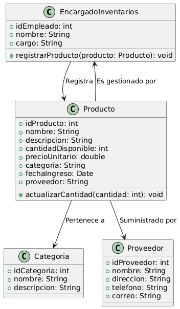

# GESTIÓN DE INVENTARIO

------

## Caso de uso historia 
Ana, encargada de inventarios, registra los movimientos de entrada y salida de productos en el sistema para mantener el inventario actualizado. El sistema actualiza automáticamente las existencias, permitiendo un seguimiento preciso de los productos entrantes y salientes.

---

<table id="customers">
  <tr class="idtext principal">
    <td>ID SYN-10</td>
  </tr>
  <tr class="single text">
    <td><strong>Requerimiento</strong>: Registrar movimientos de entrada y salida de productos. ID SYN-10</td>
  </tr>
  <tr class="single gray">
    <td><strong>Historia de usuario</strong></td>
  </tr>
  <tr class="single text">
    <td>Como encargado de inventarios quiero registrar los movimientos de entrada y salida de productos para mantener actualizado el inventario y realizar un seguimiento adecuado de los productos.</td>
  </tr>
  <tr class="duo">
    <th class="gray"><strong>Estado de la tarea</strong></th>
    <th>En desarrollo</th>
  </tr>
  <tr class="single gray">
    <td><strong>Caso de uso (Pasos)</strong></td>
  </tr>
  <tr class="single text">
    <td>
        <ol>
            <li>El encargado de inventarios accede al sistema y selecciona la opción "Registrar Movimiento".</li>
            <li>El sistema muestra un formulario con dos opciones: Entrada o Salida.</li>
            <li>El encargado selecciona el tipo de movimiento:Si es una entrada, debe ingresar la cantidad de productos recibidos.Si es una salida, debe ingresar la cantidad de productos vendidos o transferidos.</li>
            <li>El encargado selecciona el producto relacionado con el movimiento.</li>
            <li>El sistema verifica la cantidad disponible si es una salida, y valida que la cantidad no sea superior a la existente en inventario.</li>
            <li>El encargado confirma el movimiento.</li>
            <li>El sistema actualiza el inventario, sumando o restando las cantidades correspondientes.</li>
            <li>El sistema genera un registro de movimiento con la fecha, tipo (entrada/salida), producto, cantidad, y un ID único para el movimiento.</li>
    </td>
  </tr>
  <tr class="single gray">
    <td><strong>Criterios de Aceptación</strong></td>
  </tr>
  <tr class="single text">
    <td>
        <ol>
            <li>El sistema debe permitir registrar entradas y salidas de productos con detalles como cantidad, tipo de movimiento y producto.</li>
            <li>El sistema debe validar que al registrar una salida, la cantidad no sea mayor que la disponible en el inventario.</li>
            <li>El sistema debe generar un ID único para cada movimiento registrado.</li>
            <li>El sistema debe actualizar correctamente el inventario después de cada movimiento de entrada o salida.</li>
            <li>El sistema debe generar un registro de movimiento que pueda ser consultado posteriormente, incluyendo detalles como la fecha, tipo de movimiento y cantidad.</li>
        </ol>
    </td>
  </tr>
 <tr class="duo">
    <th class="gray"><strong>Calidad</strong></th>
    <th>En desarrollo</th>
  </tr>
  <tr class="duo">
    <th class="gray"><strong>Versionamiento</strong></th>
    <th>En desarrollo</th>
  </tr>
</table>

---
## Diagrama de Caso de uso
[Creado con plantuml](https://plantuml.com/es/)

---
