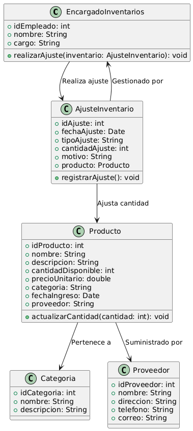

# GESTIÓN DE INVENTARIO

------

## Caso de uso historia 
Ana, encargada de inventarios, nota una discrepancia en las existencias del inventario durante un conteo. Para corregir el error, accede al sistema de gestión de inventarios y selecciona la opción para realizar un ajuste. ingresa la cantidad correcta y la razón del ajuste (como error de conteo o pérdida de producto). El sistema actualiza las existencias automáticamente y mantiene un registro detallado del ajuste realizado para un seguimiento posterior.

---

<table id="customers">
  <tr class="idtext principal">
    <td>ID SYN-12</td>
  </tr>
  <tr class="single text">
    <td><strong>Requerimiento</strong>: Generar reportes de productos. ID SYN-12</td>
  </tr>
  <tr class="single gray">
    <td><strong>Historia de usuario</strong></td>
  </tr>
  <tr class="single text">
    <td>Como encargado de inventarios quiero realizar ajustes de inventario en caso de discrepancias para corregir errores y mantener un control preciso de las existencias.</td>
  </tr>
  <tr class="duo">
    <th class="gray"><strong>Estado de la tarea</strong></th>
    <th>En desarrollo</th>
  </tr>
  <tr class="single gray">
    <td><strong>Caso de uso (Pasos)</strong></td>
  </tr>
  <tr class="single text">
    <td>
        <ol>
            <li>El encargado de inventarios accede al sistema y selecciona la opción "Ajustar Inventario".</li>
            <li>El sistema muestra una lista de productos con discrepancias, donde la cantidad registrada en el sistema no coincide con el inventario físico.</li>
            <li>El encargado selecciona el producto que necesita ajuste.</li>
            <li>El encargado ingresa la cantidad corregida y una razón para el ajuste (por ejemplo, error de registro, daño de producto, ajuste por inventario físico, etc.).</li>
            <li>El encargado revisa la información y confirma el ajuste.</li>
            <li>El sistema actualiza el inventario con la nueva cantidad.</li>
            <li>El sistema genera un registro de ajuste con los detalles del producto, la cantidad ajustada, la razón del ajuste y la fecha del cambio.</li>
    </td>
  </tr>
  <tr class="single gray">
    <td><strong>Criterios de Aceptación</strong></td>
  </tr>
  <tr class="single text">
    <td>
        <ol>
            <li>El sistema debe permitir al encargado seleccionar productos con discrepancias en las cantidades.</li>
            <li>El sistema debe permitir ingresar la cantidad corregida y una razón para el ajuste.</li>
            <li>El sistema debe actualizar automáticamente el inventario con la nueva cantidad.</li>
            <li>El sistema debe generar un registro de ajuste detallado con la fecha, producto, cantidad ajustada y razón del ajuste.</li>
            <li>El ajuste debe ser registrado de forma que se pueda auditar en el futuro.</li>
            <li>El sistema debe validar que el ajuste sea razonable, por ejemplo, no permitir ajustes arbitrarios sin una justificación válida.</li>
        </ol>
    </td>
  </tr>
 <tr class="duo">
    <th class="gray"><strong>Calidad</strong></th>
    <th>En desarrollo</th>
  </tr>
  <tr class="duo">
    <th class="gray"><strong>Versionamiento</strong></th>
    <th>En desarrollo</th>
  </tr>
</table>

---
## Diagrama de Caso de uso
[Creado con plantuml](https://plantuml.com/es/)

---
