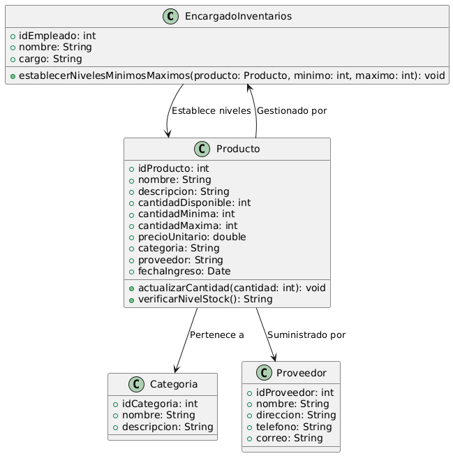

# GESTIÓN DE INVENTARIO

------

## Caso de uso historia 
Ana, encargada de inventarios, establece niveles mínimos y máximos de stock para cada producto en el sistema. El sistema genera alertas cuando el inventario alcanza estos umbrales, ayudando a Ana a mantener un control adecuado sin desabastecimientos ni exceso de productos.

---

<table id="customers">
  <tr class="idtext principal">
    <td>ID SYN-13</td>
  </tr>
  <tr class="single text">
    <td><strong>Requerimiento</strong>: Establecer niveles mínimos y máximos para productos. ID SYN-13</td>
  </tr>
  <tr class="single gray">
    <td><strong>Historia de usuario</strong></td>
  </tr>
  <tr class="single text">
    <td>Como encargado de inventarios quiero establecer niveles mínimos y máximos para productos para asegurarme de que siempre haya suficiente stock disponible sin exceso de inventario.</td>
  </tr>
  <tr class="duo">
    <th class="gray"><strong>Estado de la tarea</strong></th>
    <th>En desarrollo</th>
  </tr>
  <tr class="single gray">
    <td><strong>Caso de uso (Pasos)</strong></td>
  </tr>
  <tr class="single text">
    <td>
        <ol>
            <li>El encargado de inventarios accede al sistema y selecciona la opción "Configurar Niveles de Stock".</li>
            <li>El sistema muestra una lista de productos registrados con opciones para editar los niveles de stock.</li>
            <li>El encargado selecciona el producto al que desea establecer niveles mínimos y máximos.</li>
            <li>El encargado ingresa los valores de nivel mínimo y nivel máximo para el producto seleccionado.</li>
            <li>El encargado confirma que la información es correcta y guarda los cambios.</li>
            <li>El sistema valida que los niveles mínimos no sean mayores que los niveles máximos y que ambos valores sean razonables.</li>
            <li>El sistema actualiza los niveles de stock para el producto seleccionado y muestra una notificación de confirmación.</li>
    </td>
  </tr>
  <tr class="single gray">
    <td><strong>Criterios de Aceptación</strong></td>
  </tr>
  <tr class="single text">
    <td>
        <ol>
            <li>El sistema debe permitir al encargado configurar un nivel mínimo y máximo para cada producto.</li>
            <li>El sistema debe validar que el nivel mínimo no sea mayor que el nivel máximo.</li>
            <li>El sistema debe permitir editar los niveles de stock en cualquier momento para productos registrados.</li>
            <li>El sistema debe notificar al encargado cuando se hayan guardado correctamente los cambios en los niveles de stock.</li>
            <li>Los niveles de stock deben ser aplicados de inmediato a los productos, afectando las alertas de inventario.</li>
            <li>El sistema debe generar una alerta cuando el stock de un producto esté por debajo del nivel mínimo o por encima del nivel máximo.</li>
        </ol>
    </td>
  </tr>
 <tr class="duo">
    <th class="gray"><strong>Calidad</strong></th>
    <th>En desarrollo</th>
  </tr>
  <tr class="duo">
    <th class="gray"><strong>Versionamiento</strong></th>
    <th>En desarrollo</th>
  </tr>
</table>

---
## Diagrama de Caso de uso
[Creado con plantuml](https://plantuml.com/es/)

---
