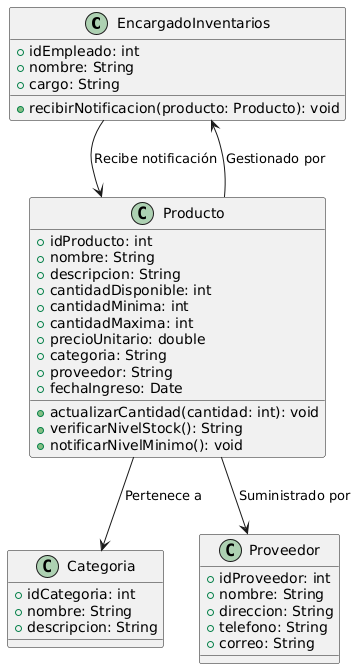

# GESTIÓN DE INVENTARIO

------

## Caso de uso historia 
Ana, encargada de inventarios, establece niveles mínimos para los productos. Cuando el stock de un producto alcanza este nivel, el sistema le envía una notificación automática.Con esta alerta, Ana puede realizar el reabastecimiento oportuno y evitar desabastecimientos, asegurando que siempre haya suficiente stock disponible.

---

<table id="customers">
  <tr class="idtext principal">
    <td>ID SYN-14</td>
  </tr>
  <tr class="single text">
    <td><strong>Requerimiento</strong>: Notificar cuando un producto alcance su nivel mínimo. ID SYN-14</td>
  </tr>
  <tr class="single gray">
    <td><strong>Historia de usuario</strong></td>
  </tr>
  <tr class="single text">
    <td>Como encargado de inventarios quiero recibir una notificación cuando un producto alcance su nivel mínimo para poder realizar el reabastecimiento oportuno y evitar desabastecimientos.</td>
  </tr>
  <tr class="duo">
    <th class="gray"><strong>Estado de la tarea</strong></th>
    <th>En desarrollo</th>
  </tr>
  <tr class="single gray">
    <td><strong>Caso de uso (Pasos)</strong></td>
  </tr>
  <tr class="single text">
    <td>
        <ol>
            <li>El encargado configura los niveles mínimos de stock para cada producto en el sistema.</li>
            <li>El sistema monitorea el inventario en tiempo real.</li>
            <li>Cuando el stock de un producto alcanza o cae por debajo de su nivel mínimo, el sistema genera una notificación.</li>
            <li>La notificación se envía al encargado de inventarios por medio de un mensaje en el sistema y, si está habilitado, por correo electrónico o alerta móvil.</li>
            <li>El encargado recibe la notificación con detalles del producto, como:Nombre del producto, Código,Nivel de stock actual,Nivel de stock mínimo.</li>
            <li>El encargado revisa la notificación y procede a realizar el reabastecimiento o tomar las acciones necesarias.</li>
    </td>
  </tr>
  <tr class="single gray">
    <td><strong>Criterios de Aceptación</strong></td>
  </tr>
  <tr class="single text">
    <td>
        <ol>
            <li>El sistema debe generar notificaciones automáticas cuando un producto alcance su nivel mínimo de stock.</li>
            <li>La notificación debe incluir los siguientes detalles: Nombre del producto, Código del producto, Nivel de stock actual, Nivel mínimo de stock.</li>
            <li>El encargado debe recibir la notificación a través de al menos uno de los siguientes canales:Mensaje en el sistema,Correo electrónico,Alerta en móvil.</li>
            <li>Las notificaciones deben enviarse en tiempo real o lo más rápido posible después de que el stock caiga por debajo del nivel mínimo.</li>
            <li>El sistema debe permitir configurar el nivel mínimo de stock para cada producto y debe monitorear continuamente los niveles de inventario.</li>
        </ol>
    </td>
  </tr>
 <tr class="duo">
    <th class="gray"><strong>Calidad</strong></th>
    <th>En desarrollo</th>
  </tr>
  <tr class="duo">
    <th class="gray"><strong>Versionamiento</strong></th>
    <th>En desarrollo</th>
  </tr>
</table>

---
## Diagrama de Caso de uso
[Creado con plantuml](https://plantuml.com/es/)

---
