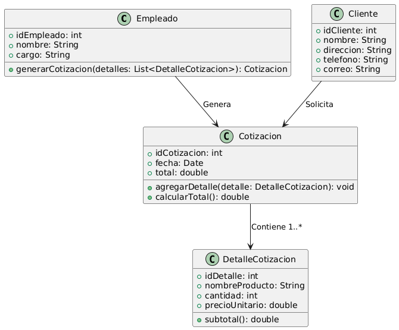

# GESTIÓN DE VENTAS

------

## Caso de uso historia 
Juan, empleado del área de ventas, recibe una solicitud de cotización de Pedro Martínez para un conjunto de tableros eléctricos y servicios de instalación. Juan accede al sistema, selecciona los productos del catálogo, y el sistema calcula automáticamente los precios, impuestos y descuentos. Luego, añade términos de pago y fecha de entrega, y envía la cotización por correo electrónico a Pedro. Pedro revisa la propuesta y, si está de acuerdo, la aprueba para proceder con el pedido.

---

<table id="customers">
  <tr class="idtext principal">
    <td>ID SYN-2</td>
  </tr>
  <tr class="single text">
    <td><strong>Requerimiento</strong>: Generar cotizaciones con detalles de productos. ID SYN-2</td>
  </tr>
  <tr class="single gray">
    <td><strong>Historia de usuario</strong></td>
  </tr>
  <tr class="single text">
    <td>Como empleado del área de ventas quiero generar cotizaciones con los detalles de productos. Para ofrecer a los clientes un presupuesto claro y detallado de los productos y servicios que desean adquirir.</td>
  </tr>
  <tr class="duo">
    <th class="gray"><strong>Estado de la tarea</strong></th>
    <th>En desarrollo</th>
  </tr>
  <tr class="single gray">
    <td><strong>Caso de uso (Pasos)</strong></td>
  </tr>
  <tr class="single text">
    <td>
        <ol>
            <li>El empleado selecciona un cliente.</li>
            <li>Elige productos y cantidades.</li>
            <li>El sistema calcula automáticamente subtotales, impuestos y descuentos.</li>
            <li>El empleado revisa y genera la cotización (formato PDF).</li>
            <li>El sistema permite enviarla por correo o imprimirla.</li>
    </td>
  </tr>
  <tr class="single gray">
    <td><strong>Criterios de Aceptación</strong></td>
  </tr>
  <tr class="single text">
    <td>
        <ol>
            <li>El sistema debe generar una cotización con productos, cantidades, precios, impuestos, descuentos y total.</li>
            <li>El sistema debe calcular los totales de productos, impuestos y descuentos automáticamente.</li>
            <li>El empleado puede modificar una cotización y recalcular totales.</li>
            <li>El sistema debe permitir guardar la cotización en PDF y enviarla por correo o imprimirla.</li>
            <li>El sistema debe permitir cancelar o eliminar cotizaciones con confirmación.</li>
        </ol>
    </td>
  </tr>
 <tr class="duo">
    <th class="gray"><strong>Calidad</strong></th>
    <th>En desarrollo</th>
  </tr>
  <tr class="duo">
    <th class="gray"><strong>Versionamiento</strong></th>
    <th>En desarrollo</th>
  </tr>
</table>

---
## Diagrama de Caso de uso
[Creado con plantuml](https://plantuml.com/es/)

 

---
