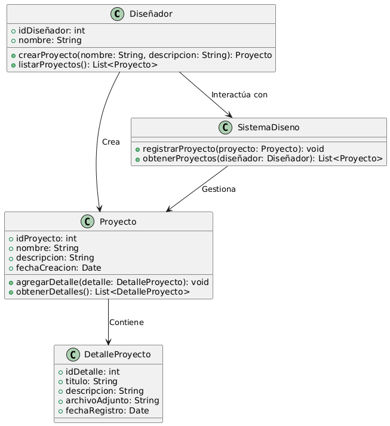

# GESTIÓN DE DISEÑO

------

## Caso de uso historia 
Laura, diseñadora, inicia un nuevo proyecto para una propuesta de diseño de tableros eléctricos. Accede al sistema, selecciona la opción "Crear Proyecto" y completa los campos con el nombre del proyecto y una descripción detallada.El sistema guarda el proyecto y lo organiza en la base de datos, permitiendo a Laura y su equipo acceder fácilmente a la información, realizar actualizaciones y documentar el progreso de la propuesta.

---

  <tr class="idtext principal">
    <td>ID SYN-29</td>
  </tr>
  <tr class="single text">
    <td><strong>Requerimiento</strong>:Crear proyectos de diseño con nombre y descripción. ID SYN-29</td>
  </tr>
  <tr class="single gray">
    <td><strong>Historia de usuario</strong></td>
  </tr>
  <tr class="single text">
    <td>Como diseñador quiero crear proyectos de diseño con nombre y descripción para organizar y documentar las propuestas de diseño de forma clara y accesible.
</td>
  </tr>
  <tr class="duo">
    <th class="gray"><strong>Estado de la tarea</strong></th>
    <th>En desarrollo</th>
  </tr>
  <tr class="single gray">
    <td><strong>Caso de uso (Pasos)</strong></td>
  </tr>
  <tr class="single text">
    <td>
        <ol>
            <li>El diseñador accede al módulo de proyectos en el sistema.
            <li>Selecciona la opción "Crear Nuevo Proyecto".</li>
            <li>Ingresa el nombre del proyecto en el campo correspondiente.</li>
            <li>Agrega una descripción que detalle el alcance o propósito del diseño.</li>
            <li>Confirma la creación del proyecto.</li>
            <li>El sistema guarda el proyecto, asigna un identificador único y lo muestra en la lista de proyectos disponibles.</li>
        </ol>
    </td>
  </tr>
  <tr class="single gray">
    <td><strong>Criterios de aceptación</strong></td>
  </tr>
  <tr class="single text">
    <td>
        <ol>
              <li>El sistema debe permitir crear un proyecto solo si se ingresan el nombre y la descripción.</li>
              <li>El nombre del proyecto debe ser único para evitar confusiones.</li>
              <li>El sistema debe notificar al usuario cuando el proyecto se cree correctamente.</li>
              <li>El sistema debe validar que los campos obligatorios no estén vacíos antes de confirmar la creación.</li>
              <li>El proyecto recién creado debe aparecer automáticamente en la lista de proyectos disponibles.</li>
            </ol>
 <tr class="duo">
    <th class="gray"><strong>Calidad</strong></th>
    <th>En desarrollo</th>
  </tr>
  <tr class="duo">
    <th class="gray"><strong>Versionamiento</strong></th>
    <th>En desarrollo</th>
  </tr>
</table>

---
## Diagrama de Caso de uso
[Creado con plantuml](https://plantuml.com/es/)

---
 