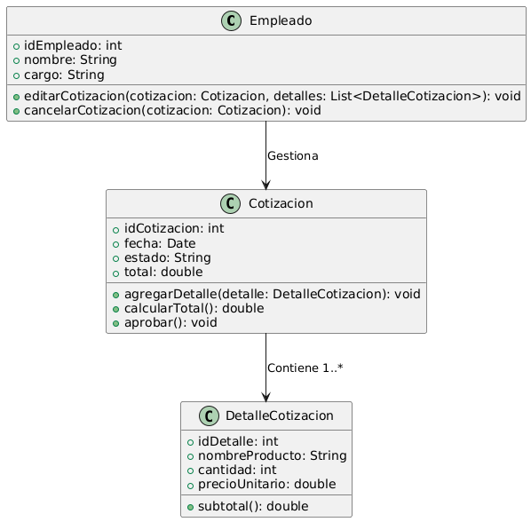

# GESTIÓN DE VENTAS

------

## Caso de uso historia 
Juan, empleado del área de ventas, genera una cotización para Pedro Martínez, pero luego se da cuenta de un error en la cantidad de productos. Accede al sistema y edita la cotización antes de enviarla, corrigiendo los detalles. Si la cotización ya no es válida, también puede cancelarla para evitar enviarla al cliente. Esto le permite asegurarse de que solo se envíen cotizaciones correctas y válidas.

---

<table id="customers">
  <tr class="idtext principal">
    <td>ID SYN-3</td>
  </tr>
  <tr class="single text">
    <td><strong>Requerimiento</strong>: Editar o cancelar cotizaciones ID SYN-3</td>
  </tr>
  <tr class="single gray">
    <td><strong>Historia de usuario</strong></td>
  </tr>
  <tr class="single text">
    <td>Como empleado de ventas quiero poder editar o cancelar cotizaciones antes de ser aprobadas para realizar cambios o descartar cotizaciones no válidas.</td>
  </tr>
  <tr class="duo">
    <th class="gray"><strong>Estado de la tarea</strong></th>
    <th>En desarrollo</th>
  </tr>
  <tr class="single gray">
    <td><strong>Caso de uso (Pasos)</strong></td>
  </tr>
  <tr class="single text">
    <td>
        <ol>
            <li>El empleado puede modificar productos, cantidades, precios y descuentos antes de la aprobación.</li>
            </li>El sistema recalcula automáticamente los totales.</li>
            </li>El empleado puede cancelar una cotización pendiente de aprobación con confirmación.</li>
            </li>La cotización se elimina o marca como cancelada.</li>
    </td>
  </tr>
  <tr class="single gray">
    <td><strong>Criterios de Aceptación</strong></td>
  </tr>
  <tr class="single text">
    <td>
        <ol>
            <li>El sistema permite editar cotizaciones antes de ser aprobadas.</li>
            <li>Los totales se recalculan automáticamente tras editar una cotización.</li>
            <li>El sistema permite cancelar cotizaciones antes de su aprobación.</li>
            <li>La cotización cancelada no puede ser aprobada.</li>

        </ol>
    </td>
  </tr>
 <tr class="duo">
    <th class="gray"><strong>Calidad</strong></th>
    <th>En desarrollo</th>
  </tr>
  <tr class="duo">
    <th class="gray"><strong>Versionamiento</strong></th>
    <th>En desarrollo</th>
  </tr>
</table>

---
## Diagrama de Caso de uso
[Creado con plantuml](https://plantuml.com/es/)

 
---
